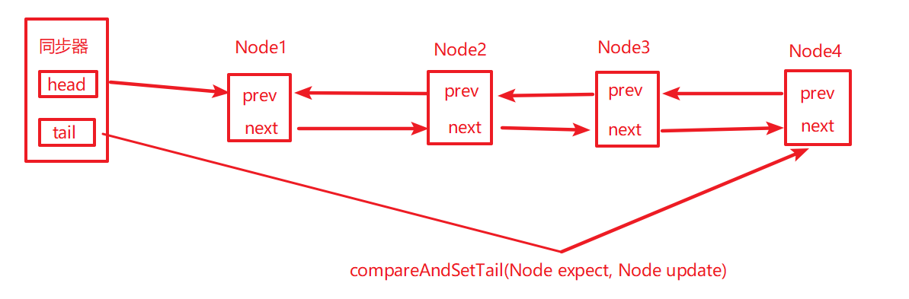
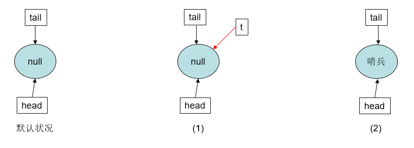
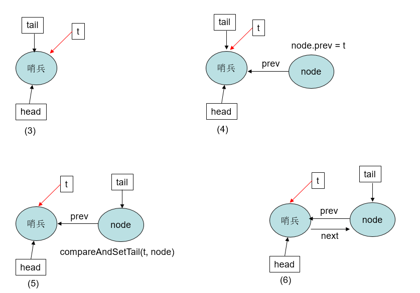
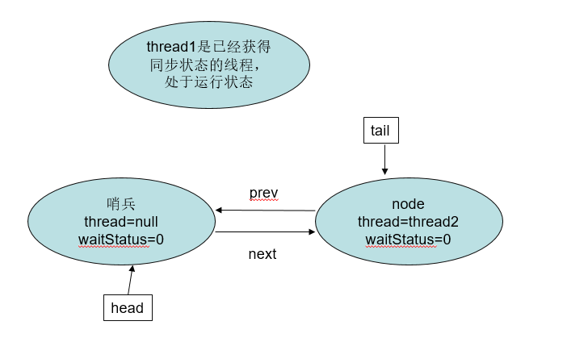
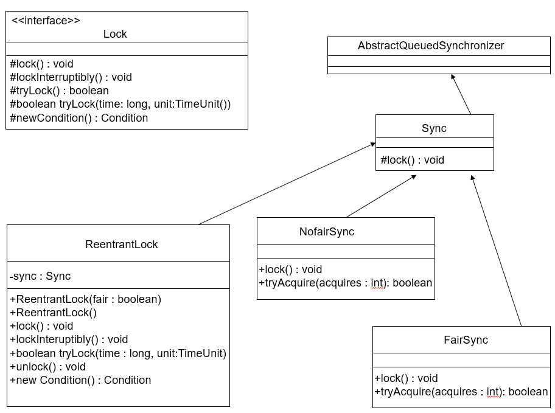
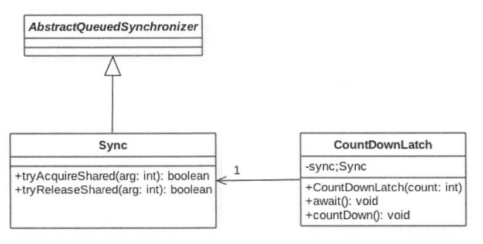

# [JUC知识](#JUC知识)

- [CAS思想](#CAS思想)
- [原子变量](#原子变量)
  - [AtomicInteger](#AtomicInteger)
  - [AtomicBoolean](#AtomicBoolean)
  - [AtomicReference](#AtomicReference)
  - [AtomicStampReference](#AtomicStampReference)
  - [原子更新数组](#AtomicIntegerArray)
  - [原子更新字段类型](#AtomicIntegerFieldUpdater)
  - [原子更新字段类使用场景](#原子更新字段类使用场景)
- [Unsafe类](#unsafe类)
- [AQS](#AQS)
  - [AQS概述](#AQS概述)
  - [AQS中的独占模式](#AQS中的独占模式)
  - [AQS中的共享模式](#AQS中的共享模式)
  - [AQS中的条件变量](#AQS中的条件变量)
  - [自定义实现同步组件](#自定义实现同步组件)
- [CountDownLatch](#countdownlatch)
  - [CountDownLatch使用](#CountDownLatch)
  - [CountDownLatch原理](#CountDownLatch)
- [CylicBarrier](#cylicbarrier)
  - [CylicBarrier使用](#CylicBarrier)
  - [CylicBarrier原理](#CylicBarrier)
- [ReentrantLock](#ReentrantLock)
  - [ReentrantLock](#ReentrantLock使用)
  - [ReentrantLock](#ReentrantLock原理)
- [ReadWriteLock](#ReadWriteLock)
  - [ReadWriteLock使用](#ReadWriteLock使用)
  - [ReadWriteLock原理](#ReadWriteLock原理)
- [StampedLock](#StampedLock使用)
  - [StampedLock使用](#StampedLock使用)
  - [StampedLock原理](#StampedLock原理)
- [Condition](#condition)
  - [Condition使用](#Condition使用)
  - [Condition原理](#Condition)
- [Semaphore](#semaphore)
  - [Semaphore使用](#Semaphore使用)
  - [Semaphore原理](#Semaphore原理)
- [Exchanger](#exchanger)
- [ExecutorService](#executorservice)
- [Phaser](#phaser)
- [ForkJoin](#forkjoin)
- [ConcurrentHashMap](#concurrenthashmap)
- [ConcurrentLinkedDeque](#concurrentlinkeddeque)
- [ConcurrentSkipListMap](#concurrentskiplistmap)
- [ConcurrentSkipSet](#concurrentskipset)
- [CopyOnWriteArrayList](#copyonwritearraylist)
- [CopyOnWriteArraySet](#copyonwritearrayset)
- [DelayQueue](#delayqueue)
- [LinkedBlockingDeque](#linkedblockingdeque)
- [LinkedBlockingQueue](#linkedblockingqueue)
- [LinkedTransferQueue](#linkedtransferqueue)
- [PriorityBlockingQueue](#priorityblockingqueue)
- [CompletableFuture](#completablefuture)
- [自定义ThreadPoolExecutor](#自定义threadpoolexecutor)
- [优先级线程池](#优先级线程池)
- [ThreadFactory](#threadfactory)
- [自定义Lock](#自定义lock)
- [自定义原子对象](#自定义原子对象)

# JUC知识

## CAS思想

### CAS概述

​	CAS需要3个操作数，分别是内存位置V、旧的预期值A和新值B，在CAS执行的时候，当且仅当内存位置V上的值符合旧的值A的时候，采用新值B更新V处的值，否则不做更新（无论是否更新了V，都会返回V的旧值）。比如在JUC下的atomic包中就大量使用这种算法。

### CAS在atomic包中的使用

我们简单看一下AtomicInteger包的部分源码，来了解一下CAS在atomic包下的应用

```java
/*
 * AtomicInteger下面的部分源码
 */
private static final Unsafe unsafe = Unsafe.getUnsafe(); //获取unsafe实例
private static final long valueOffset; //value 的内存偏移量
private volatile int value; //存取的value值
//获取AtomicInteger 的value属性的内存偏移量
static {
    try {
        valueOffset = unsafe.objectFieldOffset
            (AtomicInteger.class.getDeclaredField("value"));
    } catch (Exception ex) { throw new Error(ex); }
}
//compareAndSet就是使用CAS思想更新变量的值，调用unsafe类下的本地方法
public final boolean compareAndSet(int expect, int update) {
    return unsafe.compareAndSwapInt(this, valueOffset, expect, update);
}
/*
 * Unsafe类下的一个本地方法
 */
//方法中有四个操作数，其中obj表示对象内存的位置，valueOffset表示对象中存储变量的偏移量，expect表示变量的预期
//值，update表示更新值。操作含义就是，若果对象obj中内存偏移量为valueOffset的变量值为expect,则使用新值update
//值替更新的值expect，这是处理器提供的一个原子指令。
public final native boolean compareAndSwapInt(Object obj, long valueOffset, int expect, int update);
```

### CAS的问题

​	ABA问题：假如线程1 使用CAS修改初始值为A的变量X，那么线程1会首先回去当前变量X的值(A)，然后使用CAS操作尝试修改X的值为B，如果使用CAS修改成功了，那么程序一定执行正确了吗？在往下的假设看，如果线程I在获取变量X的值A后，在执行CAS之前线程II使用CAS修改变量X的值为B然后由修改回了A。这时候虽然线程I执行CAS时候X的值依旧是A但是这个A已经不是线程I获取时候的A了，这就是ABA问题。

​	ABA产生的原因是变量的状态值产生了环形转换，即变量值从A->B，然后又从B->A。jdk中提供了带有标记的原子类AtomicStampedReference(时间戳原子引用)通过控制变量的版本保证CAS的正确性。

## 使用CAS自定义一个显示锁

## 原子变量

​	JUC包中提供了很多原子操作类，这些类都是通过上面说到的CAS算法来实现的，相比较使用锁来实现原子性操作CAS在性能上有很大提高。由于原子操作类的原理都大致相同，所以下面分析简单看一下每一种原子类的实现原理来进一步了解原子操作类。参考总结篇之[从同步原语看非阻塞同步以及Java中的应用](https://www.cnblogs.com/fsmly/p/11019223.html)，其中讲到了同步原语以及Java中的Unsafe、CAS以及原子变量原理实现。

### AtomicInteger

参考上面的[CAS在atomic包中的使用](#CAS在atomic包中的使用)使用AtomicInteger举的例子。

### AtomicBoolean

AtomicBoolean实际上使用的是int类型的变量表示true(1)和false(0)，我们直接看一下AtomicBoolean的部分源码

```java
//获取unsafe实例
private static final Unsafe unsafe = Unsafe.getUnsafe(); 
//属性value的内存偏移量
private static final long valueOffset;
//初始化的时候，计算value的内存偏移量，并赋给valueOffset
static {
try {
    valueOffset = unsafe.objectFieldOffset
   		 (AtomicBoolean.class.getDeclaredField("value"));
    } catch (Exception ex) { throw new Error(ex); }
}
//实际存的值(0?1)
private volatile int value;
//带有参数的构造器，可以发现initialValue为true，那么value=1；initialValue=false，value=0
public AtomicBoolean(boolean initialValue) {
        value = initialValue ? 1 : 0;
}
//默认无参构造器，显然value默认值为0，即false
public AtomicBoolean() {
}
//返回value的值(0==false,1==true)
public final boolean get() {
        return value != 0;
}
//使用Unsafe类的compareAndSwapInt完成原子交换，关于compareAndSwapInt的介绍在上面AtomicInteger中说到过，
//这里不重复说明
public final boolean compareAndSet(boolean expect, boolean update) {
    int e = expect ? 1 : 0;
    int u = update ? 1 : 0;
    return unsafe.compareAndSwapInt(this, valueOffset, e, u);
}
//(1)prev = get();先获取旧值value，
//(2)调用上面compareAndSet原子的更新value值
//(3)如果更新成功compareAndSet会返回true，然后退出循环，否则一直自旋尝试更新知道成功
//(4)返回prev(旧值)
public final boolean getAndSet(boolean newValue) {
    boolean prev;
    do {
        prev = get();
    } while (!compareAndSet(prev, newValue));
    return prev;
}
```

### AtomicLong

```java
//获取unsafe实例
private static final Unsafe unsafe = Unsafe.getUnsafe();
//存储的类属性value的内存偏移量
private static final long valueOffset;
//主要差别在这里：VM_SUPPORTS_LONG_CAS被JVM调用，会查看是不是JVM支持对long类型的compareAndSwap，虽然
//Unsafe.compareAndSwapLong方法适用于任何一种情况，但是应该在Java级别处理一些构造以避免使用用户级别锁来进行对long类型的锁定。

//long:64位，在数据总线传递的时候可能不是原子性的(32位CPU或者其他)，分成高位、低位去传递。
static final boolean VM_SUPPORTS_LONG_CAS = VMSupportsCS8();
private static native boolean VMSupportsCS8();
//初始化的时候，计算value的内存偏移量，并赋给valueOffset
static {
    try {
        valueOffset = unsafe.objectFieldOffset
            (AtomicLong.class.getDeclaredField("value"));
    } catch (Exception ex) { throw new Error(ex); }
}
public final boolean compareAndSet(long expect, long update) {
    return unsafe.compareAndSwapLong(this, valueOffset, expect, update);
}
```

### AtomicReference

​	主要就是解决某些场合基本原子类型不能够解决的问题(比如想某个封装类也具备原子性的更新......)，AtomicReference就是解决这个问题。我们看一下AtomicReference的部分代码。和上面的基本原子类型差不多(就是AtomicReference<V>可以解决对封装类的原子性操作了）。

```java
private static final Unsafe unsafe = Unsafe.getUnsafe();
private static final long valueOffset;

static {
    try {
        valueOffset = unsafe.objectFieldOffset
            (AtomicReference.class.getDeclaredField("value"));
    } catch (Exception ex) { throw new Error(ex); }
}

private volatile V value;
public final boolean compareAndSet(V expect, V update) {
    return unsafe.compareAndSwapObject(this, valueOffset, expect, update);
}
```

### AtomicStampReference

​	主要是为了解决CAS带来的另一个问题[CAS的问题](#CAS的问题)，AtomicStampReference通过时间戳或者版本号的机制来解决CAS的ABA问题，我们先看看AtomicStampReference的部分源码实现

```java
//通过静态内部类的方式存储要设置为原子类型的引用类型
private static class Pair<T> {
    final T reference; //泛型T：代表构造的时候的传递的类型
    final int stamp; //版本号
    private Pair(T reference, int stamp) { //私有构造，不对外暴露，只在AtomicStampedReference内部使用of方法创建Pair对象
        this.reference = reference;
        this.stamp = stamp;
    }
    static <T> Pair<T> of(T reference, int stamp) {
        return new Pair<T>(reference, stamp); //每次调用of方法都会返回一个新的reference+stamp
    }
}
//volatile修饰的Pair类型
private volatile Pair<V> pair;
//获取unsafe示例
private static final sun.misc.Unsafe UNSAFE = sun.misc.Unsafe.getUnsafe();
//计算AtomicStampedReference的属性pair的内存偏移量
private static final long pairOffset =
    objectFieldOffset(UNSAFE, "pair", AtomicStampedReference.class);
//casPair：使用Unsafe类的compareAndSwapObject原子的更新pair
private boolean casPair(Pair<V> cmp, Pair<V> val) {
    return UNSAFE.compareAndSwapObject(this, pairOffset, cmp, val);
}
//构造方法，传入初始对象引用和版本号stamp
public AtomicStampedReference(V initialRef, int initialStamp) {
    pair = Pair.of(initialRef, initialStamp); //使用of方法构造一个pair对象
}
//返回构造的对象引用
public V getReference() {
    return pair.reference;
}
//返回版本号stamp
public int getStamp() {
    return pair.stamp;
}
//返回包装的对象引用，向传入的数组参数中设置当前的版本号stamp
public V get(int[] stampHolder) {
    Pair<V> pair = this.pair;
    stampHolder[0] = pair.stamp;
    return pair.reference;
}
//
public boolean compareAndSet(V   expectedReference,
                             V   newReference,
                             int expectedStamp,
                             int newStamp) {
    Pair<V> current = pair;
    //(1)先比较传入expectedReference是不是当前正确的reference(这个reference构造的时候传入的类类型引用)
    //(2)比较传入的expectedStamp是不是当前正确的stamp
    //(3)如果(1)和(2)都为true
    //	a.会比较更新的newReference和当前的reference是不是相同
    //	b.比较更新的newStamp和当前的stamp是不是相同
    //	c.如果上面的a和b都为true，那么就不做更新
    //	d.如果上面的a和b有一个为false，就会使用casPair原子性的更新reference和stamp
    return
        expectedReference == current.reference 
        && expectedStamp == current.stamp
        && (
           (newReference == current.reference 
            && newStamp == current.stamp)
            || casPair(current, Pair.of(newReference, newStamp)
           )
    );
}

//无条件的将当前被包装的对象设置为传入的值(reference和stamp)
public void set(V newReference, int newStamp) {
    Pair<V> current = pair;
    if (newReference != current.reference || newStamp != current.stamp)
        this.pair = Pair.of(newReference, newStamp); //并且当前pair由新的值替换
}
```

### AtomicIntegerArray

​	主要是提供原子的方式操作数组里的整形，AtomicIntegerArray的构造方法和常用的方法。

```java
public AtomicIntegerArray(int length) {
    array = new int[length];
}
/**
 * 如果参数为一个array，那么AtomicIntegerArray会将当前数组复制一份，所以对AtomicIntegerArray内部数组元素
 * 操作的时候，不会影响到原来的array的值
 * @throws NullPointerException if array is null
 */
public AtomicIntegerArray(int[] array) {
    this.array = array.clone();
}
public final int addAndGet(int i, int delta) {
    //以原子的方式将输入值与数组中索引为i的元素相加，返回更新后的结果
}
public final boolean compareAndSet(int i, int expect, int update) {
    //如果当前值等于预期值，则以原子方式将数组位置为i的元素设置为update值，并返回true；否则返回false
}
```

### AtomicLongArray

​	原子更新长整型数组里面的元素。和AtomicIntegerArray不同的地方就是方法使用C-A-S-Long的形式。

### AtomicReferenceArray

​	原子更新长整型数组里面的元素。和AtomicIntegerArray不同的地方就是方法使用C-A-S-Obj的形式。	

### AtomicIntegerFieldUpdater

​	原子更新整形字段(int，如果使用Integer会抛异常)的。比如下面的例子（将SimpleObject类中的整形属性id添加到了原子更新器上）.

```java
//具体的使用分为两步：(1)使用AtomicIntegerFieldUpdater的静态方法newUpdater创建一个更新器，同时在其中设置
//是哪个类的哪个属性。(2)所添加的那个类的属性需要使用public volatile修饰
public class TestAtomicIntegerFieldUpdater {
    private static AtomicIntegerFieldUpdater<SimpleObject> updater = 
        AtomicIntegerFieldUpdater.newUpdater(SimpleObject.class, "id");

    public static void main(String[] args) {
        SimpleObject simpleObject = new SimpleObject("test1",1);
        for (int i = 0; i < 3; i++) {
            new Thread(){
                @Override
                public void run() {
                    for (int j = 0; j < 30; j++) {
                        System.out.println(Thread.currentThread().getName() + 
                                           " ==>id: "+updater.getAndIncrement(simpleObject));
                    }
                }
            }.start();
        }
    }

    private static class SimpleObject {
        private String name;
        public volatile int id;

        public SimpleObject(String name, int id) {
            this.name = name;
            this.id = id;
        }
    }
}
```

### AtomicLongFieldUpdater

​	原子更新长整型字段(long)的更新器。

### AtomicReferenceFieldUpdate

​	原子更新引用类型的更新器。

```java
public class TestFieldUpdater {

    //java.lang.IllegalAccessException: 当所使用的类的属性为private(如果是当前类，也可以是private的)
    @Test
    public void testIllegalAccessException() {
        AtomicIntegerFieldUpdater<SimpleObject> updater = AtomicIntegerFieldUpdater.newUpdater(SimpleObject.class, "id");
        SimpleObject simpleObject = new SimpleObject("test1", 1);
        updater.compareAndSet(simpleObject, 1, 2);
    }

    //java.lang.ClassCastException: 使用更新器的方法时候，如果传递的为null
    @Test
    public void testClassCastException() {
        AtomicIntegerFieldUpdater<SimpleObject> updater = AtomicIntegerFieldUpdater.newUpdater(SimpleObject.class, "id");
        SimpleObject simpleObject = new SimpleObject("test1", 1);
        updater.compareAndSet(null, 1, 2);
    }

    //java.lang.NoSuchFieldException: 使用的类的字段名传入错误
    @Test
    public void testNoSuchFieldException() {
        AtomicIntegerFieldUpdater<SimpleObject> updater = AtomicIntegerFieldUpdater.newUpdater(SimpleObject.class, "id1");
        SimpleObject simpleObject = new SimpleObject("test1", 1);
        updater.compareAndSet(null, 1, 2);
    }

    //java.lang.ClassCastException: 当传入的类型不匹配的时候(Integer->Long)
    @Test
    public void testFieldTypeInvalid() {
        AtomicReferenceFieldUpdater<SimpleObject, Long> updater = AtomicReferenceFieldUpdater.newUpdater(SimpleObject.class, Long.class, "id");
        SimpleObject simpleObject = new SimpleObject("test1", 1);
        updater.compareAndSet(simpleObject, 1L, 2L);
    }

    //java.lang.IllegalArgumentException: Must be volatile type: 必须被volatile修饰
    @Test
    public void testVolatileType() {
        AtomicReferenceFieldUpdater<SimpleObject, Integer> updater = AtomicReferenceFieldUpdater.newUpdater(SimpleObject.class, Integer.class, "id");
        SimpleObject simpleObject = new SimpleObject("test1", 1);
        updater.compareAndSet(simpleObject, 1, 2);
    }
}
```

### 原子更新字段类使用场景

(1)需要让类的属性操作具备原子性

(2)不想使用锁(lock或者synchronized)

(3)大量需要原子类型修饰的对象(相比较会比直接使用AtomicStampedReference节省内存)

## Unsafe类


## AQS

### AQS概述  

​	AbstractQueuedSynchronizer抽象队列同步器简称AQS，它是实现同步器的基础组件，juc下面Lock的实现以及一些并发工具类就是通过AQS来实现的，这里我们通过AQS的类图先看一下大概，下面我们总结一下AQS的实现原理。先看看AQS的类图。[Java中的队列同步器AQS](https://www.cnblogs.com/fsmly/p/10701109.html)


​	**(1)**AQS是一个通过内置的**FIFO**双向队列来完成线程的排队工作(内部通过结点head和tail记录队首和队尾元素，元素的结点类型为Node类型，后面我们会看到Node的具体构造)。

```java
/*等待队列的队首结点(懒加载，这里体现为竞争失败的情况下，加入同步队列的线程执行到enq方法的时候会创
建一个Head结点)。该结点只能被setHead方法修改。并且结点的waitStatus不能为CANCELLED*/
private transient volatile Node head;
/**等待队列的尾节点，也是懒加载的。（enq方法）。只在加入新的阻塞结点的情况下修改*/
private transient volatile Node tail;
```

​	**(2)**其中**Node**中的thread用来存放进入AQS队列中的线程引用，Node结点内部的SHARED表示标记线程是因为获取共享资源失败被阻塞添加到队列中的；Node中的EXCLUSIVE表示线程因为获取独占资源失败被阻塞添加到队列中的。waitStatus表示当前线程的等待状态：

​	①CANCELLED=1：表示线程因为中断或者等待超时，需要从等待队列中取消等待；

​	②SIGNAL=-1：当前线程thread1占有锁，队列中的head(仅仅代表头结点，里面没有存放线程引用)的后继结点node1处于等待状态，如果已占有锁的线程thread1释放锁或被CANCEL之后就会通知这个结点node1去获取锁执行。

​	③CONDITION=-2：表示结点在等待队列中(这里指的是等待在某个lock的condition上，关于Condition的原理下面会写到)，当持有锁的线程调用了Condition的signal()方法之后，结点会从该condition的等待队列转移到该lock的同步队列上，去竞争lock。(注意：这里的同步队列就是我们说的AQS维护的FIFO队列，等待队列则是每个condition关联的队列)

​	④PROPAGTE=-3：表示下一次共享状态获取将会传递给后继结点获取这个共享同步状态。

下面是Node内部类的源码

```java
    static final class Node {
        /**共享模式下获取state失败被构造为Node结点加入同步队列中 */
        static final Node SHARED = new Node();
        /**独占模式下获取state失败被构造为node节点加入同步队列 */
        static final Node EXCLUSIVE = null;
        /**同步队列中等待的线程被取消，节点进入该状态不会发生变化*/
        static final int CANCELLED =  1;
        /**唤醒后继节点*/
        static final int SIGNAL    = -1;
        /**表示节点中的线程阻塞在某个condition上*/
        static final int CONDITION = -2;
        /**表示下一次共享状态获取将会传递给后继结点获取这个共享同步状态。*/
        static final int PROPAGATE = -3;
        /**waitStatus取值就是上面的四种情况*/
        volatile int waitStatus;
        /**当前Node节点的前去结点*/
        volatile Node prev;
        /**Node节点的后继节点*/
        volatile Node next;
        /** 当前Node节点中的线程引用*/
        volatile Thread thread;
        /** condition队列中的后继结点，如果当前节点是共享的，那么这个字段是一个SHARED常量 ，也就是当前节点类
        型和等待队列中的后继节点共用一个字段*/
        Node nextWaiter;
        /**返回当前是否是共享式的节点类型*/
        final boolean isShared() {
            return nextWaiter == SHARED;
        }
        /** 假设多个线程取竞争state的时候
        (1)初始情况下队列是没有结点的，这时候如果出现竞争情况，那么势必就有一个线程将会被构造为Node结点添加到
        队列中，在这个过程中，首先会做的是(实际上AQS的模板方法acquire中的第二步就是将CAS设置同步失败的线程构
        造为相应模式的Node加入同步队列中),为队列添加一个head结点（在enq方法中自旋直到设置head成功并将自己添
        加作为head的后继结点）
        (2)上面是初始情况下同步队列中没有node结点的情况，如果已经同步队列中已经有node结点，那么后续的线程竞争
        失败的话就是直接将自己设置为tail结点(具体的做法就是获得当前队列的tail结点，将之设置为自己的prev结点)
        (3)上面构造同步队列的以及添加新的node的过程都是以CAS的方式进行的
         */
        final Node predecessor() throws NullPointerException {
            Node p = prev;
            if (p == null)
                throw new NullPointerException();
            else
                return p;
        }
	    //初始同步队列为空的(head=tail= null)的时候，这时要添加新的node结点就会在enq方法中添加一个空的head
        //结点，这个结点中不保存任何线程的引用或者等待状态信息，保存这个state的队首head(没有包含线程引用)和队尾tail(包含线程引用)
        Node() {    // 用于建立初始头或SHARED标记
        }
	    //竞争失败的线程被构造为Node结点的时候，调用的构造方法
        Node(Thread thread, Node mode) {
            this.nextWaiter = mode;
            this.thread = thread;
        }
	    //condition队队列
        Node(Thread thread, int waitStatus) {
            this.waitStatus = waitStatus;
            this.thread = thread;
        }
    }
```

​	**(3)**AQS中维持了一个单一的volatile修饰的状态信息state(AQS通过Unsafe的相关方法，以原子性的方式由线程去获取这个state)。AQS提供了getState()、setState()、compareAndSetState()函数修改值(实际上调用的是unsafe的compareAndSwapInt方法)。下面是AQS中的部分成员变量以及更新state的方法

```java
//这就是我们刚刚说到的head结点，懒加载的（只有竞争失败需要构建同步队列的时候，才会创建这个head），如果头节点存在，它的waitStatus不能为CANCELLED
private transient volatile Node head;
//当前同步队列尾节点的引用，也是懒加载的，只有调用enq方法的时候会添加一个新的wait node
private transient volatile Node tail;
//AQS核心：同步状态
private volatile int state;
protected final int getState() {
    return state;
}
protected final void setState(int newState) {
    state = newState;
}
protected final boolean compareAndSetState(int expect, int update) {
    return unsafe.compareAndSwapInt(this, stateOffset, expect, update);
}
```

​	**(4)**AQS的设计师基于**模板方法**模式的。使用时候需要继承同步器并重写指定的方法，并且通常将子类推荐为定义同步组件的静态内部类，子类重写这些方法之后，AQS工作时使用的是提供的模板方法，在这些模板方法中调用子类重写的方法。

​	子类可以重写的方法：

```java
//独占式的获取同步状态，实现该方法需要查询当前状态并判断同步状态是否符合预期，然后再进行CAS设置同步状态
protected boolean tryAcquire(int arg) {	throw new UnsupportedOperationException();}
//独占式的释放同步状态，等待获取同步状态的线程可以有机会获取同步状态
protected boolean tryRelease(int arg) {	throw new UnsupportedOperationException();}
//共享式的获取同步状态
protected int tryAcquireShared(int arg) { throw new UnsupportedOperationException();}
//尝试将状态设置为以共享模式释放同步状态。 该方法总是由执行释放的线程调用。 
protected int tryReleaseShared(int arg) { throw new UnsupportedOperationException(); }
//当前同步器是否在独占模式下被线程占用，一般该方法表示是否被当前线程所独占
protected int isHeldExclusively(int arg) {	throw new UnsupportedOperationException();}
```

​	AQS提供的模板方法，这些方法会调用具体子类实现的方法，后面会单独说独占模式和共享模式下这些方法的执行原理。

```java
//以独占模式获取，忽略中断
public final void acquire(int arg) {...}
//以独占方式获得，如果中断，中止。
public final void acquireInterruptibly(int arg) throws InterruptedException {...}
//尝试以独占模式获取，如果中断则中止，如果给定的超时时间失败
public final boolean tryAcquireNanos(int arg, long nanosTimeout) throws InterruptedException {...}
//以共享模式获取，忽略中断。 
public final void acquireShared(int arg){...}
//以共享方式获取，如果中断，中止
public final void acquireSharedInterruptibly(int arg) throws InterruptedException{...}
//尝试以共享模式获取，如果中断则中止，如果给定的时间超过，则失败。
public final boolean tryAcquireSharedNanos(int arg, long nanosTimeout) throws InterruptedException{...}
//独占式的释放同步状态，该方法会在释放同步状态之后，将同步队列中的第一个节点包含的线程唤醒
public final boolean release(int arg){...}
//共享式的释放同步状态
public final boolean releaseShared(int arg){...}
//获取在等待队列上的线程集合
public final Collection<Thread> getQueuedThreads(){...}
```

​	**(5)**AQS的内部类**ConditionObject**是通过结合锁实现线程同步，ConditionObject可以直接访问AQS的变量(state、queue)，ConditionObject是个条件变量 ，每个ConditionObject对应一个队列用来存放线程调用condition条件变量的await方法之后被阻塞的线程。后面会单独说到

### AQS中的独占模式

​	上面我们简单了解了一下AQS的基本组成，这里通过**ReentrantLock**的**非公平锁**实现来具体分析AQS的独占模式的加锁和释放锁的过程。

#### 非公平锁的加锁流程

​	简单说来，AQS会把所有的请求线程构成一个CLH队列，当一个线程执行完毕（lock.unlock()）时会激活自己的后继节点，但正在执行的线程并不在队列中，而那些等待执行的线程全部处于阻塞状态(park())。如下图所示。



​	**(1)**假设这个时候在初始情况下，还没有多任务来请求竞争这个state，这时候如果第一个线程thread1调用了lock方法请求获得锁，首先会通过CAS的方式将state更新为1，表示自己thread1获得了锁，并将独占锁的线程持有者设置为thread1。

```java
final void lock() {
    if (compareAndSetState(0, 1))
        //setExclusiveOwnerThread是AbstractOwnableSynchronizer的方法，AQS继承了AbstractOwnableSynchronizer
        setExclusiveOwnerThread(Thread.currentThread());
    else
        acquire(1);
}
```

​	**(2)**这个时候有另一个线程thread2来尝试或者锁，同样也调用lock方法，尝试通过CAS的方式将state更新为1，但是由于之前已经有线程持有了state，所以thread2这一步CAS失败（前面的thread1已经获取state并且没有释放），就会调用acquire(1)方法（该方法是AQS提供的模板方法，它会调用子类的tryAcquire方法）。非公平锁的实现中，AQS的模板方法acquire(1)就会调用NofairSync的tryAcquire方法，而tryAcquire方法又调用的Sync的nonfairTryAcquire方法，所以我们看看nonfairTryAcquire的流程。

```java
//NofairSync
protected final boolean tryAcquire(int acquires) {
    return nonfairTryAcquire(acquires);
}
final boolean nonfairTryAcquire(int acquires) {
    //（1）获取当前线程
    final Thread current = Thread.currentThread();
    //（2）获得当前同步状态state
    int c = getState();
    //（3）如果state==0，表示没有线程获取
    if (c == 0) {
        //（3-1）那么就尝试以CAS的方式更新state的值
        if (compareAndSetState(0, acquires)) {
            //（3-2）如果更新成功，就设置当前独占模式下同步状态的持有者为当前线程
            setExclusiveOwnerThread(current);
            //（3-3）获得成功之后，返回true
            return true;
        }
    }
    //（4）这里是重入锁的逻辑
    else if (current == getExclusiveOwnerThread()) {
        //（4-1）判断当前占有state的线程就是当前来再次获取state的线程之后，就计算重入后的state
        int nextc = c + acquires;
        //（4-2）这里是风险处理
        if (nextc < 0) // overflow
            throw new Error("Maximum lock count exceeded");
        //（4-3）通过setState无条件的设置state的值，（因为这里也只有一个线程操作state的值，即
        //已经获取到的线程，所以没有进行CAS操作）
        setState(nextc);
        return true;
    }
    //（5）没有获得state，也不是重入，就返回false
    return false;
}
```

总结来说就是：

1、获取当前将要去获取锁的线程thread2。

2、获取当前AQS的state的值。如果此时state的值是0，那么我们就通过CAS操作获取锁，然后设置AQS的线程占有者为thread2。很明显，在当前的这个执行情况下，state的值是1不是0，因为我们的thread1还没有释放锁。所以CAS失败，后面第3步的重入逻辑也不会进行

3、如果当前将要去获取锁的线程等于此时AQS的exclusiveOwnerThread的线程，则此时将state的值加1，这是重入锁的实现方式。

4、最终thread2执行到这里会返回false。

​	**(3)**上面的thread2加锁失败，返回false。那么根据开始我们讲到的AQS概述就应该将thread2构造为一个Node结点加入同步队列中。因为NofairSync的tryAcquire方法是由AQS的模板方法acquire()来调用的，那么我们看看该方法的源码以及执行流程。

```java
//(1)tryAcquire，这里thread2执行返回了false，那么就会执行addWaiter将当前线程构造为一个结点加入同步队列中
public final void acquire(int arg) {
    if (!tryAcquire(arg) &&
        acquireQueued(addWaiter(Node.EXCLUSIVE), arg))
        selfInterrupt();
}
```

​	那么我们就看一下addWaiter方法的执行流程。

```java
private Node addWaiter(Node mode) {
    //(1)将当前线程以及阻塞原因(是因为SHARED模式获取state失败还是EXCLUSIVE获取失败)构造为Node结点
    Node node = new Node(Thread.currentThread(), mode);
    //(2)这一步是快速将当前线程插入队列尾部
    Node pred = tail;
    if (pred != null) {
        //(2-1)将构造后的node结点的前驱结点设置为tail
        node.prev = pred;
        //(2-2)以CAS的方式设置当前的node结点为tail结点
        if (compareAndSetTail(pred, node)) {
            //(2-3)CAS设置成功，就将原来的tail的next结点设置为当前的node结点。这样这个双向队
            //列就更新完成了
            pred.next = node;
            return node;
        }
    }
    //(3)执行到这里，说明要么当前队列为null，要么存在多个线程竞争失败都去将自己设置为tail结点，
    //那么就会有线程在上面（2-2）的CAS设置中失败，就会到这里调用enq方法
    enq(node);
    return node;
}
```

​	那么总结一下add Waiter方法

​	1、将当前将要去获取锁的线程也就是thread2和独占模式封装为一个node对象。

​	2、尝试快速的将当前线程构造的node结点添加作为tail结点(这里就是直接获取当前tail，然后将node的前驱结点设置为tail)，并且以CAS的方式将node设置为tail结点(CAS成功后将原tail的next设置为node，然后这个队列更新成功)。

​	3、如果2设置失败，就进入enq方法。

​	在刚刚的thread1和thread2的环境下，开始时候线程阻塞队列是空的(因为thread1获取了锁，thread2也是刚刚来请求锁，所以线程阻塞队列里面是空的)。很明显，这个时候队列的尾部tail节点也是null，那么将直接进入到enq方法。所以我们看看enq方法的实现

```java
private Node enq(final Node node) {
    for (;;) {
        //(4)还是先获取当前队列的tail结点
        Node t = tail;
        //(5)如果tail为null，表示当前同步队列为null，就必须初始化这个同步队列的head和tail（建
        //立一个哨兵结点）
        if (t == null) { 
            //（5-1）初始情况下，多个线程竞争失败，在检查的时候都发现没有哨兵结点，所以需要CAS的
            //设置哨兵结点
            if (compareAndSetHead(new Node()))
                tail = head;
        } 
        //(6)tail不为null
        else {
            //(6-1)直接将当前结点的前驱结点设置为tail结点
            node.prev = t;
            //(6-2)前驱结点设置完毕之后，还需要以CAS的方式将自己设置为tail结点，如果设置失败，
            //就会重新进入循环判断一遍
            if (compareAndSetTail(t, node)) {
                t.next = node;
                return t;
            }
        }
    }
}
```

​	enq方法内部是一个自旋循环，第一次循环默认情况如下图所示

​	1、首先代码块（4）处将t指向了tail，判断得到t==null，如图(1)所示；

​	2、于是需要新建一个哨兵结点作为整个同步队列的头节点(代码块5-1处执行)

​	3、完了之后如图(2)所示。这样第一次循环执行完毕。



​	第二次循环整体执行如下图所示。

​	1、还是先获取当前tail结点然后将t指向tail结点。如下图的(3)

​	2、然后判断得到当前t!=null，所以enq方法中进入代码块(6).

​	3、在(6-1)代码块中将node的前驱结点设置为原来队列的tail结点，如下图的(4)所示。

​	4、设置完前驱结点之后，代码块(6-2)会以CAS的方式将当前的node结点设置为tail结点,如果设置成功，就会是下图(5)所示。更新完tail结点之后，需要保证双向队列的，所以将原来的指向哨兵结点的t的next结点指向node结点，如下图(6)所示。最后返回。



​	总结来说，即使在多线程情况下，enq方法还是能够保证每个线程结点会被安全的添加到同步队列中，因为enq通过CAS方式将结点添加到同步队列之后才会返回，否则就会不断尝试添加(这样实际上就是在并发情况下，把向同步队列添加Node变得串行化了)

​	**(4)**在上面AQS的模板方法中，acquire()方法还有一步acquireQueued，这个方法的主要作用就是在同步队列中嗅探到自己的前驱结点，如果前驱结点是头节点的话就会尝试取获取同步状态，否则会先设置自己的waitStatus为-1，然后调用LockSupport的方法park自己。具体的实现如下面代码所示

```java
final boolean acquireQueued(final Node node, int arg) {
    boolean failed = true;
    try {
        boolean interrupted = false;
        //在这样一个循环中尝试tryAcquire同步状态
        for (;;) {
            //获取前驱结点
            final Node p = node.predecessor();
            //(1)如果前驱结点是头节点，就尝试取获取同步状态，这里的tryAcquire方法相当于还是调
            //用NofairSync的tryAcquire方法，在上面已经说过
            if (p == head && tryAcquire(arg)) {
                //如果前驱结点是头节点并且tryAcquire返回true，那么就重新设置头节点为node
                setHead(node);
                p.next = null; //将原来的头节点的next设置为null，交由GC去回收它
                failed = false;
                return interrupted;
            }
            //(2)如果不是头节点,或者虽然前驱结点是头节点但是尝试获取同步状态失败就会将node结点
            //的waitStatus设置为-1(SIGNAL),并且park自己，等待前驱结点的唤醒。至于唤醒的细节
            //下面会说到
            if (shouldParkAfterFailedAcquire(p, node) &&
                parkAndCheckInterrupt())
                interrupted = true;
        }
    } finally {
        if (failed)
            cancelAcquire(node);
    }
}
```

​	在上面的代码中我们可以看出，这个方法也是一个自旋循环，继续按照刚刚的thread1和thread2这个情况分析。在enq方法执行完之后，同步队列的情况大概如下所示。



​	当前的node结点的前驱结点为head，所以会调用tryAcquire()方法去获得同步状态。但是由于state被thread1占有，所以tryAcquire失败。这里就是执行acquireQueued方法的代码块(2)了。代码块(2)中首先调用了shouldParkAfterFailedAcquire方法，该方法会将同步队列中node结点的前驱结点的waitStatus为CANCELLED的线程移除，并将当前调用该方法的线程所属结点自己和他的前驱结点的waitStatus设置为-1(SIGNAL)，然后返回。具体方法实现如下所示

```java
private static boolean shouldParkAfterFailedAcquire(Node pred, Node node) {
    //（1）获取前驱结点的waitStatus
    int ws = pred.waitStatus;
    //（2）如果前驱结点的waitStatus为SINGNAL，就直接返回true
    if (ws == Node.SIGNAL)
        //前驱结点的状态为SIGNAL，那么该结点就能够安全的调用park方法阻塞自己了。
        return true;
    if (ws > 0) {
        //（3）这里就是将所有的前驱结点状态为CANCELLED的都移除
        do {
            node.prev = pred = pred.prev;
        } while (pred.waitStatus > 0);
        pred.next = node;
    } else {
        
        /*
             * waitStatus must be 0 or PROPAGATE.  Indicate that we
             * need a signal, but don't park yet.  Caller will need to
             * retry to make sure it cannot acquire before parking.
             */
        compareAndSetWaitStatus(pred, ws, Node.SIGNAL);
    }
    return false;
}
```


### AQS中的共享模式

### AQS中的条件变量

### 自定义实现同步组件

```java
public class NonReentrantLock implements Lock {
    //使用静态内部类继承AQS，并重写指定的方法
    private static class Sync extends AbstractQueuedSynchronizer {
        @Override
        protected boolean tryAcquire(int arg) {
            //使用CAS尝试去设置同步状态
            if (compareAndSetState(0, 1)) {
                //如果获取成功，设置state占有者为当前线程
                setExclusiveOwnerThread(Thread.currentThread());
                return true;
            }
            return false;
        }

        //释放
        @Override
        protected boolean tryRelease(int arg) {
            if (getState() == 0) {
                throw new IllegalMonitorStateException();
            }
            setExclusiveOwnerThread(null);
            setState(0);
            return true;
        }

        //是否处于占有状态
        @Override
        protected boolean isHeldExclusively() {
            return getState() == 1;
        }

        //提供条件变量接口
        Condition newCondition() {
            return new ConditionObject();
        }
    }

    //创建一个Sync来做具体的同步工作
    private final Sync sync = new Sync();
    @Override
    public void lock() {
        sync.acquire(1); //这里调用的是AQS的模板方法，而在其中又调用了sync实现的tryAcquire方法
    }

    @Override
    public void lockInterruptibly() throws InterruptedException {
        sync.acquireInterruptibly(1);
    }

    @Override
    public boolean tryLock() {
        return sync.tryAcquire(1);
    }

    @Override
    public boolean tryLock(long time, TimeUnit unit) throws InterruptedException {
        return sync.tryAcquireNanos(1,unit.toNanos(time));
    }

    @Override
    public void unlock() {
        sync.release(1);
    }

    @Override
    public Condition newCondition() {
        return sync.newCondition();
    }

    public boolean isLocked() {
        return sync.isHeldExclusively();
    }
}
//使用自定义同步组建实现Producer-Consumer-Model
public class ProduceAndConsumer {

    private static final NonReentrantLock lock = new NonReentrantLock();
    private static final Condition notFull = lock.newCondition();
    private static final Condition notEmpty = lock.newCondition();

    private static Queue<String> queue = new LinkedBlockingQueue<>();
    private final static int SIZE = 10;

    public static void main(String[] args) {
        new Thread("ProducerThread") {
            @Override
            public void run() {
                while (true) {
                    lock.lock();
                    try {
                        //生产者线程
                        //队列满了，等待
                        while (queue.size() == SIZE) {
                            System.out.println("size : " + queue.size());
                            notEmpty.await();
                        }
                        //队列未满，添加元素
                        queue.add("element");
                        //唤醒消费者线程
                        notFull.signalAll();
                    } catch (InterruptedException e) {
                        e.printStackTrace();
                    } finally {
                        lock.unlock();
                    }
                }
            }
        }.start();

        new Thread("ConsumerThread") {
            @Override
            public void run() {
                while (true) {
                    lock.lock();
                    try {
                        //消费者线程
                        //队列空了，等待
                        while (queue.size() == 0) {
                            notFull.await();
                        }
                        //队列未满，添加元素
                        String ele = queue.poll();
                        System.out.println(ele);
                        //唤醒生产者者线程
                        notEmpty.signalAll();
                    } catch (InterruptedException e) {
                        e.printStackTrace();
                    } finally {
                        lock.unlock();
                    }
                }
            }
        }.start();
    }
}

```


## ReentrantLock

### ReentrantLock使用

### ReentrantLock原理



非公平锁的实现原理请参考上面介绍AQS原理的[非公平锁的加锁流程](#非公平锁的加锁流程).

## ReadWriteLock

### ReadWriteLock使用

### ReadWriteLock原理

## StampedLock

### StampedLock使用

### StampedLock原理

## Condition

### Condition使用

### Condition原理

## CountDownLatch

### CountDownLatch使用

### CountDownLatch原理



```java
private static final class Sync extends AbstractQueuedSynchronizer {
    private static final long serialVersionUID = 4982264981922014374L;

    Sync(int count) {
        setState(count);
    }

    int getCount() {
        return getState();
    }

    protected int tryAcquireShared(int acquires) {
        return (getState() == 0) ? 1 : -1;
    }

    protected boolean tryReleaseShared(int releases) {
        // Decrement count; signal when transition to zero
        for (;;) {
            int c = getState();
            if (c == 0)
                return false;
            int nextc = c-1;
            if (compareAndSetState(c, nextc))
                return nextc == 0;
        }
    }
}
```


## CylicBarrier

### CylicBarrier使用

### CylicBarrier原理

## Semaphore

## Exchanger

## ExecutorService

## Phaser

## ForkJoin

## ConcurrentHashMap

## ConcurrentLinkedDeque

## ConcurrentSkipListMap

## ConcurrentSkipSet

## CopyOnWriteArrayList

## CopyOnWriteArraySet

## DelayQueue

## LinkedBlockingDeque

## LinkedBlockingQueue

## LinkedTransferQueue

## PriorityBlockingQueue

## CompletableFuture

## 自定义ThreadPoolExecutor

## 优先级线程池

## ThreadFactory

## 自定义Lock

## 自定义原子对象


