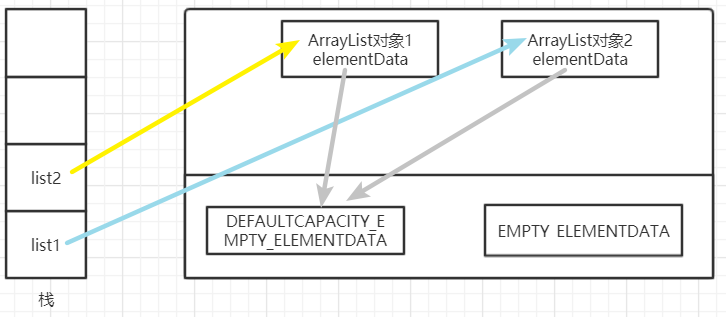
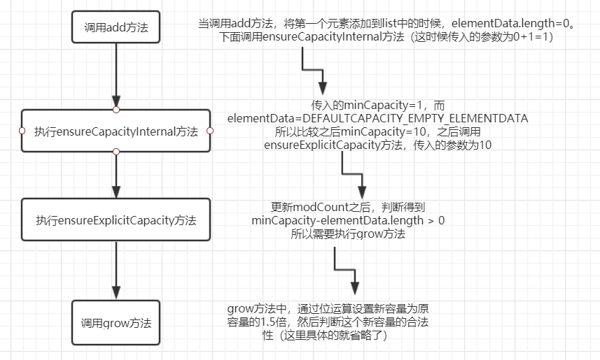
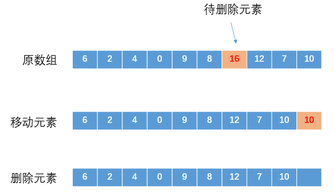

## ArrayList概述

（1）`ArrayList` 是一种变长的集合类，基于定长数组实现。

（2）`ArrayList` 允许空值和重复元素，当往 ArrayList 中添加的元素数量大于其底层数组容量时，其会通过**扩容**机制重新生成一个更大的数组。

（3）由于 `ArrayList` 底层基于数组实现，所以其可以保证在 `O(1)` 复杂度下完成随机查找操作。

（4）`ArrayList` 是非线程安全类，并发环境下，多个线程同时操作 ArrayList，会引发不可预知的异常或错误。

## ArrayList的成员属性

在介绍关于ArrayList的各种方法之前先看一下基础属性成员。其中`DEFAULTCAPACITY_EMPTY_ELEMENTDATA与EMPTY_ELEMENTDATA的区别是：当我们向数组中添加第一个元素时，DEFAULTCAPACITY_EMPTY_ELEMENTDATA将会知道数组该扩充多少`。

```java
//默认初始化容量
private static final int DEFAULT_CAPACITY = 10;

//默认的空的数组，这个主要是在构造方法初始化一个空数组的时候使用
private static final Object[] EMPTY_ELEMENTDATA = {};

//使用默认size大小的空数组实例，和EMPTY_ELEMENTDATA区分开来，
//这样可以知道当第一个元素添加的时候进行扩容至多少
private static final Object[] DEFAULTCAPACITY_EMPTY_ELEMENTDATA = {};

//ArrayList底层存储数据就是通过数组的形式，ArrayList长度就是数组的长度。
//一个空的实例elementData为上面的DEFAULTCAPACITY_EMPTY_ELEMENTDATA，当添加第一个元素的时候
//会进行扩容，扩容大小就是上面的默认容量DEFAULT_CAPACITY
transient Object[] elementData; // non-private to simplify nested class access

//arrayList的大小
private int size;
```

static修饰的`EMPTY_ELEMENTDATA`和`DEFAULTCAPACITY_EMPTY_ELEMENTDATA`



## ArrayList构造方法

（1）带有初始化容量的构造方法

- 参数大于0，elementData初始化为initialCapacity大小的数组
- 参数小于0，elementData初始化为空数组
- 参数小于0，抛出异常

```java
//参数为初始化容量
public ArrayList(int initialCapacity) {
    //判断容量的合法性
    if (initialCapacity > 0) {
        //elementData才是实际存放元素的数组
        this.elementData = new Object[initialCapacity];
    } else if (initialCapacity == 0) {
        //如果传递的长度为0，就是直接使用自己已经定义的成员变量(一个空数组)
        this.elementData = EMPTY_ELEMENTDATA;
    } else {
        throw new IllegalArgumentException("Illegal Capacity: "+
                                           initialCapacity);
    }
}
```

（2）无参构造

- 构造方法中将elementData初始化为空数组DEFAULTCAPACITY_EMPTY_ELEMENTDATA
- 当调用add方法添加第一个元素的时候，会进行扩容
- 扩容至大小为DEFAULT_CAPACITY=10

```java
//无参构造，使用默认的size为10的空数组，在构造方法中没有对数组长度进行设置，会在后续调用add方法的时候进行扩容
public ArrayList() {
    this.elementData = DEFAULTCAPACITY_EMPTY_ELEMENTDATA;
}
```

（3）参数为Collection类型的构造器

```java
//将一个参数为Collection的集合转变为ArrayList（实际上就是将集合中的元素换为了数组的形式）。如果
//传入的集合为null会抛出空指针异常（调用c.toArray()方法的时候）
public ArrayList(Collection<? extends E> c) {
    elementData = c.toArray();
    if ((size = elementData.length) != 0) {
        //c.toArray()可能不会正确地返回一个 Object[]数组，那么使用Arrays.copyOf()方法
        if (elementData.getClass() != Object[].class)
            elementData = Arrays.copyOf(elementData, size, Object[].class);
    } else {
        //如果集合转换为数组之后数组长度为0，就直接使用自己的空成员变量初始化elementData
        this.elementData = EMPTY_ELEMENTDATA;
    }
}
```

​	上面的这些构造方法理解起来比较简单，关注前两个构造方法做的事情，目的都是**初始化底层数组 elementData(this.elementData=XXX)**。区别在于`无参构造方法会将 elementData 初始化一个空数组，插入元素时，扩容将会按默认值重新初始化数组`。而`有参的构造方法则会将 elementData 初始化为参数值大小（>= 0）的数组`。一般情况下，我们用默认的构造方法即可。倘若在可知道将会向 ArrayList 插入多少元素的情况下，可以使用有参构造方法。

​	上面说到了使用无参构造的时候，在调用add方法的时候会进行扩容，所以下面我们就看看add方法以及扩容的细节

## ArrayList的add方法

### 	add方法大致流程

```java
//将指定元素添加到list的末尾
public boolean add(E e) {
    //因为要添加元素，所以添加之后可能导致容量不够，所以需要在添加之前进行判断（扩容）
    ensureCapacityInternal(size + 1);  // Increments modCount!!（待会会介绍到fast-fail）
    elementData[size++] = e;
    return true;
}
```

我们看到add方法中在添加元素之前，会先判断size的大小，所以我们来看看ensureCapacityInternal方法的细节

### ensureCapacityInternal方法分析

```java
private void ensureCapacityInternal(int minCapacity) {
    //这里就是判断elementData数组是不是为空数组
    //（使用的无参构造的时候，elementData=DEFAULTCAPACITY_EMPTY_ELEMENTDATA）
    //如果是，那么比较size+1(第一次调用add的时候size+1=1)和DEFAULT_CAPACITY，
    //那么显然容量为10
    if (elementData == DEFAULTCAPACITY_EMPTY_ELEMENTDATA) {
        minCapacity = Math.max(DEFAULT_CAPACITY, minCapacity);
    }
    ensureExplicitCapacity(minCapacity);
}
```

​	**当 要 add 进第1个元素时，minCapacity为(size+1=0+1=)1，在Math.max()方法比较后，minCapacity 为10。**然后紧接着调用ensureExplicitCapacity更新modCount的值，并判断是否需要扩容

### ensureExplicitCapacity方法分析

```java
private void ensureExplicitCapacity(int minCapacity) {
    modCount++; //这里就是add方法中注释的Increments modCount
    //溢出
    if (minCapacity - elementData.length > 0)
        grow(minCapacity);//这里就是执行扩容的方法
}
```

​	下面来看一下扩容的主要方法grow。

### grow方法分析

```java
private static final int MAX_ARRAY_SIZE = Integer.MAX_VALUE - 8;
private void grow(int minCapacity) {
    // oldCapacity为旧数组的容量
    int oldCapacity = elementData.length;
    // newCapacity为新数组的容量（oldCap+oldCap/2:即更新为旧容量的1.5倍）
    int newCapacity = oldCapacity + (oldCapacity >> 1);
    // 检查新容量的大小是否小于最小需要容量，如果小于那旧将最小容量最为数组的新容量
    if (newCapacity - minCapacity < 0)
        newCapacity = minCapacity;
    //如果新容量大于MAX_ARRAY_SIZE，使用hugeCapacity比较二者
    if (newCapacity - MAX_ARRAY_SIZE > 0)
        newCapacity = hugeCapacity(minCapacity);
    // minCapacity is usually close to size, so this is a win:
    // 将原数组中的元素拷贝
    elementData = Arrays.copyOf(elementData, newCapacity);
}
```

### hugeCapacity方法

这里简单看一下hugeCapacity方法

```java
private static int hugeCapacity(int minCapacity) {
    if (minCapacity < 0) // overflow
        throw new OutOfMemoryError();
    //对minCapacity和MAX_ARRAY_SIZE进行比较
    //若minCapacity大，将Integer.MAX_VALUE作为新数组的大小
    //若MAX_ARRAY_SIZE大，将MAX_ARRAY_SIZE作为新数组的大小
    //MAX_ARRAY_SIZE = Integer.MAX_VALUE - 8;
    return (minCapacity > MAX_ARRAY_SIZE) ? Integer.MAX_VALUE : MAX_ARRAY_SIZE;
}
```

### add方法执行流程总结

​	我们用一幅图来简单梳理一下，当使用无参构造的时候，在第一次调用add方法之后的执行流程



​	这是第一次调用add方法的过程，当扩容值capacity为10之后，

- 继续添加第2个元素（先注意调用ensureCapacityInternal方法传递的参数为size+1=1+1=2）

- 在ensureCapacityInternal方法中，elementData == DEFAULTCAPACITY_EMPTY_ELEMENTDATA不成立，所以直接执行ensureExplicitCapacity方法
- ensureExplicitCapacity方法中minCapacity为刚刚传递的2，所以第二个if判断（2-10=-8）不会成立，即newCapacity 不比 MAX_ARRAY_SIZE大，则不会进入 `grow` 方法。数组容量为10，add方法中 return true,size增为1。
- 假设又添加3、4......10个元素（其中过程类似，但是不会执行grow扩容方法）
- 当add第11个元素时候，会进入grow方法时，计算newCapacity为15，比minCapacity（为10+1=11）大，第一个if判断不成立。新容量没有大于数组最大size，不会进入hugeCapacity方法。数组容量扩为15，add方法中return true,size增为11。

### add(int index,E element)方法

```java
//在元素序列 index 位置处插入
public void add(int index, E element) {
    rangeCheckForAdd(index); //校验传递的index参数是不是合法
    // 1. 检测是否需要扩容
    ensureCapacityInternal(size + 1);  // Increments modCount!!
    // 2. 将 index 及其之后的所有元素都向后移一位
    System.arraycopy(elementData, index, elementData, index + 1,
                     size - index);
    // 3. 将新元素插入至 index 处
    elementData[index] = element;
    size++;
}
private void rangeCheckForAdd(int index) {
    if (index > size || index < 0) //这里判断的index>size（保证数组的连续性），index小于0
        throw new IndexOutOfBoundsException(outOfBoundsMsg(index));
}
```

add(int index, E element)方法（在元素序列指定位置（`假设该位置合理`）插入）的过程大概是下面这些

1. 检测数组是否有足够的空间(这里的实现和上面的)
2. 将 index 及其之后的所有元素向后移一位
3. 将新元素插入至 index 处.

将新元素插入至序列指定位置，需要先将该位置及其之后的元素都向后移动一位，为新元素腾出位置。这个操作的时间复杂度为`O(N)`，频繁移动元素可能会导致效率问题，特别是集合中元素数量较多时。在日常开发中，若非所需，我们应当尽量避免在大集合中调用第二个插入方法。

## ArrayList的remove方法

ArrayList支持两种删除元素的方式

1、remove(int index) 按照下标删除

```java
public E remove(int index) {
    rangeCheck(index); //校验下标是否合法（如果index>size，旧抛出IndexOutOfBoundsException异常）
    modCount++;//修改list结构，就需要更新这个值
    E oldValue = elementData(index); //直接在数组中查找这个值

    int numMoved = size - index - 1;//这里计算所需要移动的数目
    //如果这个值大于0 说明后续有元素需要左移(size=index+1)
    //如果是0说明被移除的对象就是最后一位元素(不需要移动别的元素)
    if (numMoved > 0)
        //索引index只有的所有元素左移一位  覆盖掉index位置上的元素
        System.arraycopy(elementData, index+1, elementData, index,
                         numMoved);
    //移动之后，原数组中size位置null
    elementData[--size] = null; // clear to let GC do its work
    //返回旧值
    return oldValue;
}
//src:源数组   
//srcPos:从源数组的srcPos位置处开始移动
//dest:目标数组
//desPos:源数组的srcPos位置处开始移动的元素，这些元素从目标数组的desPos处开始填充
//length:移动源数组的长度
public static native void arraycopy(Object src,  int  srcPos,
                                    Object dest, int destPos,
                                    int length);
```

​	删除过程如下图所示



2、remove(Object o) 按照元素删除，会删除和参数匹配的第一个元素

```java
public boolean remove(Object o) {
    //如果元素是null 遍历数组移除第一个null
    if (o == null) {
        for (int index = 0; index < size; index++)
            if (elementData[index] == null) {
                //遍历找到第一个null元素的下标 调用下标移除元素的方法
                fastRemove(index);
                return true;
            }
    } else {
        //找到元素对应的下标 调用下标移除元素的方法
        for (int index = 0; index < size; index++)
            if (o.equals(elementData[index])) {
                fastRemove(index);
                return true;
            }
    }
    return false;
}
//按照下标移除元素（通过数组元素的位置移动来达到删除的效果）
private void fastRemove(int index) {
  modCount++;
  int numMoved = size - index - 1;
  if (numMoved > 0)
    System.arraycopy(elementData, index+1, elementData, index,
                     numMoved);
  elementData[--size] = null; // clear to let GC do its work
}
```


## ArrayList遍历

​	ArrayList 实现了 RandomAccess 接口（该接口是个标志性接口），表明它具有随机访问的能力。ArrayList 底层基于数组实现，所以它可在常数阶的时间内完成随机访问，效率很高。对 ArrayList 进行遍历时，一般情况下，我们喜欢使用 foreach 循环遍历，但这并不是推荐的遍历方式。ArrayList 具有随机访问的能力，如果在一些效率要求比较高的场景下，更推荐下面这种方式：

```java
for (int i = 0; i < list.size(); i++) {
    list.get(i);
}
```

## ArrayList的其他方法

### ensureCapacity方法

**最好在 add 大量元素之前用 ensureCapacity 方法，以减少增量从新分配的次数**

```java
public void ensureCapacity(int minCapacity) {
    int minExpand = (elementData != DEFAULTCAPACITY_EMPTY_ELEMENTDATA)
        // any size if not default element table
        ? 0
        // larger than default for default empty table. It's already
        // supposed to be at default size.
        : DEFAULT_CAPACITY;

    if (minCapacity > minExpand) {
        ensureExplicitCapacity(minCapacity);
    }
}
```


## ArrayList总结

（1）`ArrayList` 是一种变长的集合类，基于定长数组实现，使用默认构造方法初始化出来的容量是10（1.7之后都是延迟初始化，即第一次调用add方法添加元素的时候才将elementData容量初始化为10）。

（2）`ArrayList` 允许空值和重复元素，当往 ArrayList 中添加的元素数量大于其底层数组容量时，其会通过**扩容**机制重新生成一个更大的数组。`ArrayList`扩容的长度是原长度的1.5倍

（3）由于 `ArrayList` 底层基于数组实现，所以其可以保证在 `O(1)` 复杂度下完成随机查找操作。

（4）`ArrayList` 是非线程安全类，并发环境下，多个线程同时操作 ArrayList，会引发不可预知的异常或错误。

（5）顺序添加很方便

（6）删除和插入需要复制数组，性能差（可以使用LinkindList）

（7）Integer.MAX_VALUE - 8 ：主要是考虑到不同的JVM,有的JVM会在加入一些数据头,当扩容后的容量大于MAX_ARRAY_SIZE,我们会去比较最小需要容量和MAX_ARRAY_SIZE做比较,如果比它大, 只能取Integer.MAX_VALUE,否则是Integer.MAX_VALUE -8。 这个是从jdk1.7开始才有的

## fast-fail机制

fail-fast的解释：

> In systems design, a fail-fast system is one which immediately reports at its interface any condition that is likely to indicate a failure. Fail-fast systems are usually designed to stop normal operation rather than attempt to continue a possibly flawed process. Such designs often check the system’s state at several points in an operation, so any failures can be detected early. The responsibility of a fail-fast module is detecting errors, then letting the next-highest level of the system handle them.

​	大概意思是：在系统设计中，快速失效系统一种可以立即报告任何可能表明故障的情况的系统。快速失效系统通常设计用于停止正常操作，而不是试图继续可能存在缺陷的过程。这种设计通常会在操作中的多个点检查系统的状态，因此可以及早检测到任何故障。快速失败模块的职责是检测错误，然后让系统的下一个最高级别处理错误。

​	其实就是在做系统设计的时候先考虑异常情况，一旦发生异常，直接停止并上报，比如下面的这个简单的例子

```java
//这里的代码是一个对两个整数做除法的方法，在fast_fail_method方法中，我们对被除数做了个简单的检查，如果其值为0，那么就直接抛出一个异常，并明确提示异常原因。这其实就是fail-fast理念的实际应用。
public int fast_fail_method(int arg1,int arg2){
    if(arg2 == 0){
        throw new RuntimeException("can't be zero");
    }
    return arg1/arg2;
}
```

​	在Java集合类中很多地方都用到了该机制进行设计，一旦使用不当，触发fail-fast机制设计的代码，就会发生非预期情况。我们通常说的Java中的fail-fast机制，**默认指的是Java集合的一种错误检测机制**。当多个线程对部分集合进行结构上的改变的操作时，有可能会触发该机制时，之后就会抛出并发修改异常**`ConcurrentModificationException`**.当然如果不在多线程环境下，如果在foreach遍历的时候使用add/remove方法，也可能会抛出该异常。参考[fast-fail机制](https://www.hollischuang.com/archives/3542)，这里简单做个总结

​	`之所以会抛出ConcurrentModificationException异常，是因为我们的代码中使用了增强for循环，而在增强for循环中，集合遍历是通过iterator进行的，但是元素的add/remove却是直接使用的集合类自己的方法。这就导致iterator在遍历的时候，会发现有一个元素在自己不知不觉的情况下就被删除/添加了，就会抛出一个异常，用来提示可能发生了并发修改！所以，在使用Java的集合类的时候，如果发生ConcurrentModificationException，优先考虑fail-fast有关的情况，实际上这可能并没有真的发生并发，只是Iterator使用了fail-fast的保护机制，只要他发现有某一次修改是未经过自己进行的，那么就会抛出异常。`

