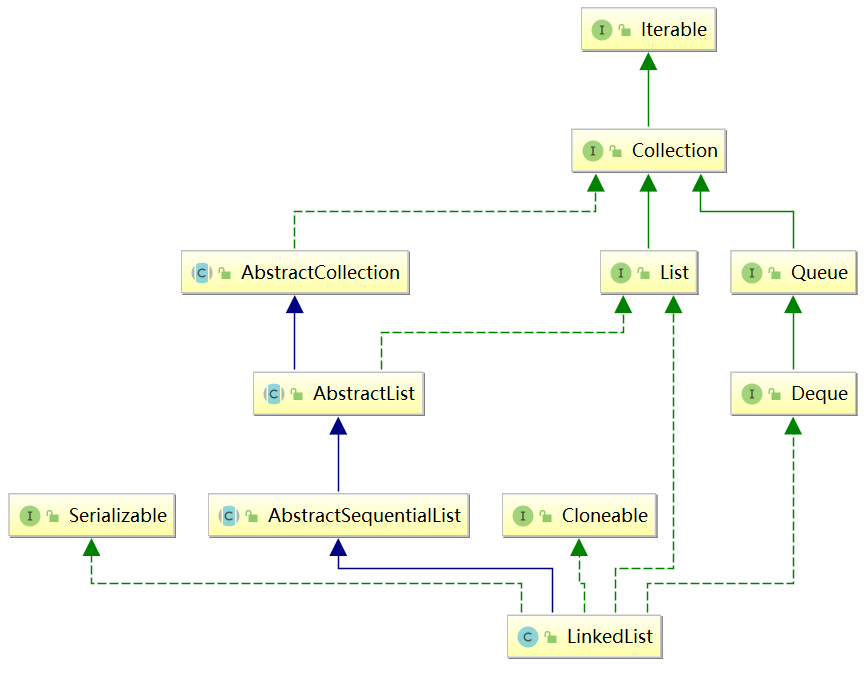
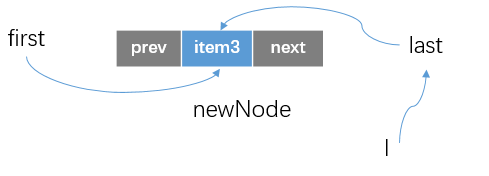
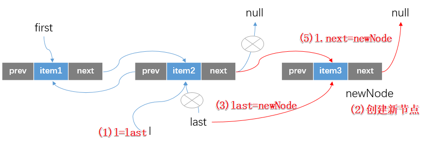
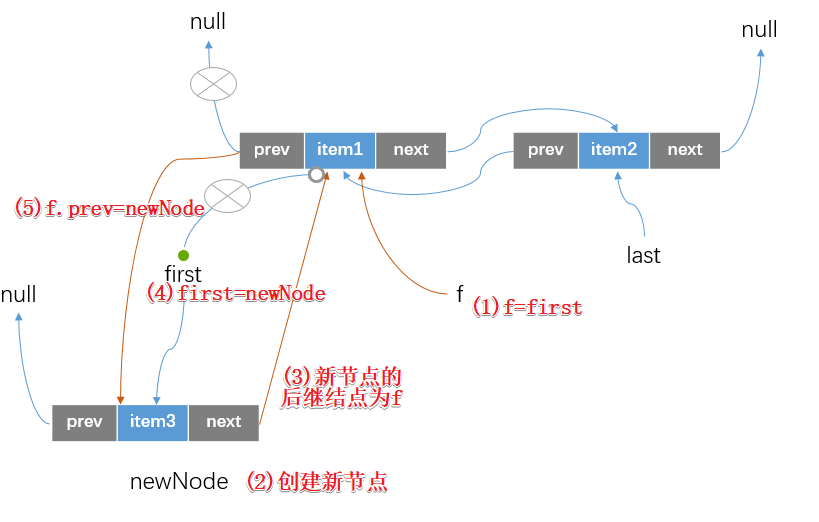
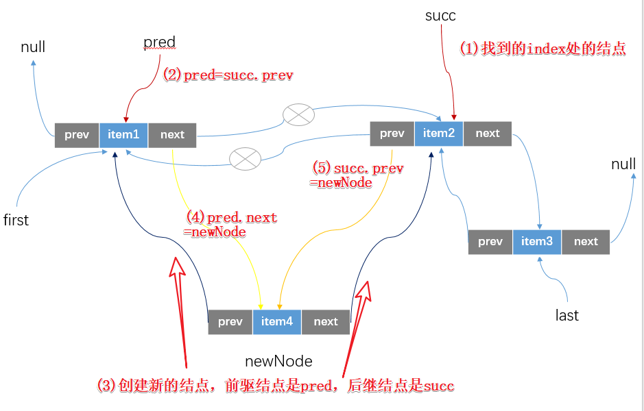

## LinkedList概述

​	LinkedList 是 Java 集合框架中一个重要的实现，我们先简述一下LinkedList的一些特点：

- `LinkedList `底层采用的`双向链表`结构；
- `LinkedList `支持空值和重复值(List的特点)；
- `LinkedList `实现Deque接口，具有双端队列的特性，也可以作为栈来使用；
- `LinkedList `存储元素过程中，无需像 ArrayList 那样进行扩容，但存储元素的节点需要额外的空间存储前驱和后继的引用；
- `LinkedList `在链表头部和尾部插入效率比较高，但在指定位置进行插入时，需要定位到该位置处的节点，此操作的时间复杂度为`O(N)`；
- `LinkedList `是非线程安全的集合类，并发环境下，多个线程同时操作 LinkedList，会引发不可预知的异常错误。

## LinkedList继承体系结构



​	直接通过idea查看一下LinkedList的继承体系，体系结构比较复杂，一点点看。

- 继承自 AbstractSequentialList；
- 实现了 List 和 Deque 接口；
- 实现序列化接口；
- 实现了Cloneable接口

​	这里简单说一下AbstractSequentialList这个类，该类提供一套基本的基于顺序访问的接口，通过继承此类，子类仅需实现部分代码即可拥有完整的一套访问某种序列表（比如链表）的接口。AbstractSequentialList 提供的方法基本上都是通过 ListIterator 实现的，比如下面的get和add方法。但是虽然LinkedList 继承了 AbstractSequentialList，却并没有直接使用父类的方法，而是重新实现了一套的方法，后面我们会讲到这些方法的实现。

```java
public E get(int index) {
    try {
        return listIterator(index).next();
    } catch (NoSuchElementException exc) {
        throw new IndexOutOfBoundsException("Index: "+index);
    }
}
public void add(int index, E element) {
    try {
        listIterator(index).add(element);
    } catch (NoSuchElementException exc) {
        throw new IndexOutOfBoundsException("Index: "+index);
    }
}
// 留给子类实现
public abstract ListIterator<E> listIterator(int index);
```

​	另外的就是文章开头概述的，LinkedList实现了Deque接口，具有双端队列的特点。

## LinkedList的成员属性

```java
//记录链表中的实际元素个数
transient int size = 0;
//维护链表的首结点引用
transient Node<E> first;
//维护链表的尾节点引用
transient Node<E> last;
```

可以看到first和last都是Node类型的，所以我们简单看一下`LinkedList`中的这个内部类

```java
private static class Node<E> {
    E item; //结点中存放的实际元素
    Node<E> next; //维护结点的后继结点
    Node<E> prev; //维护结点的前驱结点
	//构造方法，创建一个新的结点，参数为：前驱结点，插入元素引用，后继节点
    Node(Node<E> prev, E element, Node<E> next) {
        this.item = element;
        this.next = next;
        this.prev = prev;
    }
}
```

​	可以看到Node这个静态内部类的结构也是比较简单的，每个结点维护的就是自己存储的元素信息+前驱结点引用+后继节点引用。这里就不做过多的阐述，下面简单看看`LinkedList`的构造方法

## LinkedList的构造方法

```java
//构造一个空的集合（链表为空）
public LinkedList() {
}
//先调用自己的无参构造方法构造一个空的集合，然后将Collection集合中的所有元素加入该链表中
//如果传入的Collection为空，会抛出空指针异常
public LinkedList(Collection<? extends E> c) {
    this();
    addAll(c);
}
```

## LinkedList的主要方法

### add方法

LinkedList实现的添加方法主要有下面几种

- 在链表尾部添加结点（linkLast方法）

- 在链表首部添加元素（linkFirst方法）

- 在链表中间添加元素（linkBefore方法）

下面我们看看这三种方法的实现。

#### （1）linkLast方法

```java
public void addLast(E e) {
    linkLast(e);
}
```

​	在addLast方法中直接就是调用了linkLast方法实现结点的添加（没有返回值，所以add方法一定是返回true的），所以下面我们看看这个方法：

```java
void linkLast(E e) {
    //（1）获得当前链表实例的全局后继节点
    final Node<E> l = last;
    //（2）创建一个新的结点，从Node的构造方法我们就能知道
    //这个新的结点中存放的元素item为当前传入的泛型引用，前驱结点为全局后继结点，后继节点为null
    //(即相当于要将这个新节点作为链表的新的后继节点)
    final Node<E> newNode = new Node<>(l, e, null);// Node(Node<E> prev, E element, Node<E> next){}
    //（3）更新全局后继节点的引用
    last = newNode;
    //（4）如果原链表的后继结点为null，那么也需要将全局头节点引用指向这个新的结点
    if (l == null)
        first = newNode;
    //（5）不为null，因为是双向链表，创建新节点的时候只是将newNode的prev设置为原last结点。这里就需要将原last
    //结点的后继结点设置为newNode
    else
        l.next = newNode;
    //（6）更新当前链表中的size个数
    size++;
    //（7）这里是fast-fail机制使用的参数
    modCount++;
}
```

​	我们通过一个示例图来简单模拟这个过程

- 当链表初始时为空的时候，我么调用add方法添加一个新的结点



- 链表不为空，此时调用add方法在链表尾部添加结点的时候



#### （2）linkFirst方法

​	该方法是一个private方法，通过addFirst方法调用暴露给使用者。

```java
public void addFirst(E e) {
    linkFirst(e);
}
```

​	我们还是主要看看linkFirst方法的实现逻辑

```java
private void linkFirst(E e) {
    //（1）获取全局头节点
    final Node<E> f = first;
    //（2）创建一个新节点，其前驱结点为null，后继结点为当前的全局首结点
    final Node<E> newNode = new Node<>(null, e, f);
    //（3）更新全局首结点引用
    first = newNode;
    //（4）如果首结点为null，last结点指向新建的结点
    if (f == null)
        last = newNode;
    //（5）不为null，原头节点的前驱结点为newNode
    else
        f.prev = newNode;
    size++;
    modCount++;
}
```

​	上面的逻辑也比较简单，就是将新添加的结点设置为头节点，然后更新链表中结点之间的指向，我们通过下面这个图简单理解一下（链表初始为null就不做演示了，和上面图示的差不多，这里假设已经存在结点）



#### （3）linkBefore方法

```java
public void add(int index, E element) {
    //检查index的合法性：大于等于0小于等于size，不合法会抛出异常
    checkPositionIndex(index);
    //index等于size，就在尾部插入新节点，linkLast方法上面说到过
    if (index == size)
        linkLast(element);
    //否则就在指定index处插入结点，先找到index处的结点（调用的是node(index方法)）
    else
        linkBefore(element, node(index));
}
private void checkPositionIndex(int index) {
    if (!isPositionIndex(index))
        throw new IndexOutOfBoundsException(outOfBoundsMsg(index));
}
private boolean isPositionIndex(int index) {
    return index >= 0 && index <= size;
}
```

​	add(index,element)方法中主要的逻辑还是linkBefore，我们下面看看这个方法，在此之前调用的是node(index)方法，找到index处的结点

```java
Node<E> node(int index) {
    //index < size/2 （index在链表的前半部分）
    if (index < (size >> 1)) {
        //使用全局头节点去查找（遍历链表）
        Node<E> x = first;
        for (int i = 0; i < index; i++)
            x = x.next;
        return x;
    } else {
        //index > size / 2 （index在链表的后半部分）
        Node<E> x = last;
        //使用全局尾节点向前查找
        for (int i = size - 1; i > index; i--)
            x = x.prev;
        return x;
    }
}
```

​	node方法实现利用双向链表以及记录了链表总长度的这两个特点，分为前后两部分去遍历查询jindex位置处的结点。查找这个结点后，就会作为参数调用linkBefore方法，如下所示

```java
void linkBefore(E e, Node<E> succ) {
    //succ != null;succ就是指定位置处的结点
    //传入的结点element=succ
    final Node<E> pred = succ.prev;
    //创建新的结点
    //前驱结点是传入的结点的前驱结点
    //后继结点是传入的结点
    final Node<E> newNode = new Node<>(pred, e, succ);
    //更新index处结点的前驱结点引用
    succ.prev = newNode;
    //index处结点的前驱结点为null，那么就相当于在头部插入结点，并且更新first
    if (pred == null)
        first = newNode;
    //不为null，那么它的后继结点就是新的结点
    else
        pred.next = newNode;
    size++;
    modCount++;
}
```

​	这个方法的逻辑也比较简单，就是在succ和succ.prev两个结点之间插入一个新的结点，我们通过简单的图示理解这个过程



### 删除

​	作为双端队列，删除元素也有两种方式`队列首删除元素`、`队列尾删除元素`；作为List，又要支持`中间删除元素`，所以删除元素一个有三个方法。

#### （1）unlinkFirst方法

​	下面是调用unlinkFirst方法的两个public方法（Deque接口的方法实现），主要区别就是removeFirst方法执行时候，first为null的时候会抛出异常，而pollFirst返回null。

```java
// remove的时候如果没有元素抛出异常
public E removeFirst() {
    final Node<E> f = first;
    if (f == null)
        throw new NoSuchElementException();
    return unlinkFirst(f);
}
// poll的时候如果没有元素返回null
public E pollFirst() {
    final Node<E> f = first;
    return (f == null) ? null : unlinkFirst(f);
}
```

​	主要还是看unlinkFirst这个方法的实现

```java
private E unlinkFirst(Node<E> f) {
    // assert f == first && f != null;
    //获取头结点的元素值
    final E element = f.item;
    //获取头结点的后继结点
    final Node<E> next = f.next;
    //删除头节点中存放的元素item和后继结点，GC
    f.item = null;
    f.next = null; // help GC
    //更新头节点引用（原头节点的后继结点）
    first = next;
    //链表中只有一个结点，那么尾节点也是null了
    if (next == null)
        last = null;
    //将新的头节点的前驱结点设置为null
    else
        next.prev = null;
    //更新size和modCount
    size--;
    modCount++;
    //返回原头节点的值
    return element;
}
```

#### （2）unlinkLast方法

​	下面是调用unlinkLast方法的两个public方法（Deque接口的方法实现），主要区别就是removeLast方法执行时候，first为null的时候会抛出异常，而pollLast返回null。

```java
// remove的时候如果没有元素抛出异常
public E removeLast() {
    final Node<E> l = last;
    if (l == null)
        throw new NoSuchElementException();
    return unlinkLast(l);
}

// poll的时候如果没有元素返回null
public E pollLast() {
    final Node<E> l = last;
    return (l == null) ? null : unlinkLast(l);
}
```

​	下面是unlinkLast方法的实现

```java
// 删除尾节点
private E unlinkLast(Node<E> l) {
    // 尾节点的元素值
    final E element = l.item;
    // 尾节点的前置指针
    final Node<E> prev = l.prev;
    // 清空尾节点的内容，协助GC
    l.item = null;
    l.prev = null; // help GC
    // 让前置节点成为新的尾节点
    last = prev;
    // 如果只有一个元素，删除了把first置为空
    // 否则把前置节点的next置为空
    if (prev == null)
        first = null;
    else
        prev.next = null;
    // 更新size和modCount
    size--;
    modCount++;
    // 返回删除的元素
    return element;
}
```

#### （4）unlink方法

```java
// 删除中间节点
public E remove(int index) {
    // 检查是否越界
    checkElementIndex(index);
    // 删除指定index位置的节点
    return unlink(node(index));
}
```

```java
// 删除指定节点x
E unlink(Node<E> x) {
    // x的元素值
    final E element = x.item;
    // x的前置节点
    final Node<E> next = x.next;
    // x的后置节点
    final Node<E> prev = x.prev;
    // 如果前置节点为空
    // 说明是首节点，让first指向x的后置节点
    // 否则修改前置节点的next为x的后置节点
    if (prev == null) {
        first = next;
    } else {
        prev.next = next;
        x.prev = null;
    }
    // 如果后置节点为空
    // 说明是尾节点，让last指向x的前置节点
    // 否则修改后置节点的prev为x的前置节点
    if (next == null) {
        last = prev;
    } else {
        next.prev = prev;
        x.next = null;
    }
    // 清空x的元素值，协助GC
    x.item = null;
    // 元素个数减1
    size--;
    // 修改次数加1
    modCount++;
    // 返回删除的元素
    return element;
}
```

### 查找

​	`LinkedList `底层基于链表结构，无法向 ArrayList 那样随机访问指定位置的元素。LinkedList 查找过程要稍麻烦一些，需要从链表头结点（或尾节点）向后查找，时间复杂度为 `O(N)`。相关源码如下：

```java
public E get(int index) {
    checkElementIndex(index); //还是先检验index的合法性，这里上面已经说过
    //调用node方法遍历查询index处的结点，然后返回结点存放的值item，node方法上面已经说过
    return node(index).item; 
}
```

### 遍历

​	链表的遍历过程也很简单，和上面查找过程类似，我们从头节点往后遍历就行了。但对于 LinkedList 的遍历还是需要注意一些，不然可能会导致代码效率低下。通常情况下，我们会使用 foreach 遍历 LinkedList，而 foreach 最终转换成迭代器形式。所以分析 LinkedList 的遍历的核心就是它的迭代器实现，相关代码如下：

```java
public ListIterator<E> listIterator(int index) {
    checkPositionIndex(index);
    return new ListItr(index);
}
private class ListItr implements ListIterator<E> {
    private Node<E> lastReturned;
    private Node<E> next;
    private int nextIndex;
    private int expectedModCount = modCount;
	/** 构造方法将 next 引用指向指定位置的节点 */
    ListItr(int index) {
        // assert isPositionIndex(index);
        next = (index == size) ? null : node(index);
        nextIndex = index;
    }

    public boolean hasNext() {
        return nextIndex < size;
    }

    public E next() {
        checkForComodification();
        if (!hasNext())
            throw new NoSuchElementException();
        lastReturned = next;
        next = next.next;
        nextIndex++;
        return lastReturned.item;
    }
	//...other method
}
```

​	这里主要说下遍历 LinkedList 需要注意的一个点。LinkedList 不擅长随机位置访问，如果大家用随机访问的方式遍历 LinkedList，效率会很差。比如下面的代码：

```java
List<Integet> list = new LinkedList<>();
list.add(1)
list.add(2)
......
for (int i = 0; i < list.size(); i++) {
    Integet item = list.get(i);
    // do something
}
```

​	当链表中存储的元素很多时，上面的遍历方式对于效率肯定是非常低的。原因在于，通过上面的方式每获取一个元素(`调用get(i)方法，上面说到了这个方法的实现`)，LinkedList 都需要从头节点（或尾节点）进行遍历(`node()方法的实现`)，效率低，上面的遍历方式在大数据量情况下，效率很差。在日常使用中应该尽量避免这种用法。

## 总结

最后总结一下面试常问的`ArrayList`和`LinkedList`的区别，关于`ArrayList`请参考我上一篇[ArrayList源码分析](https://juejin.im/post/5d42ab5e5188255d691bc8d6)。

- `ArrayList`是基于动态数组实现的，`LinkedList`是基于双向链表实现的；

- 对于随机访问来说，`ArrayList`(数组下标访问)要优于`LinkedList`(遍历链表访问)；

- 不考虑直接在尾部添加数据的话，`ArrayList`按照指定的`index`添加/删除数据是通过复制数组实现。`LinkedList`通过寻址改变节点指向实现；所以添加元素的话LinkedList（改变结点的next和prev指向即可）要优于ArrayList（移动数组元素）。

- `LinkedList`在数据存储上不存在浪费空间的情况。`ArrayList`动态扩容会导致有一部分空间是浪费的。