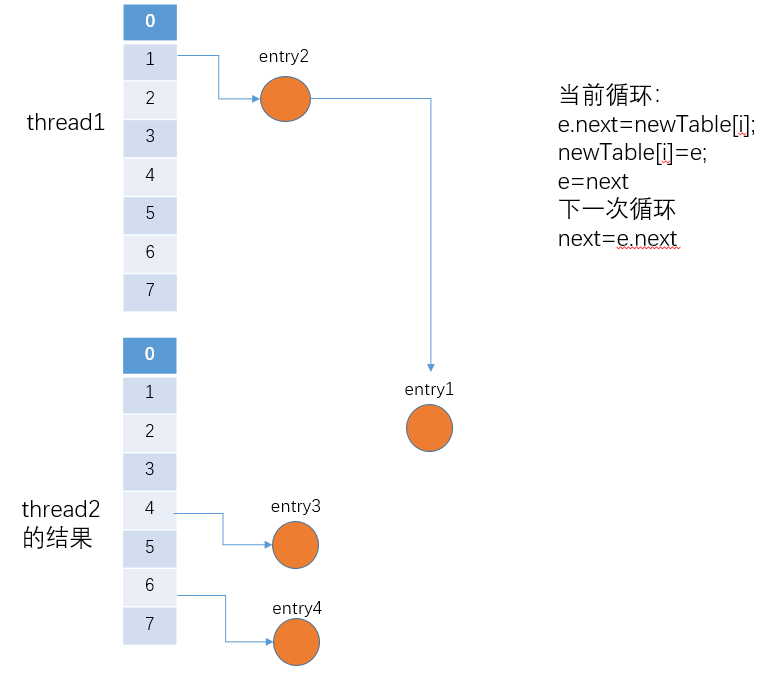

[HashMap中的存储结构图示](#HashMap中的存储结构图示)

[HashMap中的成员变量以及含义](#HashMap中的成员变量以及含义)

[HashMap构造方法](#HashMap构造方法)

[怎样确定元素在桶中的位置](#怎样确定元素在桶中的位置)

[put方法分析](#put方法分析)

[resize方法分析](#resize方法分析)

[get方法分析](#get方法分析)

## HashMap中的存储结构图示

​	jdk1.7的HashMap采用数组+单链表实现，尽管定义了hash函数来避免冲突，但因为数组长度有限，还是会出现两个不同的Key经过计算后在数组中的位置一样，1.7版本中采用了链表来解决。


​	从上面的简易示图中也能发现，如果位于链表中的结点过多，那么很显然通过key值依次查找效率太低，所以在1.8中对其进行了改良，采用数组+链表+红黑树来实现，当链表长度超过阈值8时，将链表转换为红黑树.具体细节参考我上一篇总结的 [深入理解jdk8中的HashMap](https://juejin.im/post/5d37b5475188251b4b32b993 )

​	从上面图中也知道实际上每个元素都是Entry类型，所以下面再来看看Entry中有哪些属性(在1.8中Entry改名为Node，同样实现了Map.Entry)。 

```java
//hash标中的结点Node,实现了Map.Entry
static class Entry<K,V> implements Map.Entry<K,V> {
    final K key;
    V value;
    Entry<K,V> next;
    int hash;
	//Entry构造器，需要key的hash，key，value和next指向的结点
    Entry(int h, K k, V v, Entry<K,V> n) {
        value = v;
        next = n;
        key = k;
        hash = h;
    }

    public final K getKey() { return key; }

    public final V getValue() { return value; }

    public final V setValue(V newValue) {
        V oldValue = value;
        value = newValue;
        return oldValue;
    }
    //equals方法
    public final boolean equals(Object o) {
        if (!(o instanceof Map.Entry))
            return false;
        Map.Entry e = (Map.Entry)o;
        Object k1 = getKey();
        Object k2 = e.getKey();
        if (k1 == k2 || (k1 != null && k1.equals(k2))) {
            Object v1 = getValue();
            Object v2 = e.getValue();
            if (v1 == v2 || (v1 != null && v1.equals(v2)))
                return true;
        }
        return false;
    }
	//重写Object的hashCode
    public final int hashCode() {
        return Objects.hashCode(getKey()) ^ Objects.hashCode(getValue());
    }

    public final String toString() {
        return getKey() + "=" + getValue();
    }

	//调用put（k，v）方法时候，如果key相同即Entry数组中的值会被覆盖，就会调用此方法。
    void recordAccess(HashMap<K,V> m) {
    }

    //只要从表中删除entry，就会调用此方法
    void recordRemoval(HashMap<K,V> m) {
    }
}
```

## HashMap中的成员变量以及含义

```java
//默认初始化容量初始化=16
static final int DEFAULT_INITIAL_CAPACITY = 1 << 4; // aka 16

//最大容量 = 1 << 30
static final int MAXIMUM_CAPACITY = 1 << 30;

//默认加载因子.一般HashMap的扩容的临界点是当前HashMap的大小 > DEFAULT_LOAD_FACTOR * 
//DEFAULT_INITIAL_CAPACITY = 0.75F * 16
static final float DEFAULT_LOAD_FACTOR = 0.75f;

//默认是空的table数组
static final Entry<?,?>[] EMPTY_TABLE = {};

//table[]默认也是上面给的EMPTY_TABLE空数组，所以在使用put的时候必须resize长度为2的幂次方值
transient Entry<K,V>[] table = (Entry<K,V>[]) EMPTY_TABLE;

//map中的实际元素个数 != table.length
transient int size;

//扩容阈值，当size大于等于其值，会执行resize操作
//一般情况下threshold=capacity*loadFactor
int threshold;

//hashTable的加载因子
final float loadFactor;

/**
     * The number of times this HashMap has been structurally modified
     * Structural modifications are those that change the number of mappings in
     * the HashMap or otherwise modify its internal structure (e.g.,
     * rehash).  This field is used to make iterators on Collection-views of
     * the HashMap fail-fast.  (See ConcurrentModificationException).
     */
transient int modCount;

//hashSeed用于计算key的hash值，它与key的hashCode进行按位异或运算
//hashSeed是一个与实例相关的随机值，用于解决hash冲突
//如果为0则禁用备用哈希算法
transient int hashSeed = 0;
```

## HashMap构造方法

​	我们看看HashMap源码中为我们提供的四个构造方法。

```java
//(1)无参构造器：
//构造一个空的table，其中初始化容量为DEFAULT_INITIAL_CAPACITY=16。加载因子为DEFAULT_LOAD_FACTOR=0.75F
public HashMap() {
    this(DEFAULT_INITIAL_CAPACITY, DEFAULT_LOAD_FACTOR);
}
```

```java
//(2)指定初始化容量的构造器
//构造一个空的table，其中初始化容量为传入的参数initialCapacity。加载因子为DEFAULT_LOAD_FACTOR=0.75F
public HashMap(int initialCapacity) {
    this(initialCapacity, DEFAULT_LOAD_FACTOR);
}
```

```java
//(3)指定初始化容量和加载因子的构造器
//构造一个空的table，初始化容量为传入参数initialCapacity，加载因子为loadFactor
public HashMap(int initialCapacity, float loadFactor) {
    //对传入初始化参数进行合法性检验，<0就抛出异常
    if (initialCapacity < 0)
        throw new IllegalArgumentException("Illegal initial capacity: " +
                                           initialCapacity);
    //如果initialCapacity大于最大容量，那么容量=MAXIMUM_CAPACITY
    if (initialCapacity > MAXIMUM_CAPACITY)
        initialCapacity = MAXIMUM_CAPACITY;
    //对传入加载因子参数进行合法检验，
    if (loadFactor <= 0 || Float.isNaN(loadFactor))
        //<0或者不是Float类型的数值，抛出异常
        throw new IllegalArgumentException("Illegal load factor: " +
                                           loadFactor);
	//两个参数检验完了，就给本map实例的属性赋值
    this.loadFactor = loadFactor;
    threshold = initialCapacity;
    //init是一个空的方法，模板方法，如果有子类需要扩展可以自行实现
    init();
}
```

​	从上面的这3个构造方法中我们可以发现虽然指定了初始化容量大小，但此时的table还是空，是一个空数组，且扩容阈值threshold为给定的容量或者默认容量(前两个构造方法实际上都是通过调用第三个来完成的)。在其put操作前，会创建数组（跟jdk8中使用无参构造时候类似）.

```java
//(4)参数为一个map映射集合
//构造一个新的map映射，使用默认加载因子，容量为参数map大小除以默认负载因子+1与默认容量的最大值
public HashMap(Map<? extends K, ? extends V> m) {
    //容量：map.size()/0.75+1 和 16两者中更大的一个
    this(Math.max(
        	(int) (m.size() / DEFAULT_LOAD_FACTOR) + 1,
                  DEFAULT_INITIAL_CAPACITY), 
         DEFAULT_LOAD_FACTOR);
    inflateTable(threshold);
    //把传入的map里的所有元素放入当前已构造的HashMap中
    putAllForCreate(m);
}
```

​	这个构造方法便是在put操作前调用inflateTable方法，这个方法具体的作用就是创建一个新的table用以后面使用putAllForCreate装入传入的map中的元素，这个方法我们来看下，注意刚也提到了此时的threshold扩容阈值是初始容量。下面对其中的一些方法进行说明

### (1)inflateTable方法说明

​	这个方法比较重要，在第四种构造器中调用了这个方法。而如果创建集合对象的时候使用的是前三种构造器的话会在调用put方法的时候调用该方法对table进行初始化

```java
private void inflateTable(int toSize) {
    //返回不小于number的最小的2的幂数，最大为MAXIMUM_CAPACITY,类比jdk8的实现中的tabSizeFor的作用
    int capacity = roundUpToPowerOf2(toSize);
	//扩容阈值为：(容量*加载因子)和(最大容量+1)中较小的一个
    threshold = (int) Math.min(capacity * loadFactor, MAXIMUM_CAPACITY + 1);
    //创建table数组
    table = new Entry[capacity];
    initHashSeedAsNeeded(capacity);
}
```

### (2)roundUpToPowerOf方法说明

```java
private static int roundUpToPowerOf2(int number) {
    //number >= 0，不能为负数，
    //(1)number >= 最大容量：就返回最大容量
    //(2)0 =< number <= 1：返回1
    //(3)1 < number < 最大容量：
    return number >= MAXIMUM_CAPACITY
        ? MAXIMUM_CAPACITY
        : (number > 1) ? Integer.highestOneBit((number - 1) << 1) : 1;
}
//该方法和jdk8中的tabSizeFor实现基本差不多
public static int highestOneBit(int i) {
    //因为传入的i>0,所以i的高位还是0，这样使用>>运算符就相当于>>>了，高位0。
    //还是举个例子，假设i=5=0101
    i |= (i >>  1); //（1）i>>1=0010；（2）i= 0101 | 0010 = 0111
    i |= (i >>  2); //（1）i>>2=0011；（2）i= 0111 | 0011 = 0111
    i |= (i >>  4); //（1）i>>4=0000；（2）i= 0111 | 0000 = 0111
    i |= (i >>  8); //（1）i>>8=0000；（2）i= 0111 | 0000 = 0111
    i |= (i >> 16); //（1）i>>16=0000；（2）i= 0111 | 0000 = 0111
    return i - (i >>> 1); //（1）0111>>>1=0011（2）0111-0011=0100=4
    //所以这里返回4。
    //而在上面的roundUpToPowerOf2方法中，最后会将highestOneBit的返回值进行 << 1 操作，即最后的结果为4<<1=8.就是返回大于number的最小2次幂
}
```

### (3)putAllForCreate方法说明

​	该方法就是遍历传入的map集合中的元素，然后加入本map实例中。下面我们来看看该方法的实现细节

```java
private void putAllForCreate(Map<? extends K, ? extends V> m) {
    //实际上就是遍历传入的map，将其中的元素添加到本map实例中（putForCreate方法实现）
    for (Map.Entry<? extends K, ? extends V> e : m.entrySet())
        putForCreate(e.getKey(), e.getValue());
}
```

​	putForCreate方法原理实现

```java
private void putForCreate(K key, V value) {
    //判断key是否为null，如果为null那么对应的hash为0，否则调用刚刚上面说到的hash()方法计算hash值
    int hash = null == key ? 0 : hash(key); 
    //根据刚刚计算得到的hash值计算在table数组中的下标
    int i = indexFor(hash, table.length);
    for (Entry<K,V> e = table[i]; e != null; e = e.next) {
        Object k;
        //hash相同，key也相同，直接用旧的值替换新的值
        if (e.hash == hash &&
            ((k = e.key) == key || (key != null && key.equals(k)))) {
            e.value = value;
            return;
        }
    }
	//这里就是：要插入的元素的key与前面的链表中的key都不相同，所以需要新加一个结点加入链表中
    createEntry(hash, key, value, i);
}
```

### (4)createEntry方法实现

```java
void createEntry(int hash, K key, V value, int bucketIndex) {
    //这里说的是，前面的链表中不存在相同的key，所以调用这个方法创建一个新的结点，并且结点所在的桶
    //bucket的下标指定好了
    Entry<K,V> e = table[bucketIndex];
    /*Entry(int h, K k, V v, Entry<K,V> n) {value = v;next = n;key = k;hash = h;}*/
    table[bucketIndex] = new Entry<>(hash, key, value, e);//Entry的构造器，创建一个新的结点作为头节点（头插法）
    size++;//将当前hash表中的数量加1
}
```

## 怎样确定元素在桶中的位置

​	1.7中的计算hash值的算法和1.8的实现是不一样的，而hash值又关系到我们put新元素的位置、get查找元素、remove删除元素的时候去通过indexFor查找下标。所以我们来看看这两个方法

### 	(1)hash方法

```java
final int hash(Object k) {
    int h = hashSeed;
    //默认是0，不是0那么需要key是String类型才使用stringHash32这种hash方法
    if (0 != h && k instanceof String) {
        return sun.misc.Hashing.stringHash32((String) k);
    }
    //这段代码是为了对key的hashCode进行扰动计算，防止不同hashCode的高位不同但低位相同导致的hash冲突。简单点
    //说，就是为了把高位的特征和低位的特征组合起来，降低哈希冲突的概率，也就是说，尽量做到任何一位的变化都能对
    //最终得到的结果产生影响
    h ^= k.hashCode();
    h ^= (h >>> 20) ^ (h >>> 12);
    return h ^ (h >>> 7) ^ (h >>> 4);
}
```

​	我们通过下面的例子来说明对于key的hashCode进行扰动处理的重要性，我们现在想向一个map中put一个Key-Value对，Key的值为“fsmly”，不进行任何的扰动处理知识单纯的经过简单的获取hashcode后，得到的值为“**0000_0000_0011_0110_0100_0100_1001_0010**”，如果当前map的中的table数组长度为16，最终得到的index结果值为10。由于15的二进制扩展到32位为“00000000000000000000000000001111”，所以，一个数字在和他进行按位与操作的时候，前28位无论是什么，计算结果都一样（因为0和任何数做与，结果都为0，那这样的话一个put的Entry结点就太过依赖于key的hashCode的低位值，产生冲突的概率也会大大增加）。如下图所示


​	因为map的数组长度是有限的，这样冲突概率大的方法是不适合使用的，所以需要对hashCode进行扰动处理降低冲突概率，而JDK7中对于这个处理使用了四次位运算，还是通过下面的简单例子看一下这个过程.可以看到，刚刚不进行扰动处理的hashCode在进行处理后就没有产生hash冲突了。


​	总结一下：我们会首先计算传入的key的hash值然后通过下面的indexFor方法确定在table中的位置，具体实现就是通过一个计算出来的hash值和length-1做位运算，那么对于2^n来说，长度减一转换成二进制之后就是低位全一（长度16，len-1=15,二进制就是1111）。上面四次扰动的这种设定的好处就是，对于得到的hashCode的每一位都会影响到我们索引位置的确定，其目的就是为了能让数据更好的散列到不同的桶中，降低hash冲突的发生。关于Java集合中存在hash方法的更多原理和细节，请参考这篇[hash()方法分析](https://www.hollischuang.com/archives/2091)

### 	(2)indexFor方法

```java
static int indexFor(int h, int length) {
    //还是使用hash & (n - 1)计算得到下标
    return h & (length-1);
}
```

 主要实现就是将计算的key的hash值与map中数组长度length-1进行按位与运算，得到put的Entry在table中的数组下标。具体的计算过程在上面hash方法介绍的时候也有示例，这里就不赘述了。

## put方法分析

### 	(1)put方法

```java
public V put(K key, V value) {
    //我们知道Hash Map有四中构造器，而只有一种(参数为map的)初始化了table数组，其余三个构造器只
    //是赋值了阈值和加载因子，所以使用这三种构造器创建的map对象，在调用put方法的时候table为{}，
    //其中没有元素，所以需要对table进行初始化
    if (table == EMPTY_TABLE) {
        //调用inflateTable方法，对table进行初始化，table的长度为：
        //不小于threshold的最小的2的幂数，最大为MAXIMUM_CAPACITY
        inflateTable(threshold);
    }
    //如果key为null，表示插入一个键为null的K-V对，需要调用putForNullKey方法
    if (key == null)
        return putForNullKey(value);
    
    //计算put传入的key的hash值
    int hash = hash(key);
    //根据hash值和table的长度计算所在的下标
    int i = indexFor(hash, table.length);
    //从数组中下标为indexFor(hash, table.length)处开始（1.7中是用链表解决hash冲突的，这里就
    //是遍历链表），实际上就是已经定位到了下标i，这时候就需要处理可能出现hash冲突的问题
    for (Entry<K,V> e = table[i]; e != null; e = e.next) {
        Object k;
        //hash值相同，key相同，替换该位置的oldValue为value
        if (e.hash == hash && ((k = e.key) == key || key.equals(k))) {
            V oldValue = e.value;
            e.value = value;
            //空方法，让其子类重写
            e.recordAccess(this);
            return oldValue;
        }
    }
	//如果key不相同，即在链表中没有找到相同的key，那么需要将这个结点加入table[i]这个链表中
    
    //修改modCount值（后续总结文章会说到这个问题）
    modCount++;
    //遍历没有找到该key，就调用该方法添加新的结点
    addEntry(hash, key, value, i);
    return null;
}
```

### (2)putForNullKey方法分析

​	这个方法是处理key为null的情况的，当传入的key为null的时候，会在table[0]位置开始遍历，遍历的实际上是当前以table[0]为head结点的链表，如果找到链表中结点的key为null，那么就直接替换掉旧值为传入的value。否则创建一个新的结点并且加入的位置为table[0]位置处。

```java
//找到table数组中key为null的那个Entry对象，然后将其value进行替换
private V putForNullKey(V value) {
    //从table[0]开始遍历
    for (Entry<K,V> e = table[0]; e != null; e = e.next) {
        //key为null
        if (e.key == null) {
            //将value替换为传递进来的value
            V oldValue = e.value;
            e.value = value;
            e.recordAccess(this);
            return oldValue; //返回旧值
        }
    }
    modCount++;
    //若不存在，0位置桶上的链表中添加新结点
    addEntry(0, null, value, 0);
    return null;
}
```

### (3)addEntry方法分析

​	addEntry方法的主要作用就是判断当前的size是否大于阈值，然后根据结果判断是否扩容，最终创建一个新的结点插入在链表的头部（实际上就是table数组中的那个指定下标位置处）

```java
/*
	hashmap采用头插法插入结点，为什么要头插而不是尾插，因为后插入的数据被使用的频次更高，而单链表无法随机访问只能从头开始遍历查询，所以采用头插.突然又想为什么不采用二维数组的形式利用线性探查法来处理冲突，数组末尾插入也是O(1)，可数组其最大缺陷就是在于若不是末尾插入删除效率很低，其次若添加的数据分布均匀那么每个桶上的数组都需要预留内存.
*/
void addEntry(int hash, K key, V value, int bucketIndex) {
    //这里有两个条件
    //①size是否大于阈值
    //②当前传入的下标在table中的位置不为null
    if ((size >= threshold) && (null != table[bucketIndex])) {
        //如果超过阈值需要进行扩容
        resize(2 * table.length);
        //下面是扩容之后的操作
        //计算不为null的key的hash值，为null就是0
        hash = (null != key) ? hash(key) : 0;
        //根据hash计算下标
        bucketIndex = indexFor(hash, table.length);
    }
    //执行到这里表示（可能已经扩容也可能没有扩容），创建一个新的Entry结点
    createEntry(hash, key, value, bucketIndex);
}
```

### (4)总结put方法的执行流程

1. 首先判断数组是否为空，若为空调用inflateTable进行扩容.
2. 接着判断key是否为null，若为null就调用putForNullKey方法进行put.（这里也说明HashMap允许key为null，默认插入在table中位置为0处）
3. 调用hash()方法，将key进行一次哈希计算，得到的hash值和当前数组长度进行&计算得到数组中的索引
4. 然后遍历该数组索引下的链表，若key的hash和传入key的hash相同且key的equals放回true，那么直接覆盖 value 
5. 最后若不存在，那么在此链表中头插创建新结点

## resize方法分析

### 	(1)resize的大体流程

```java
void resize(int newCapacity) {
    //获取map中的旧table数组暂存起来
    Entry[] oldTable = table;
    //获取原table数组的长度暂存起来
    int oldCapacity = oldTable.length;
    //如果原table的容量已经超过了最大值，旧直接将阈值设置为最大值
    if (oldCapacity == MAXIMUM_CAPACITY) {
        threshold = Integer.MAX_VALUE;
        return;
    }
	//以传入的新的容量长度为新的哈希表的长度，创建新的数组
    Entry[] newTable = new Entry[newCapacity];
    //调用transfer
    transfer(newTable, initHashSeedAsNeeded(newCapacity));
    //table指向新的数组
    table = newTable;
    //更新阈值
    threshold = (int)Math.min(newCapacity * loadFactor, MAXIMUM_CAPACITY + 1);
}
```

### 	(2)transfer方法分析

​	transfer方法遍历旧数组所有Entry，根据新的容量逐个重新计算索引头插保存在新数组中。

```java
void transfer(Entry[] newTable, boolean rehash) {
    //新数组的长度
    int newCapacity = newTable.length;
    //遍历旧数组
    for (Entry<K,V> e : table) {
        while(null != e) {
            Entry<K,V> next = e.next;
            if (rehash) {
                //重新计算hash值
                e.hash = null == e.key ? 0 : hash(e.key);
            }
            //这里根据刚刚得到的新hash重新调用indexFor方法计算下标索引
            int i = indexFor(e.hash, newCapacity);
            //假设当前数组中某个位置的链表结构为a->b->c;women 
            //（1）当为原链表中的第一个结点的时候：e.next=null;newTable[i]=e;e=e.next
            //（2）当遍历到原链表中的后续节点的时候：e.next=head;newTable[i]=e（这里将头节点设置为新插入的结点，即头插法）;e=e.next
            //（3）这里也是导致扩容后，链表顺序反转的原理（代码就是这样写的，链表反转，当然前提是计算的新下标还是相同的）
            e.next = newTable[i]; 
            newTable[i] = e;
            e = next;
        }
    }
}
```

​	这个方法的主要部分就是，在重新计算hash之后对于原链表和新table中的链表结构的差异，我们通过下面这个简单的图理解一下，假设原table中位置为4处为一个链表entry1->entry2->entry3,三个结点在新数组中的下标计算还是4，那么这个流程大概如下图所示


### (3)resize扩容方法总结

1. ​	创建一个新的数组（长度为原长度为2倍，如果已经超过最大值就设置为最大值）
2. 调用transfer方法将entry从旧的table中移动到新的数组中，具体细节如上所示
3. 将table指向新的table，更新阈值

## get方法分析

```java
//get方法，其中调用的是getEntry方法没如果不为null就返回对应entry的value
public V get(Object key) {
    if (key == null)
        return getForNullKey();
    Entry<K,V> entry = getEntry(key);
    return null == entry ? null : entry.getValue();
}
```

​	可以看到，get方法中是调用getEntry查询到Entry对象，然后返回Entry的value的。所以下面看看getEntry方法的实现

### getEntry方法

```java
//这是getEntry的实现
final Entry<K,V> getEntry(Object key) {
    //没有元素自然返回null
    if (size == 0) {
        return null;
    }
	//通过传入的key值调用hash方法计算哈希值
    int hash = (key == null) ? 0 : hash(key);
    //计算好索引之后，从对应的链表中遍历查找Entry
    for (Entry<K,V> e = table[indexFor(hash, table.length)];
         e != null;
         e = e.next) {
        Object k;
        //hash相同，key相同就返回
        if (e.hash == hash &&
            ((k = e.key) == key || (key != null && key.equals(k))))
            return e;
    }
    return null;
}
```

### getForNullKey方法

```java
//这个方法是直接查找key为null的
private V getForNullKey() {
    if (size == 0) {
        return null;
    }
    //直接从table中下标为0的位置处的链表（只有一个key为null的）开始查找
    for (Entry<K,V> e = table[0]; e != null; e = e.next) {
        //key为null，直接返回对应的value
        if (e.key == null)
            return e.value;
    }
    return null;
}
```

## jdk1.7版本的实现简单总结

​	(1)因为其put操作对key为null场景使用putForNullKey方法做了单独处理，HashMap允许null作为Key

​	(2)在计算table的下标的时候，是根据key的hashcode值调用hash()方法之后获取hash值与数组length-1进行&运算，length-1的二进制位全为1，这是为了能够均匀分布，避免冲突（长度要求为2的整数幂次方）
​	(3)不管是get还是put以及resize，执行过程中都会对key的hashcode进行hash计算，而可变对象其hashcode很容易变化，所以HashMap建议用不可变对象(如String类型)作为Key.
​	(4)HashMap是线程不安全的，在多线程环境下扩容时候可能会导致环形链表死循环，所以若需要多线程场景下操作可以使用ConcurrentHashMap（下面我们通过图示简单演示一下这个情况）
​	(5)当发生冲突时，HashMap采用链地址法处理冲突
​	(6)HashMap初始容量定为16，简单认为是8的话扩容阈值为6，阈值太小导致扩容频繁;而32的话可能空间利用率低。

## jdk7中并发情况下的死循环问题图解

​	上面在说到resize方法的时候，我们也通过图示实例讲解了一个resize的过程，所以这里我们就不再演示单线程下面的执行流程了。我们首先记住resize方法中的几行核心代码

```java
Entry<K,V> next = e.next;
//省略重新计算hash和index的两个过程...
e.next = newTable[i]; 
newTable[i] = e;
e = next;
```

​	resize方法中调用的transfer方法的主要几行代码就是上面的这四行，下来简单模拟一下假设两个线程thread1和thread2执行了resize的过程.

​	(1)resize之前，假设table长度为2,假设现在再添加一个entry4，就需要扩容了


​	(2)假设现在thread1执行到了 **Entry<K,V> next = e.next;**这行代码处，那么根据上面几行代码，我们简单做个注释


​	(3)然后由于线程调度轮到thread2执行，假设thread2执行完transfer方法（假设entry3和entry4在扩容后到了如下图所示的位置，这里我们主要关注entry1和entry2两个结点），那么得到的结果为


(4)此时thread1被调度继续执行，将entry1插入到新数组中去，然后e为Entry2，轮到下次循环时next由于Thread2的操作变为了Entry1

- **先是执行 newTalbe[i] = e;**在thread1执行时候，e指向的是entry1
- **然后是e = next，导致了e指向了entry2**（next指向的是entry2）
- **而下一次循环的next = e.next，（即next=entry2.next=entry1这是thread2执行的结果）导致了next指向了entry1**

如下图所示


​	(5)thread1继续执行，将entry2拿下来，放在newTable[1]这个桶的第一个位置，然后移动e和next



（6）**e.next = newTable[1] 导致  entry1.next 指向了 entry2**,也要注意，**此时的entry2.next 已经指向了entry1(thread2执行的结果就是entry2->entry1,看上面的thread2执行完的示意图)， 环形链表就这样出现了。**


