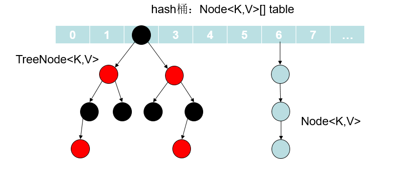
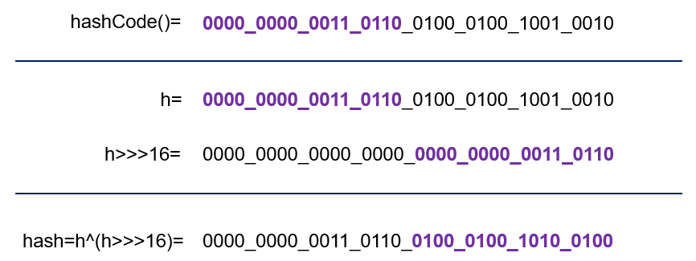
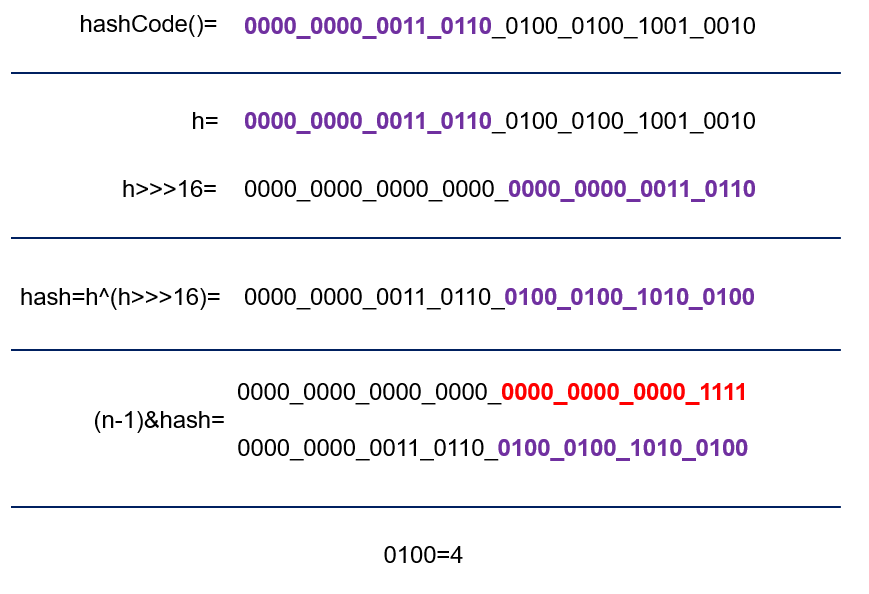
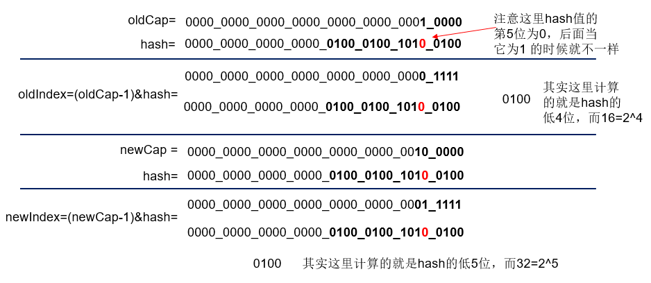
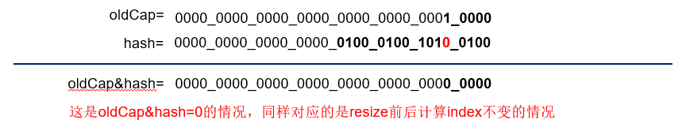
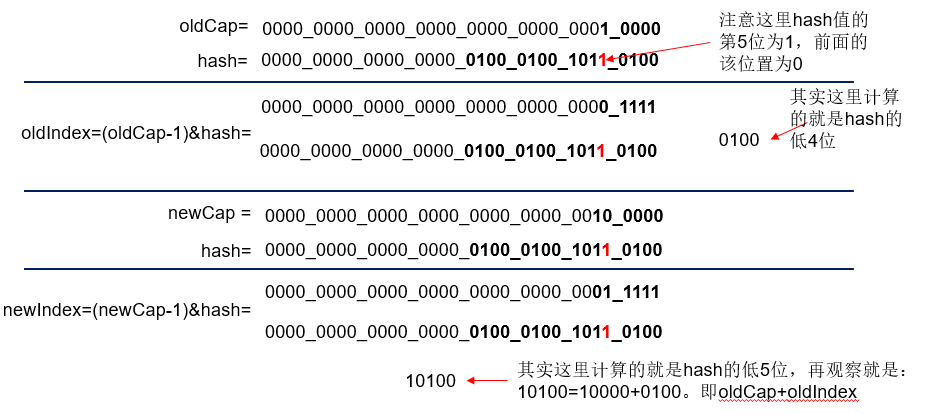
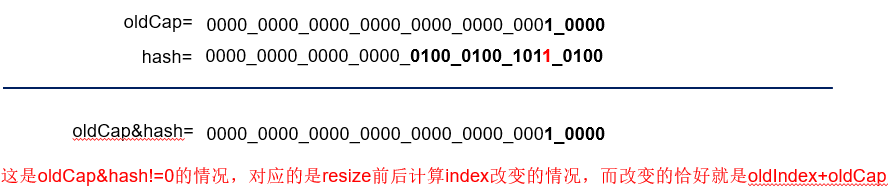
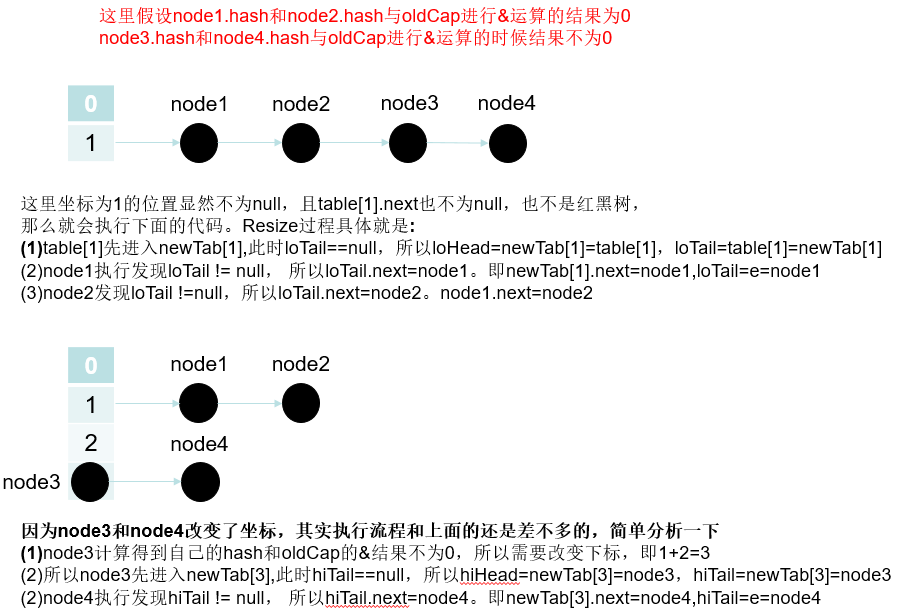
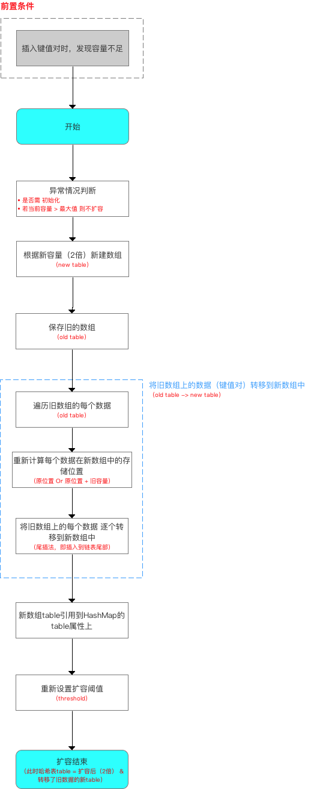

[HashMap中的存储结构图示](#HashMap中的存储结构图示)

[HashMap中的成员变量以及含义](#HashMap中的成员变量以及含义)

[HashMap构造方法](#HashMap构造方法)

[怎样确定元素在桶中的位置](#怎样确定元素在桶中的位置)

[put方法分析](#put方法分析)

[resize方法分析](#resize方法分析)

[get方法分析](#get方法分析)

# HashMap jdk1.8版本

## HashMap中的存储结构图示

​	因为主要说的是1.8版本中的实现。而1.8中HashMap是数组+链表+红黑树实现的，大概如下图所示。后面还是主要介绍Hash Map中主要的一些成员以及方法原理。



​	那么上述图示中的结点Node具体类型是什么，源码如下。Node是HashMap的内部类，实现了Map.Entery接口，主要就是存放我们put方法所添加的元素。其中的next就表示这可以构成一个单向链表，这主要是通过链地址法解决发生hash冲突问题。而当桶中的元素个数超过阈值的时候就换转为红黑树。

```java
//hash桶中的结点Node,实现了Map.Entry
static class Node<K,V> implements Map.Entry<K,V> {
    final int hash;
    final K key;
    V value;
    Node<K,V> next; //链表的next指针
    Node(int hash, K key, V value, Node<K,V> next) {
        this.hash = hash;
        this.key = key;
        this.value = value;
        this.next = next;
    }
    public final K getKey()        { return key; }
    public final V getValue()      { return value; }
    public final String toString() { return key + "=" + value; }
    //重写Object的hashCode
    public final int hashCode() {
        return Objects.hashCode(key) ^ Objects.hashCode(value);
    }
    public final V setValue(V newValue) {
        V oldValue = value;
        value = newValue;
        return oldValue;
    }
    //equals方法
    public final boolean equals(Object o) {
        if (o == this)
            return true;
        if (o instanceof Map.Entry) {
            Map.Entry<?,?> e = (Map.Entry<?,?>)o;
            if (Objects.equals(key, e.getKey()) &&
                Objects.equals(value, e.getValue()))
                return true;
        }
        return false;
    }
}
//转变为红黑树后的结点类
static final class TreeNode<k,v> extends LinkedHashMap.Entry<k,v> {
    TreeNode<k,v> parent;  // 父节点
    TreeNode<k,v> left; //左子树
    TreeNode<k,v> right;//右子树
    TreeNode<k,v> prev;    // needed to unlink next upon deletion
    boolean red;    //颜色属性
    TreeNode(int hash, K key, V val, Node<k,v> next) {
        super(hash, key, val, next);
    }
    //返回当前节点的根节点
    final TreeNode<k,v> root() {
        for (TreeNode<k,v> r = this, p;;) {
            if ((p = r.parent) == null)
                return r;
            r = p;
        }
    }
}
```

​	上面只是大概了解了一下HashMap的简单组成，下面主要介绍其中的一些参数和重要的方法原理实现。

## HashMap中的成员变量以及含义

```java
//默认初始化容量初始化=16
static final int DEFAULT_INITIAL_CAPACITY = 1 << 4; // aka 16
//最大容量 = 1 << 30
static final int MAXIMUM_CAPACITY = 1 << 30;
//默认加载因子.一般HashMap的扩容的临界点是当前HashMap的大小 > DEFAULT_LOAD_FACTOR * 
//DEFAULT_INITIAL_CAPACITY = 0.75F * 16
static final float DEFAULT_LOAD_FACTOR = 0.75f;
//当hash桶中的某个bucket上的结点数大于该值的时候，会由链表转换为红黑树
static final int TREEIFY_THRESHOLD = 8;
//当hash桶中的某个bucket上的结点数小于该值的时候，红黑树转变为链表
static final int UNTREEIFY_THRESHOLD = 6;
//桶中结构转化为红黑树对应的table的最小大小
static final int MIN_TREEIFY_CAPACITY = 64;
//hash算法,计算传入的key的hash值，下面会有例子说明这个计算的过程
static final int hash(Object key) {
    int h;
    return (key == null) ? 0 : (h = key.hashCode()) ^ (h >>> 16);
} 
//tableSizeFor(initialCapacity)返回大于initialCapacity的最小的二次幂数值。下面会有例子说明
static final int tableSizeFor(int cap) {
    int n = cap - 1;
    n |= n >>> 1;
    n |= n >>> 2;
    n |= n >>> 4;
    n |= n >>> 8;
    n |= n >>> 16;
    return (n < 0) ? 1 : (n >= MAXIMUM_CAPACITY) ? MAXIMUM_CAPACITY : n + 1;
}
//hash桶
transient Node<K,V>[] table;
//保存缓存的entrySet
transient Set<Map.Entry<K,V>> entrySet;
//桶的实际元素个数 != table.length
transient int size;
//扩容或者更改了map的计数器。含义：表示这个HashMap结构被修改的次数，结构修改是那些改变HashMap中的映射数量或者
//修改其内部结构（例如，重新散列rehash）的修改。 该字段用于在HashMap失败快速（fast-fail）的Collection-views
//上创建迭代器。
transient int modCount;
//临界值，当实际大小（cap*loadFactor）大于该值的时候，会进行扩充
int threshold;
//加载因子
final float loadFactor;
```

### (1)hash方法说明

```java
//hash算法
static final int hash(Object key) {
    int h;
    //key == null : 返回hash=0
    //key != null 
    //（1）得到key的hashCode：h=key.hashCode()
    //（2）将h无符号右移16位
    //（3）异或运算：h ^ h>>>16
    return (key == null) ? 0 : (h = key.hashCode()) ^ (h >>> 16);
}   
```

​	假设现在我们向一个map中添加元素，例如map.put("fsmly","test")，那么其中key为"fsmly"的hashCode的二进制表示为**0000_0000_0011_0110_0100_0100_1001_0010**，按照上面的步骤来计算，那么我们调用hash算法得到的hash值为：‭



### (2)tableSizeFor方法说明

​	该方法的作用就是：返回大于initialCapacity的最小的二次幂数值。如下实例

```java
//n=cap-1=5; 5的二进制0101B。>>> 操作符表示无符号右移，高位取0
//n |= n>>>1: (1)n=0101 | 0101>>>1; (2)n=0101 | 0010; (3)n = 0111B 
//n |= n>>>2: (1)n=0111 | 0111>>>2; (2)n=0111 | 0011; (3)n = 0111B
//n |= n>>>4: (1)n=0111 | 0111>>>4; (2)n=0111 | 0000; (3)n = 0111B
//n |= n>>>8: (1)n=0111 | 0111>>>8; (2)n=0111 | 0000; (3)n = 0111B
//n |= n>>>16:(1)n=0111 | 0111>>>16;(2)n=0111 | 0000; (3)n = 0111B
static final int tableSizeFor(int cap) {
    int n = cap - 1;
    n |= n >>> 1;
    n |= n >>> 2;
    n |= n >>> 4;
    n |= n >>> 8;
    n |= n >>> 16;
    //n<0返回1
    //n>最大容量，返回最大容量
    //否则返回n+1(0111B+1B=1000B=8)
    return (n < 0) ? 1 : (n >= MAXIMUM_CAPACITY) ? MAXIMUM_CAPACITY : n + 1;
}
```

​	再看下面这个：

```java
//至于这里为什么减1，当传入的cap为2的整数次幂的时候，减1即保证最后的计算结果还是cap，而不是大于cap的另一个2的
//整数次幂，例如我们传入cap=16=10000B.按照上面那样计算
//n=cap-1=15=1111B.按照上面的方法计算得到：
// n |= n>>>1: n=1111|0111=1111;后面还是相同的结果最后n=1111B=15.
//所以返回的时候为return 15+1;
int n = cap - 1; 
```

## HashMap构造方法

​	我们看看HashMap源码中为我们提供的四个构造方法。我们可以看到，平常我们最常用的无参构造器内部只是仅仅初始化了loadFactor，别的都没有做，底层的数据结构则是延迟到插入键值对时再进行初始化，或者说在resize中会做。后面说到扩容方法的实现的时候会讲到。

```java
//（1）参数为初始化容量和加载因子的构造函数
public HashMap(int initialCapacity, float loadFactor) {
    if (initialCapacity < 0)
        throw new IllegalArgumentException("Illegal initial capacity: " +
                                           initialCapacity);
    if (initialCapacity > MAXIMUM_CAPACITY)
        initialCapacity = MAXIMUM_CAPACITY;
    if (loadFactor <= 0 || Float.isNaN(loadFactor))
        throw new IllegalArgumentException("Illegal load factor: " +
                                           loadFactor);
    this.loadFactor = loadFactor;
    this.threshold = tableSizeFor(initialCapacity); //阈值为大于initialCapacity的最小二次幂
}
//（2）只给定初始化容量，那么加载因子就是默认的加载因子：0.75
public HashMap(int initialCapacity) {
    this(initialCapacity, DEFAULT_LOAD_FACTOR);
}
//（3）加载因子为默认的加载因子，但是这个时候的初始化容量是没有指定的，后面调用put或者get方法的时候才resize
public HashMap() {
    this.loadFactor = DEFAULT_LOAD_FACTOR; // all other fields defaulted
}
//（4）将传递的map中的值调用putMapEntries加入新的map集合中，其中加载因子是默认的加载因子
public HashMap(Map<? extends K, ? extends V> m) {
    this.loadFactor = DEFAULT_LOAD_FACTOR;
    putMapEntries(m, false);
}
```

​	其中第（4）中构造方法是将传入的map集合中的元素添加到本map实例中，源码如下

```java
//该函数将传递的map集合中的所有元素加入本map实例中
final void putMapEntries(Map<? extends K, ? extends V> m, boolean evict) {
    int s = m.size(); //m.size()
    if (s > 0) {
        //如果本map实例的table为null，没有初始化，那么需要初始化
        if (table == null) { // pre-size
            //实际大小：ft = m.size() / 0.75 + 1;
            float ft = ((float)s / loadFactor) + 1.0F;
            //判断刚刚计算的大小是否小于最大值1<<<30
            int t = ((ft < (float)MAXIMUM_CAPACITY) ?
                     (int)ft : MAXIMUM_CAPACITY);
            //计算的实际大小ft大于当前的阈值threshhold，那么将threshhold重新计算，tableSizeFor传递的
            //参数是计算的大小，即重新计算大于ft的最小二次幂
            if (t > threshold)
                threshold = tableSizeFor(t);
        }
        //如果table!=null，并且m.size() > threshhold，直接进行扩容处理
        else if (s > threshold)
            resize();
        //将map中的所有元素加入本map实例中
        for (Map.Entry<? extends K, ? extends V> e : m.entrySet()) {
            K key = e.getKey();
            V value = e.getValue();
            putVal(hash(key), key, value, false, evict);
        }
    }
}
```

## 怎样确定元素在桶中的位置

​	不管增加、删除、查找键值对，定位到哈希桶数组的索引都是很关键的第一步，所以我们看看源码怎样通过hash()方法以及其他代码确定一个元素在hash桶中的位置的。

```java
//计算map中key的hash值
static final int hash(Object key) {
    int h;
    return (key == null) ? 0 : (h = key.hashCode()) ^ (h >>> 16);
}
//这一小段代码就是定位元素在桶中的位置。具体做法就是：容量n-1 & hash. 
//其中n是一个2的整数幂，而(n - 1) & hash其实质就是hash%n,但
//是取余运算的效率不如位运算与，并且(n - 1) & hash也能保证散列均匀，不会产生只有偶数位有值的现象
p = tab[i = (n - 1) & hash];
```

​	下面我们通过一个例子计算一下上面这个定位的过程，假设现在桶大小n为16.



​	我们可以看到，这里的hash方法并不是用原有对象的hashcode最为最终的hash值，而是做了一定位运算，大概因为如果(n-1)的值太小的话，(n - 1) & hash的值就完全依靠hash的低位值，比如n-1为0000 1111，那么最终的值就完全依赖于hash值的低4位了，这样的话hash的高位就玩完全失去了作用，h ^ (h >>> 16)，通过这种方式，让高位数据与低位数据进行异或，也是变相的加大了hash的随机性，这样就不单纯的依赖对象的hashcode方法了。

## put方法分析

### 	(1)put方法源码分析

```java
public V put(K key, V value) {
    return putVal(hash(key), key, value, false, true);
}

final V putVal(int hash, K key, V value, boolean onlyIfAbsent,
               boolean evict) {
    Node<K,V>[] tab;  Node<K,V> p;  int n, i;
    //table == null 或者table的长度为0，调用resize方法进行扩容
    //这里也说明：table 被延迟到插入新数据时再进行初始化
    if ((tab = table) == null || (n = tab.length) == 0)
        n = (tab = resize()).length;
    // 这里就是调用了Hash算法的地方，具体的计算可参考后面写到的例子
    //这里定位坐标的做法在上面也已经说到过
    if ((p = tab[i = (n - 1) & hash]) == null)
        // 如果计算得到的桶下标值中的Node为null，就新建一个Node加入该位置(这个新的结点是在
        //table数组中)。而该位置的hash值就是调用hash()方法计算得到的key的hash值
        tab[i] = newNode(hash, key, value, null);
    //这里表示put的元素用自己key的hash值计算得到的下表和桶中的第一个位置元素产生了冲突，具体就是
    //(1)key相同，value不同
    //(2)只是通过hash值计算得到的下标相同，但是key和value都不同。这里处理的方法就是链表和红黑树
    else {
        Node<K,V> e; K k;
        //上面已经计算得到了该hash对应的下标i，这里p=tab[i]。这里比较的有：
        //(1)tab[i].hash是否等于传入的hash。这里的tab[i]就是桶中的第一个元素
        //(2)比较传入的key和该位置的key是否相同
        //(3)如果都相同，说明是同一个key，那么直接替换对应的value值(在后面会进行替换)
        if (p.hash == hash && ((k = p.key) == key || (key != null && key.equals(k))))
            //将桶中的第一个元素赋给e，用来记录第一个位置的值
            e = p;
        //这里判断为红黑树。hash值不相等，key不相等；为红黑树结点
        else if (p instanceof TreeNode)
            e = ((TreeNode<K,V>)p).putTreeVal(this, tab, hash, key, value); //加入红黑树
        //判断为链表结点
        else {
            for (int binCount = 0; ; ++binCount) {
                //如果达到链表的尾部
                if ((e = p.next) == null) {
                    //在尾部插入新的结点
                    p.next = newNode(hash, key, value, null);
                    //前面的binCount是记录链表长度的，如果该值大于8，就会转变为红黑树
                    if (binCount >= TREEIFY_THRESHOLD - 1) // -1 for 1st
                        treeifyBin(tab, hash);
                    break;
                }
                //如果在遍历链表的时候，判断得出要插入的结点的key和链表中间的某个结点的key相
                //同，就跳出循环,后面也会更新旧的value值
                if (e.hash == hash &&
                    ((k = e.key) == key || (key != null && key.equals(k))))
                    break;
                //e = p.next。遍历链表所用
                p = e;
            }
        }
        //判断插入的是否存在HashMap中，上面e被赋值，不为空，则说明存在，更新旧的键值对
        if (e != null) { // existing mapping for key
            V oldValue = e.value;
            if (!onlyIfAbsent || oldValue == null)
                e.value = value; //用传入的参数value更新旧的value值
            afterNodeAccess(e);
            return oldValue; //返回旧的value值
        }
    }
    //modCount修改
    ++modCount;
    //容量超出就扩容
    if (++size > threshold)
        resize();
    afterNodeInsertion(evict);
    return null;
}
```
### (2)put方法执行过程总结

​	可以看到主要逻辑在put方法中调用了putVal方法，传递的参数是调用了hash()方法计算key的hash值，主要逻辑在putVal中。可以结合注释熟悉这个方法的执行，我在这里大概总结一下这个方法的执行：

1. 首先 **(tab = table) == null || (n = tab.length) == 0**这一块判断hash桶是否为null，如果为null那么会调用resize方法扩容。后面我们会说到这个方法

2. 定位元素在桶中的位置，具体就是通过**key的hash值和hash桶的长度**计算得到下标i，如果计算到的位置处没有元素(null)，那么就新建结点然后添加到该位置。

3. 如果table[i]处不为null，已经有元素了，那么就表明产生hash冲突,这里可能是三种情况

   ①判断key是不是一样，如果key一样，那么就将新的值替换旧的值；

   ②如果不是因为key一样，那么需要判断当前该桶是不是已经转为了红黑树，是的话就构造一个TreeNode结点插入红黑树；

   ③不是红黑树，就使用链地址法处理冲突问题。这里主要就是遍历链表，如果在遍历过程中也找到了key一样的元素，那么久还是使用新值替换旧值。否则会遍历到链表结尾处，到这里就直接新添加一个Node结点插入链表，插入之后还需要判断是不是已将超过了转换为红黑树的阈值8，如果超过就会转为红黑树。

4. 最后需要修改modCount的值。

5. 判断插入后的size大小是不是超过了threshhold，如果超过需要进行扩容。

上面很多地方都涉及到了扩容，所以下面我们首先看看扩容方法。

## resize方法分析

### 	(1)resize方法源码

​	扩容(resize)就是重新计算容量，具体就是当map内部的size大于**DEFAULT_LOAD_FACTOR** * **DEFAULT_INITIAL_CAPACITY** ，就需要扩大数组的长度，以便能装入更多的元素。resize方法实现中是使用一个新的数组代替已有的容量小的数组。

```java
//该方法有2种使用情况：1.初始化哈希表(table==null) 2.当前数组容量过小，需扩容
final Node<K,V>[] resize() {
    Node<K,V>[] oldTab = table; //oldTab指向旧的table数组
    //oldTab不为null的话，oldCap为原table的长度
    //oldTab为null的话，oldCap为0
    int oldCap = (oldTab == null) ? 0 : oldTab.length; 
    int oldThr = threshold; //阈值
    int newCap, newThr = 0;
    if (oldCap > 0) { 
        //这里表明oldCap！=0，oldCap=原table.length();
        if (oldCap >= MAXIMUM_CAPACITY) {
            threshold = Integer.MAX_VALUE; //如果大于最大容量了，就赋值为整数最大的阀值
            return oldTab;
        }
        // 如果数组的长度在扩容后小于最大容量 并且oldCap大于默认值16(这里的newCap也是在原来的
        //长度上扩展两倍)
        else if ((newCap = oldCap << 1) < MAXIMUM_CAPACITY &&
                 oldCap >= DEFAULT_INITIAL_CAPACITY)
            newThr = oldThr << 1; // double threshold双倍扩展threshhold
    }
    else if (oldThr > 0) // initial capacity was placed in threshold
        //	这里的oldThr=tabSizeFor(initialCapacity),从上面的构造方法看出，如果不是调用的
        //无参构造，那么threshhold肯定都会是经过tabSizeFor运算得到的2的整数次幂的,所以可以将
        //其作为Node数组的长度(个人理解)
        newCap = oldThr; 
    else { // zero initial threshold signifies using defaults(零初始阈值表示使用默认值)
        //这里说的是我们调用无参构造函数的时候(table == null,threshhold = 0)，新的容量等于默
        //认的容量，并且threshhold也等于默认加载因子*默认初始化容量
        newCap = DEFAULT_INITIAL_CAPACITY;
        newThr = (int)(DEFAULT_LOAD_FACTOR * DEFAULT_INITIAL_CAPACITY);
    }
    // 计算新的resize上限
    if (newThr == 0) {
        float ft = (float)newCap * loadFactor; //容量 * 加载因子
        newThr = (newCap < MAXIMUM_CAPACITY && ft < (float)MAXIMUM_CAPACITY ?
                  (int)ft : Integer.MAX_VALUE);
    }
    threshold = newThr;
    @SuppressWarnings({"rawtypes","unchecked"})
    //以新的容量作为长度，创建一个新的Node数组存放结点元素
    //当然，桶数组的初始化也是在这里完成的
    Node<K,V>[] newTab = (Node<K,V>[])new Node[newCap]; 
    table = newTab;
    //原来的table不为null
    if (oldTab != null) {
        // 把每个bucket都移动到新的buckets中
        for (int j = 0; j < oldCap; ++j) {
            Node<K,V> e;
            //原table中下标j位置不为null
            if ((e = oldTab[j]) != null) {
                oldTab[j] = null; //将原来的table[j]赋为null，及时GC？
                if (e.next == null) //如果该位置没有链表，即只有数组中的那个元素
                    //通过新的容量计算在新的table数组中的下标：(n-1)&hash
                    newTab[e.hash & (newCap - 1)] = e; 
                else if (e instanceof TreeNode) 
                    //如果是红黑树结点，重新映射时，需要对红黑树进行拆分
                    ((TreeNode<K,V>)e).split(this, newTab, j, oldCap);
                else { // 链表优化重hash的代码块
                    Node<K,V> loHead = null, loTail = null;
                    Node<K,V> hiHead = null, hiTail = null;
                    Node<K,V> next;
                    do {//上面判断不是红黑树，那就是链表，这里就遍历链表，进行重新映射
                        next = e.next;
                        // 原位置
                        if ((e.hash & oldCap) == 0) {
                            //loTail处为null，那么直接加到该位置
                            if (loTail == null) 
                                loHead = e;
                            //loTail为链表尾结点，添加到尾部
                            else
                                loTail.next = e;
                            //添加后，将loTail指向链表尾部，以便下次从尾部添加
                            loTail = e;
                        }
                        // 原位置+旧容量
                        else {
                            //hiTail处为null，就直接点添加到该位置
                            if (hiTail == null)
                                hiHead = e;
                            //hiTail为链表尾结点，尾插法添加
                            else
                                hiTail.next = e;
                            hiTail = e;
                        }
                    } while ((e = next) != null);
                    // 将分组后的链表映射到新桶中
                    // 原索引放到bucket里
                    if (loTail != null) {
                        //旧链表迁移新链表,链表元素相对位置没有变化; 
                        //实际是对对象的内存地址进行操作 
                        loTail.next = null;//链表尾元素设置为null
                        newTab[j] = loHead; //数组中位置为j的地方存放链表的head结点
                    }
                    // 原索引+oldCap放到bucket里
                    if (hiTail != null) {
                        hiTail.next = null;
                        newTab[j + oldCap] = hiHead;
                    }
                }
            }
        }
    }
    return newTab;
}
```

### (2)(e.hash & oldCap) == 0分析

​	我这里添加上一点，就是为什么使用 **(e.hash & oldCap) == 0**判断是处于原位置还是放在更新的位置（原位置+旧容量），解释如下：我们知道capacity是2的幂，所以oldCap为10...0的二进制形式(比如16=10000B)。

（1）若判断条件为真，意味着**oldCap为1的那位对应的hash位为0**(1&0=0,其他位都是0,结果自然是0)，对新索引的计算没有影响，至于为啥没影响下面就说到了。先举个例子计算一下数组中的下标在扩容前后的变化：



​	从上面计算发现，当cap为1的那位对应的hash为0的时候，resize前后的index是不变的。我们再看下面，使用上面的hash值，对应的就是 **(e.hash & oldCap) == 0**，恰好也是下标不变的



​	（2）若判断条件为假，则 **oldCap为1的那位对应的hash位为1**。比如新下标=hash&( newCap-1 )= hash&( (16<<2) - 1)=10010，相当于多了10000，即 oldCap .如同下面的例子



​	从上面计算发现，当cap为1的那位对应的hash为1的时候，resize前后的index是改变的。我们再看下面，使用上面的hash值，对应的就是 **(e.hash & oldCap) != 0**，恰好下标就是原索引+原容量



### (3)部分代码理解

​	这一部分其实和put方法中，使用链地址法解决hash冲突的原理差不多，都是对链表的操作。

```java
// 原位置
if ((e.hash & oldCap) == 0) {
    //loTail处为null，那么直接加到该位置
    if (loTail == null) 
        loHead = e;
    //loTail为链表尾结点，添加到尾部
    else
        loTail.next = e;
    //添加后，将loTail指向链表尾部，以便下次从尾部添加
    loTail = e;
}
// 原位置+旧容量
else {
    //hiTail处为null，就直接点添加到该位置
    if (hiTail == null)
        hiHead = e;
    //hiTail为链表尾结点，尾插法添加
    else
        hiTail.next = e;
    hiTail = e;
}
```

​	我们直接通过一个简单的图来理解吧



### (4)resize总结

​	resize代码稍微长了点，但是总结下来就是这几点

- 判断当前oldTab长度是否为空，如果为空，则进行初始化桶数组，也就回答了**无参构造函数初始化为什么没有对容量和阈值进行赋值**，如果不为空，则进行位运算，左移一位，2倍运算扩容。
- 扩容，创建一个新容量的数组，遍历旧的数组： 
  - 如果节点为空，直接赋值插入
  - 如果节点为红黑树，则需要进行进行拆分操作（个人对红黑树还没有理解，所以先不说明）
  - 如果为链表，根据hash算法进行重新计算下标，将链表进行拆分分组（相信看到这里基本上也知道链表拆分的大致过程了）
  - 附上网上的一张resize扩容的图。博客链接https://blog.csdn.net/carson_ho/article/details/79373134



## get方法分析

### 	(1)get方法源码

​	基本逻辑就是根据key算出hash值定位到哈希桶的索引，当可以就是当前索引的值则直接返回其对于的value，反之用key去遍历equal该索引下的key，直到找到位置。

```java

public V get(Object key) {
    Node<K,V> e;
    return (e = getNode(hash(key), key)) == null ? null : e.value;
}

final Node<K,V> getNode(int hash, Object key) {
    Node<K,V>[] tab; Node<K,V> first, e; int n; K k;
    //计算存放在数组table中的位置.具体计算方法上面也已经介绍了
    if ((tab = table) != null && (n = tab.length) > 0 &&
        (first = tab[(n - 1) & hash]) != null) {
        //先查找是不是就是数组中的元素
        if (first.hash == hash && // always check first node
            ((k = first.key) == key || (key != null && key.equals(k))))
            return first;
        //该位置为红黑树根节点或者链表头结点
        if ((e = first.next) != null) {
            //如果first为红黑树结点，就在红黑树中遍历查找
            if (first instanceof TreeNode)
                return ((TreeNode<K,V>)first).getTreeNode(hash, key);
            //不是树结点，就在链表中遍历查找
            do {
                if (e.hash == hash &&
                    ((k = e.key) == key || (key != null && key.equals(k))))
                    return e;
            } while ((e = e.next) != null);
        }
    }
    return null;
}

```

## HashMap多线程下的问题

参考https://coolshell.cn/articles/9606.html


