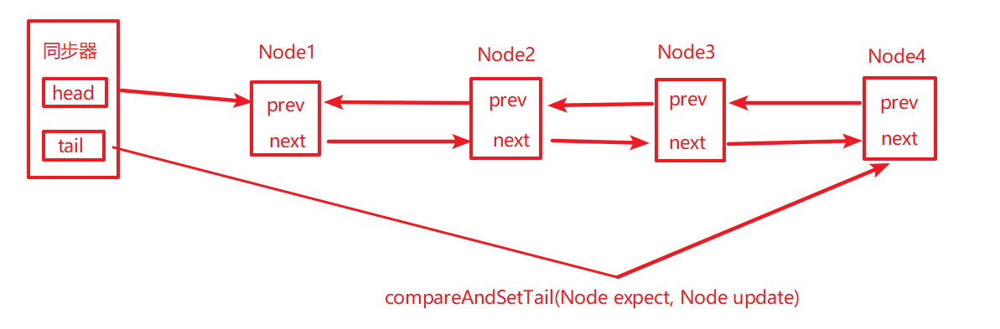
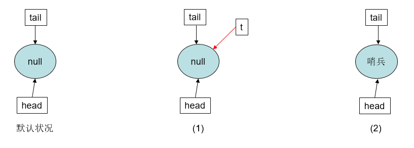
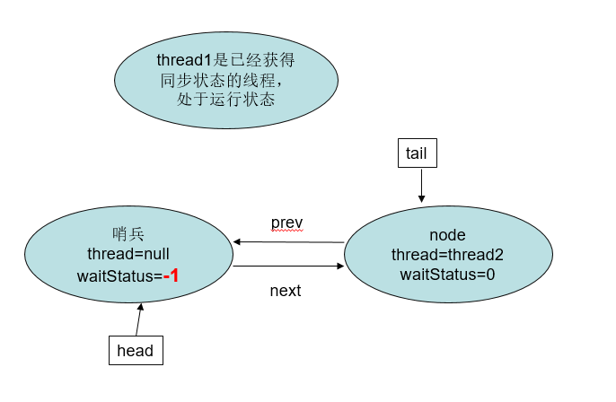
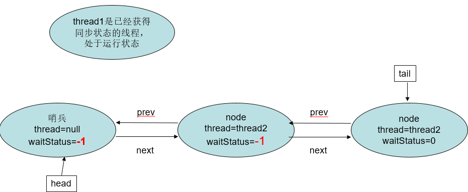
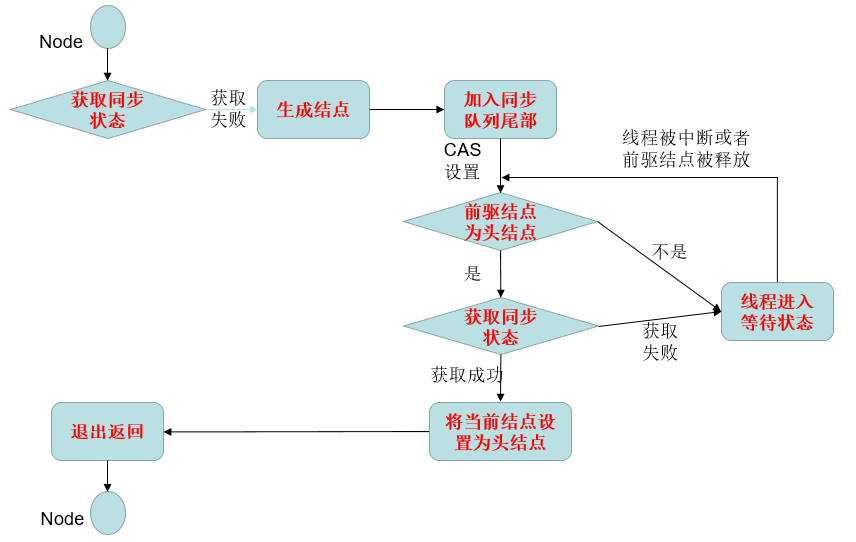
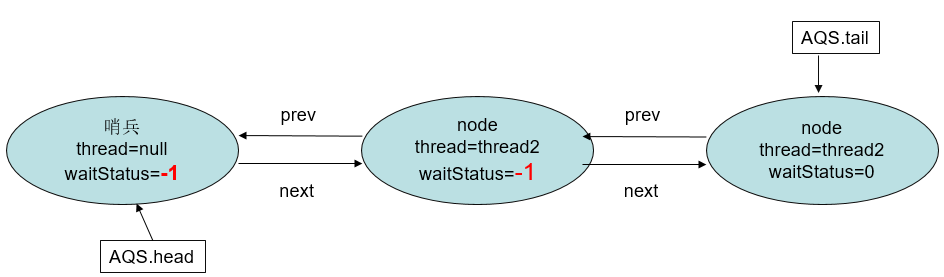
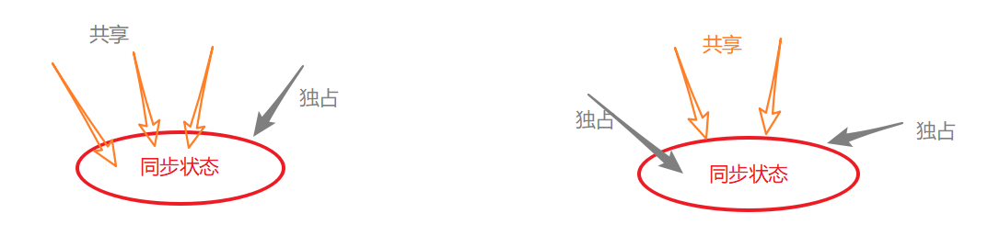
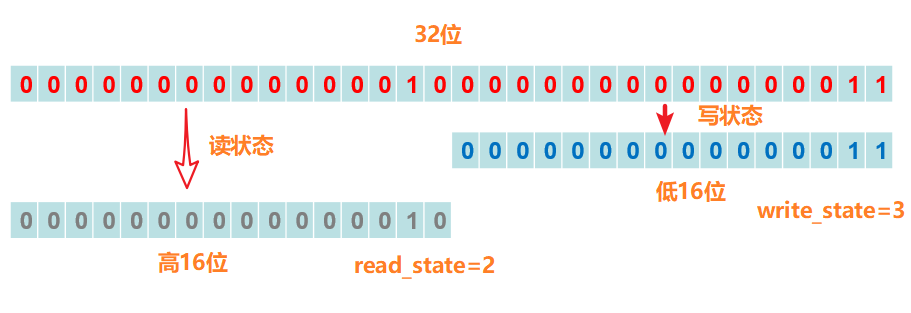
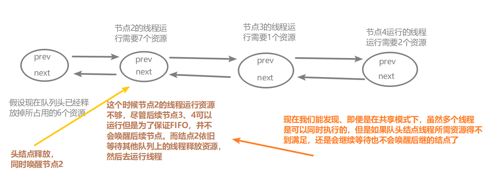

## AQS

### AQS概述  

​	AbstractQueuedSynchronizer抽象队列同步器简称AQS，它是实现同步器的基础组件，juc下面Lock的实现以及一些并发工具类就是通过AQS来实现的，这里我们通过AQS的类图先看一下大概，下面我们总结一下AQS的实现原理。先看看AQS的类图。[Java中的队列同步器AQS](https://www.cnblogs.com/fsmly/p/10701109.html)


​	**(1)**AQS是一个通过内置的**FIFO**双向队列来完成线程的排队工作(内部通过结点head和tail记录队首和队尾元素，元素的结点类型为Node类型，后面我们会看到Node的具体构造)。

```java
/*等待队列的队首结点(懒加载，这里体现为竞争失败的情况下，加入同步队列的线程执行到enq方法的时候会创
建一个Head结点)。该结点只能被setHead方法修改。并且结点的waitStatus不能为CANCELLED*/
private transient volatile Node head;
/**等待队列的尾节点，也是懒加载的。（enq方法）。只在加入新的阻塞结点的情况下修改*/
private transient volatile Node tail;
```

​	**(2)**其中**Node**中的thread用来存放进入AQS队列中的线程引用，Node结点内部的SHARED表示标记线程是因为获取共享资源失败被阻塞添加到队列中的；Node中的EXCLUSIVE表示线程因为获取独占资源失败被阻塞添加到队列中的。waitStatus表示当前线程的等待状态：

​	①CANCELLED=1：表示线程因为中断或者等待超时，需要从等待队列中取消等待；

​	②SIGNAL=-1：当前线程thread1占有锁，队列中的head(仅仅代表头结点，里面没有存放线程引用)的后继结点node1处于等待状态，如果已占有锁的线程thread1释放锁或被CANCEL之后就会通知这个结点node1去获取锁执行。

​	③CONDITION=-2：表示结点在等待队列中(这里指的是等待在某个lock的condition上，关于Condition的原理下面会写到)，当持有锁的线程调用了Condition的signal()方法之后，结点会从该condition的等待队列转移到该lock的同步队列上，去竞争lock。(注意：这里的同步队列就是我们说的AQS维护的FIFO队列，等待队列则是每个condition关联的队列)

​	④PROPAGTE=-3：表示下一次共享状态获取将会传递给后继结点获取这个共享同步状态。

下面是Node内部类的源码

```java
    static final class Node {
        /**共享模式下获取state失败被构造为Node结点加入同步队列中 */
        static final Node SHARED = new Node();
        /**独占模式下获取state失败被构造为node节点加入同步队列 */
        static final Node EXCLUSIVE = null;
        /**同步队列中等待的线程被取消，节点进入该状态不会发生变化*/
        static final int CANCELLED =  1;
        /**唤醒后继节点*/
        static final int SIGNAL    = -1;
        /**表示节点中的线程阻塞在某个condition上*/
        static final int CONDITION = -2;
        /**表示下一次共享状态获取将会传递给后继结点获取这个共享同步状态。*/
        static final int PROPAGATE = -3;
        /**waitStatus取值就是上面的四种情况*/
        volatile int waitStatus;
        /**当前Node节点的前去结点*/
        volatile Node prev;
        /**Node节点的后继节点*/
        volatile Node next;
        /** 当前Node节点中的线程引用*/
        volatile Thread thread;
        /** condition队列中的后继结点，如果当前节点是共享的，那么这个字段是一个SHARED常量 ，也就是当前节点类
        型和等待队列中的后继节点共用一个字段*/
        Node nextWaiter;
        /**返回当前是否是共享式的节点类型*/
        final boolean isShared() {
            return nextWaiter == SHARED;
        }
        /** 假设多个线程取竞争state的时候
        (1)初始情况下队列是没有结点的，这时候如果出现竞争情况，那么势必就有一个线程将会被构造为Node结点添加到
        队列中，在这个过程中，首先会做的是(实际上AQS的模板方法acquire中的第二步就是将CAS设置同步失败的线程构
        造为相应模式的Node加入同步队列中),为队列添加一个head结点（在enq方法中自旋直到设置head成功并将自己添
        加作为head的后继结点）
        (2)上面是初始情况下同步队列中没有node结点的情况，如果已经同步队列中已经有node结点，那么后续的线程竞争
        失败的话就是直接将自己设置为tail结点(具体的做法就是获得当前队列的tail结点，将之设置为自己的prev结点)
        (3)上面构造同步队列的以及添加新的node的过程都是以CAS的方式进行的
         */
        final Node predecessor() throws NullPointerException {
            Node p = prev;
            if (p == null)
                throw new NullPointerException();
            else
                return p;
        }
	    //初始同步队列为空的(head=tail= null)的时候，这时要添加新的node结点就会在enq方法中添加一个空的head
        //结点，这个结点中不保存任何线程的引用或者等待状态信息，保存这个state的队首head(没有包含线程引用)和队尾tail(包含线程引用)
        Node() {    // 用于建立初始头或SHARED标记
        }
	    //竞争失败的线程被构造为Node结点的时候，调用的构造方法
        Node(Thread thread, Node mode) {
            this.nextWaiter = mode;
            this.thread = thread;
        }
	    //condition队队列
        Node(Thread thread, int waitStatus) {
            this.waitStatus = waitStatus;
            this.thread = thread;
        }
    }
```

​	**(3)**AQS中维持了一个单一的volatile修饰的状态信息state(AQS通过Unsafe的相关方法，以原子性的方式由线程去获取这个state)。AQS提供了getState()、setState()、compareAndSetState()函数修改值(实际上调用的是unsafe的compareAndSwapInt方法)。下面是AQS中的部分成员变量以及更新state的方法

```java
//这就是我们刚刚说到的head结点，懒加载的（只有竞争失败需要构建同步队列的时候，才会创建这个head），如果头节点存在，它的waitStatus不能为CANCELLED
private transient volatile Node head;
//当前同步队列尾节点的引用，也是懒加载的，只有调用enq方法的时候会添加一个新的wait node
private transient volatile Node tail;
//AQS核心：同步状态
private volatile int state;
protected final int getState() {
    return state;
}
protected final void setState(int newState) {
    state = newState;
}
protected final boolean compareAndSetState(int expect, int update) {
    return unsafe.compareAndSwapInt(this, stateOffset, expect, update);
}
```

​	**(4)**AQS的设计师基于**模板方法**模式的。使用时候需要继承同步器并重写指定的方法，并且通常将子类推荐为定义同步组件的静态内部类，子类重写这些方法之后，AQS工作时使用的是提供的模板方法，在这些模板方法中调用子类重写的方法。

​	子类可以重写的方法：

```java
//独占式的获取同步状态，实现该方法需要查询当前状态并判断同步状态是否符合预期，然后再进行CAS设置同步状态
protected boolean tryAcquire(int arg) {	throw new UnsupportedOperationException();}
//独占式的释放同步状态，等待获取同步状态的线程可以有机会获取同步状态
protected boolean tryRelease(int arg) {	throw new UnsupportedOperationException();}
//共享式的获取同步状态
protected int tryAcquireShared(int arg) { throw new UnsupportedOperationException();}
//尝试将状态设置为以共享模式释放同步状态。 该方法总是由执行释放的线程调用。 
protected int tryReleaseShared(int arg) { throw new UnsupportedOperationException(); }
//当前同步器是否在独占模式下被线程占用，一般该方法表示是否被当前线程所独占
protected int isHeldExclusively(int arg) {	throw new UnsupportedOperationException();}
```

​	AQS提供的模板方法，这些方法会调用具体子类实现的方法，后面会单独说独占模式和共享模式下这些方法的执行原理。

```java
//以独占模式获取，忽略中断
public final void acquire(int arg) {...}
//以独占方式获得，如果中断，中止。
public final void acquireInterruptibly(int arg) throws InterruptedException {...}
//尝试以独占模式获取，如果中断则中止，如果给定的超时时间失败
public final boolean tryAcquireNanos(int arg, long nanosTimeout) throws InterruptedException {...}
//以共享模式获取，忽略中断。 
public final void acquireShared(int arg){...}
//以共享方式获取，如果中断，中止
public final void acquireSharedInterruptibly(int arg) throws InterruptedException{...}
//尝试以共享模式获取，如果中断则中止，如果给定的时间超过，则失败。
public final boolean tryAcquireSharedNanos(int arg, long nanosTimeout) throws InterruptedException{...}
//独占式的释放同步状态，该方法会在释放同步状态之后，将同步队列中的第一个节点包含的线程唤醒
public final boolean release(int arg){...}
//共享式的释放同步状态
public final boolean releaseShared(int arg){...}
//获取在等待队列上的线程集合
public final Collection<Thread> getQueuedThreads(){...}
```

​	**(5)**AQS的内部类**ConditionObject**是通过结合锁实现线程同步，ConditionObject可以直接访问AQS的变量(state、queue)，ConditionObject是个条件变量 ，每个ConditionObject对应一个队列用来存放线程调用condition条件变量的await方法之后被阻塞的线程。后面会单独说到

### AQS中的独占模式

​	上面我们简单了解了一下AQS的基本组成，这里通过**ReentrantLock**的**非公平锁**实现来具体分析AQS的独占模式的加锁和释放锁的过程。

#### 非公平锁的加锁流程

​	简单说来，AQS会把所有的请求线程构成一个CLH队列，当一个线程执行完毕（lock.unlock()）时会激活自己的后继节点，但正在执行的线程并不在队列中，而那些等待执行的线程全部处于阻塞状态(park())。如下图所示。



​	**(1)**假设这个时候在初始情况下，还没有多任务来请求竞争这个state，这时候如果第一个线程thread1调用了lock方法请求获得锁，首先会通过CAS的方式将state更新为1，表示自己thread1获得了锁，并将独占锁的线程持有者设置为thread1。

```java
final void lock() {
    if (compareAndSetState(0, 1))
        //setExclusiveOwnerThread是AbstractOwnableSynchronizer的方法，AQS继承了AbstractOwnableSynchronizer
        setExclusiveOwnerThread(Thread.currentThread());
    else
        acquire(1);
}
```

​	**(2)**这个时候有另一个线程thread2来尝试或者锁，同样也调用lock方法，尝试通过CAS的方式将state更新为1，但是由于之前已经有线程持有了state，所以thread2这一步CAS失败（前面的thread1已经获取state并且没有释放），就会调用acquire(1)方法（该方法是AQS提供的模板方法，它会调用子类的tryAcquire方法）。非公平锁的实现中，AQS的模板方法acquire(1)就会调用NofairSync的tryAcquire方法，而tryAcquire方法又调用的Sync的nonfairTryAcquire方法，所以我们看看nonfairTryAcquire的流程。

```java
//NofairSync
protected final boolean tryAcquire(int acquires) {
    return nonfairTryAcquire(acquires);
}
final boolean nonfairTryAcquire(int acquires) {
    //（1）获取当前线程
    final Thread current = Thread.currentThread();
    //（2）获得当前同步状态state
    int c = getState();
    //（3）如果state==0，表示没有线程获取
    if (c == 0) {
        //（3-1）那么就尝试以CAS的方式更新state的值
        if (compareAndSetState(0, acquires)) {
            //（3-2）如果更新成功，就设置当前独占模式下同步状态的持有者为当前线程
            setExclusiveOwnerThread(current);
            //（3-3）获得成功之后，返回true
            return true;
        }
    }
    //（4）这里是重入锁的逻辑
    else if (current == getExclusiveOwnerThread()) {
        //（4-1）判断当前占有state的线程就是当前来再次获取state的线程之后，就计算重入后的state
        int nextc = c + acquires;
        //（4-2）这里是风险处理
        if (nextc < 0) // overflow
            throw new Error("Maximum lock count exceeded");
        //（4-3）通过setState无条件的设置state的值，（因为这里也只有一个线程操作state的值，即
        //已经获取到的线程，所以没有进行CAS操作）
        setState(nextc);
        return true;
    }
    //（5）没有获得state，也不是重入，就返回false
    return false;
}
```

总结来说就是：

1、获取当前将要去获取锁的线程thread2。

2、获取当前AQS的state的值。如果此时state的值是0，那么我们就通过CAS操作获取锁，然后设置AQS的线程占有者为thread2。很明显，在当前的这个执行情况下，state的值是1不是0，因为我们的thread1还没有释放锁。所以CAS失败，后面第3步的重入逻辑也不会进行

3、如果当前将要去获取锁的线程等于此时AQS的exclusiveOwnerThread的线程，则此时将state的值加1，这是重入锁的实现方式。

4、最终thread2执行到这里会返回false。

​	**(3)**上面的thread2加锁失败，返回false。那么根据开始我们讲到的AQS概述就应该将thread2构造为一个Node结点加入同步队列中。因为NofairSync的tryAcquire方法是由AQS的模板方法acquire()来调用的，那么我们看看该方法的源码以及执行流程。

```java
//(1)tryAcquire，这里thread2执行返回了false，那么就会执行addWaiter将当前线程构造为一个结点加入同步队列中
public final void acquire(int arg) {
    if (!tryAcquire(arg) &&
        acquireQueued(addWaiter(Node.EXCLUSIVE), arg))
        selfInterrupt();
}
```

​	那么我们就看一下addWaiter方法的执行流程。

```java
private Node addWaiter(Node mode) {
    //(1)将当前线程以及阻塞原因(是因为SHARED模式获取state失败还是EXCLUSIVE获取失败)构造为Node结点
    Node node = new Node(Thread.currentThread(), mode);
    //(2)这一步是快速将当前线程插入队列尾部
    Node pred = tail;
    if (pred != null) {
        //(2-1)将构造后的node结点的前驱结点设置为tail
        node.prev = pred;
        //(2-2)以CAS的方式设置当前的node结点为tail结点
        if (compareAndSetTail(pred, node)) {
            //(2-3)CAS设置成功，就将原来的tail的next结点设置为当前的node结点。这样这个双向队
            //列就更新完成了
            pred.next = node;
            return node;
        }
    }
    //(3)执行到这里，说明要么当前队列为null，要么存在多个线程竞争失败都去将自己设置为tail结点，
    //那么就会有线程在上面（2-2）的CAS设置中失败，就会到这里调用enq方法
    enq(node);
    return node;
}
```

​	那么总结一下add Waiter方法

​	1、将当前将要去获取锁的线程也就是thread2和独占模式封装为一个node对象。

​	2、尝试快速的将当前线程构造的node结点添加作为tail结点(这里就是直接获取当前tail，然后将node的前驱结点设置为tail)，并且以CAS的方式将node设置为tail结点(CAS成功后将原tail的next设置为node，然后这个队列更新成功)。

​	3、如果2设置失败，就进入enq方法。

​	在刚刚的thread1和thread2的环境下，开始时候线程阻塞队列是空的(因为thread1获取了锁，thread2也是刚刚来请求锁，所以线程阻塞队列里面是空的)。很明显，这个时候队列的尾部tail节点也是null，那么将直接进入到enq方法。所以我们看看enq方法的实现

```java
private Node enq(final Node node) {
    for (;;) {
        //(4)还是先获取当前队列的tail结点
        Node t = tail;
        //(5)如果tail为null，表示当前同步队列为null，就必须初始化这个同步队列的head和tail（建
        //立一个哨兵结点）
        if (t == null) { 
            //（5-1）初始情况下，多个线程竞争失败，在检查的时候都发现没有哨兵结点，所以需要CAS的
            //设置哨兵结点
            if (compareAndSetHead(new Node()))
                tail = head;
        } 
        //(6)tail不为null
        else {
            //(6-1)直接将当前结点的前驱结点设置为tail结点
            node.prev = t;
            //(6-2)前驱结点设置完毕之后，还需要以CAS的方式将自己设置为tail结点，如果设置失败，
            //就会重新进入循环判断一遍
            if (compareAndSetTail(t, node)) {
                t.next = node;
                return t;
            }
        }
    }
}
```

​	enq方法内部是一个自旋循环，第一次循环默认情况如下图所示

​	1、首先代码块（4）处将t指向了tail，判断得到t==null，如图(1)所示；

​	2、于是需要新建一个哨兵结点作为整个同步队列的头节点(代码块5-1处执行)

​	3、完了之后如图(2)所示。这样第一次循环执行完毕。



​	第二次循环整体执行如下图所示。

​	1、还是先获取当前tail结点然后将t指向tail结点。如下图的(3)

​	2、然后判断得到当前t!=null，所以enq方法中进入代码块(6).

​	3、在(6-1)代码块中将node的前驱结点设置为原来队列的tail结点，如下图的(4)所示。

​	4、设置完前驱结点之后，代码块(6-2)会以CAS的方式将当前的node结点设置为tail结点,如果设置成功，就会是下图(5)所示。更新完tail结点之后，需要保证双向队列的，所以将原来的指向哨兵结点的t的next结点指向node结点，如下图(6)所示。最后返回。


​	总结来说，即使在多线程情况下，enq方法还是能够保证每个线程结点会被安全的添加到同步队列中，因为enq通过CAS方式将结点添加到同步队列之后才会返回，否则就会不断尝试添加(这样实际上就是在并发情况下，把向同步队列添加Node变得串行化了)

​	**(4)**在上面AQS的模板方法中，acquire()方法还有一步acquireQueued，这个方法的主要作用就是在同步队列中嗅探到自己的前驱结点，如果前驱结点是头节点的话就会尝试取获取同步状态，否则会先设置自己的waitStatus为-1，然后调用LockSupport的方法park自己。具体的实现如下面代码所示

```java
final boolean acquireQueued(final Node node, int arg) {
    boolean failed = true;
    try {
        boolean interrupted = false;
        //在这样一个循环中尝试tryAcquire同步状态
        for (;;) {
            //获取前驱结点
            final Node p = node.predecessor();
            //(1)如果前驱结点是头节点，就尝试取获取同步状态，这里的tryAcquire方法相当于还是调
            //用NofairSync的tryAcquire方法，在上面已经说过
            if (p == head && tryAcquire(arg)) {
                //如果前驱结点是头节点并且tryAcquire返回true，那么就重新设置头节点为node
                setHead(node);
                p.next = null; //将原来的头节点的next设置为null，交由GC去回收它
                failed = false;
                return interrupted;
            }
            //(2)如果不是头节点,或者虽然前驱结点是头节点但是尝试获取同步状态失败就会将node结点
            //的waitStatus设置为-1(SIGNAL),并且park自己，等待前驱结点的唤醒。至于唤醒的细节
            //下面会说到
            if (shouldParkAfterFailedAcquire(p, node) &&
                parkAndCheckInterrupt())
                interrupted = true;
        }
    } finally {
        if (failed)
            cancelAcquire(node);
    }
}
```

​	在上面的代码中我们可以看出，这个方法也是一个自旋循环，继续按照刚刚的thread1和thread2这个情况分析。在enq方法执行完之后，同步队列的情况大概如下所示。


​	当前的node结点的前驱结点为head，所以会调用tryAcquire()方法去获得同步状态。但是由于state被thread1占有，所以tryAcquire失败。这里就是执行acquireQueued方法的代码块(2)了。代码块(2)中首先调用了shouldParkAfterFailedAcquire方法，该方法会将同步队列中node结点的前驱结点的waitStatus为CANCELLED的线程移除，并将当前调用该方法的线程所属结点自己和他的前驱结点的waitStatus设置为-1(SIGNAL)，然后返回。具体方法实现如下所示。

```java
private static boolean shouldParkAfterFailedAcquire(Node pred, Node node) {
    //（1）获取前驱结点的waitStatus
    int ws = pred.waitStatus;
    //（2）如果前驱结点的waitStatus为SINGNAL，就直接返回true
    if (ws == Node.SIGNAL)
        //前驱结点的状态为SIGNAL，那么该结点就能够安全的调用park方法阻塞自己了。
        return true;
    if (ws > 0) {
        //（3）这里就是将所有的前驱结点状态为CANCELLED的都移除
        do {
            node.prev = pred = pred.prev;
        } while (pred.waitStatus > 0);
        pred.next = node;
    } else {
        //CAS操作将这个前驱节点设置成SIGHNAL。
        compareAndSetWaitStatus(pred, ws, Node.SIGNAL);
    }
    return false;
}
```

​	所以shouldParkAfterFailedAcquire方法执行完毕，现在的同步队列情况大概就是这样子，即哨兵结点的waitStatus值变为-1。



​	上面的执行完毕返回到acquireQueued方法的时候，在acquireQueued方法中就会进行第二次循环了，但是还是获取state失败，而当再次进入shouldParkAfterFailedAcquire方法的时候，当前结点node的前驱结点head的waitStatus已经为-1(SIGNAL)了，就会返回true，然后acquireQueued方法中就会接着执行parkAndCheckInterrupt将自己park阻塞挂起。

```java
private final boolean parkAndCheckInterrupt() {
    LockSupport.park(this);
    return Thread.interrupted();
}
```

​	**(5)**我们梳理一下整个方法调用的流程，假设现在又有一个thread3线程竞争这个state，那么这个方法调用的流程是什么样的呢。

​	①首先肯定是调用**ReentrantLock.lock()**方法去尝试加锁;

​	②因为是非公平锁，所以就会转到调用**NoFairSync.lock()**方法;

​	③在NoFairSync.lock()方法中，会首先尝试设置state的值，因为已经被占有那么肯定就是失败的。这时候就会调用AQS的模板方法**AQS.acquire(1)**。

​	④在AQS的模板方法acquire(1)中，实际首先会调用的是子类的tryAcquire()方法，而在非公平锁的实现中即**Sync.nofairTryAcquire()**方法。

​	⑤显然tryAcquire()会返回false，所以acquire()继续执行，即调用**AQS.addWaiter()**，就会将当前线程构造称为一个Node结点,初始状况下waitStatus为0。

​	⑥在addWaiter方法中，会首先尝试直接将构建的node结点以CAS的方式(存在多个线程尝试将自己设置为tail)设置为tail结点，如果设置成功就直接返回，失败的话就会进入一个自旋循环的过程。即调用**enq()**方法。最终保证自己成功被添加到同步队列中。

​	⑦加入同步队列之后，就需要将自己挂起或者嗅探自己的前驱结点是否为头结点以便尝试获取同步状态。即调用**acquireQueued()**方法。

​	⑧在这里thread3的前驱结点不是head结点，所以就直接调用**shouldParkAfterFailedAcquire()**方法，该方法首先会将刚刚的thread2线程结点中的waitStatue的值改变为-1(初始的时候是没有改变这个waitStatus的，每个新节点的添加就会改变前驱结点的waitStatus值)。

​	⑨thread2所在结点的waitStatus改变后，shouldParkAfterFailedAcquire方法会返回false。所以之后还会在acquireQueued中进行第二次循环。并再次调用shouldParkAfterFailedAcquire方法，然后返回true。最终调用**parkAndCheckInterrupt()**将自己挂起。

​	每个线程去竞争这个同步状态失败的话大概就会经历上面的这些过程。假设现在thread3经历上面这些过程之后也进入同步队列，那么整个同步队列大概就是下面这样了.



​	将上面的流程整理一下大概就是下面这个图



#### 非公平锁的释放流程

​	上面说一ReentrantLock为例到了怎样去获得非公平锁，那么thread1获取锁，执行完释放锁的流程是怎样的呢。首先肯定是在finally中调用ReentrantLock.unlock()方法，所以我们就从这个方法开始看起。

​	**(1)**从下面的unlock方法中我们可以看出，实际上是调用AQS的release()方法，其中传递的参数为1，表示每一次调用unlock方法都是释放所获得的一次state。重入的情况下会多次调用unlock方法，也保证了lock和unlock是成对的。

```java
public void unlock() {
    sync.release(1); //这里ReentrantLock的unlock方法调用了AQS的release方法
}
public final boolean release(int arg) {
	//这里调用了子类的tryRelease方法，即ReentrantLock的内部类Sync的tryRelease方法
    if (tryRelease(arg)) {
        Node h = head;
        if (h != null && h.waitStatus != 0)
            unparkSuccessor(h);
        return true;
    }
    return false;
}
```

​	**(2)**上面看到release方法首先会调用ReentrantLock的内部类Sync的tryRelease方法。而通过下面代码的分析，大概知道tryRelease做了这些事情。

​	①获取当前AQS的state，并减去1；

​	②判断当前线程是否等于AQS的exclusiveOwnerThread，如果不是，就抛IllegalMonitorStateException异常，这就保证了加锁和释放锁必须是同一个线程；

​	③如果(state-1)的结果不为0，说明锁被重入了，需要多次unlock，这也是lock和unlock成对的原因；

​	④如果(state-1)等于0，我们就将AQS的ExclusiveOwnerThread设置为null；

​	⑤如果上述操作成功了，也就是tryRelase方法返回了true；返回false表示需要多次unlock。

```java
protected final boolean tryRelease(int releases) {
    //（1）获取当前的state，然后减1，得到要更新的state
    int c = getState() - releases;
    //（2）判断当前调用的线程是不是持有锁的线程，如果不是抛出IllegalMonitorStateException
    if (Thread.currentThread() != getExclusiveOwnerThread())
        throw new IllegalMonitorStateException();
    boolean free = false;
    //（3）判断更新后的state是不是0
    if (c == 0) {
        free = true;
        //（3-1）将当前锁持者设为null
        setExclusiveOwnerThread(null);
    }
    //（4）设置当前state=c=getState()-releases
    setState(c);
    //（5）只有state==0，才会返回true
    return free;
}
```

​	**(3)**那么当tryRelease返回true之后，就会执行release方法中if语句块中的内容。从上面我们看到，

```java
if (tryRelease(arg)) {
    //（1）获取当前队列的头节点head
    Node h = head;
    //（2）判断头节点不为null，并且头结点的waitStatus不为0(CACCELLED)
    if (h != null && h.waitStatus != 0)
        //（3-1）调用下面的方法唤醒同步队列head结点的后继结点中的线程
        unparkSuccessor(h);
    return true;
}
```

​	**(4)**在获取锁的流程分析中，我们知道当前同步队列如下所示，所以判断得到head!=null并且head的waitStatus=-1。所以会执行unparkSuccessor方法，传递的参数为指向head的一个引用h.那下面我们就看看unparkSuccessor方法中处理了什么事情。



```java
private void unparkSuccessor(Node node) {
    //（1）获得node的waitStatus
    int ws = node.waitStatus;
    //（2）判断waitStatus是否小于0
    if (ws < 0)
        //（2-1）如果waitStatus小于0需要将其以CAS的方式设置为0
        compareAndSetWaitStatus(node, ws, 0);

    //（2）获得s的后继结点，这里即head的后继结点
    Node s = node.next;
    //（3）判断后继结点是否已经被移除，或者其waitStatus==CANCELLED
    if (s == null || s.waitStatus > 0) {
        //（3-1）如果s！=null，但是其waitStatus=CANCELLED需要将其设置为null
        s = null;
        //（3-2）会从尾部结点开始寻找，找到离head最近的不为null并且node.waitStatus的结点
        for (Node t = tail; t != null && t != node; t = t.prev)
            if (t.waitStatus <= 0)
                s = t;
    }
    //（4）node.next!=null或者找到的一个离head最近的结点不为null
    if (s != null)
        //（4-1）唤醒这个结点中的线程
        LockSupport.unpark(s.thread);
}
```

​	从上面的代码实现中可以总结，unparkSuccessor主要做了两件事情:

​	①获取head节点的waitStatus，如果小于0，就通过CAS操作将head节点的waitStatus修改为0

​	②寻找head节点的下一个节点，如果这个节点的waitStatus小于0，就唤醒这个节点，否则遍历下去，找到第一个waitStatus<=0的节点，并唤醒。

​	**(5)**下面我们应该分析的是释放掉state之后，唤醒同步队列中的结点之后程序又是是怎样执行的。按照上面的同步队列示意图，那么下面会执行这些

​	**①**thread1(获取到锁的线程)调用unlock方法之后，最终执行到unparkSuccessor方法会唤醒thread2结点。**所以thread2被unpark**。

​	**②**再回想一下，当时thread2是在调用acquireQueued方法之后的parkAndCheckInterrupt里面被park阻塞挂起了，所以thread2被唤醒之后**继续执行acquireQueued方法中的for循环**（到这里可以往前回忆看一下acquireQueued方法中的for循环做了哪些事情）；

​	**③**for循环中做的第一件事情就是**查看自己的前驱结点是不是头结点**（按照上面的同步队列情况是满足的）；

​	**④**前驱结点是head结点，就会**调用tryAcquire方法尝试获取state**，因为thread1已经释放了state，即state=0，所以thread2调用tryAcquire方法时候，以**CAS的方式去将state从0更新为1是成功的**，所以这个时候**thread2就获取到了锁**

​	**⑤**thread2获取state成功，就会从acquireQueued方法中退出。注意这时候的acquireQueued返回值为false，所以在AQS的模板方法的acquire中会直接从if条件退出，最后执行自己锁住的代码块中的程序。

### AQS中的共享模式

​	共享式获取和独占式获取最主要的区别是能否有多个线程同时获取到同步状态。如图所示简易描述二者的区别（共享式访问的时候，可以允许多个线程访问资源，但是存在独占式访问的时候，同一时刻其他的不管是共享还是独占都会被阻塞）



​	我们还是使用ReentrantReadWriteLock中的读锁来简单分析一下AQS提供的共享模式是怎样工作的。在此之前我们先要知道读写锁的一些原理。我们这里只大概说一下读写锁中读写同步状态的表示:

​	**读写锁同步器的同步状态就是读写锁的读写状态，只是读写锁的同步器需要在同步状态上维护多个读线程和写线程的状态。使用按位切割的方式将一个32位整形变量按照高低16位切割成两个部分。对比下图，低位值表示当前获取写锁的线程重入两次，高位的值表示当前获取读锁的线程重入一次。读写锁的获取伴随着读写状态值的更新。当低位为0000_0000_0000_0000的时候表示写锁已经释放，当高位为0000_0000_0000_0000的时候表示读锁已经释放。从下面的划分得到：当state值不等于0的时候，如果写状态(state & 0x0000FFFF)等于0的话，读状态是大于0的，表示读锁被获取；如果写状态不等于0的话，读锁没有被获取。**



#### 读锁的加锁流程

​	**（1）**上面简单说了读写锁中的同步状态的含义，之后还是先从lock方法说起。ReentrantReadWriteLock中的ReadLock中的lock方法如下所示：

```java
public void lock() {
    sync.acquireShared(1);
}
```

​	**（2）**我们看到，其中还是调用了AQS的模板方法acquireShared方法。所以来看一下acquireShared方法的源码如下所示。

```java
/**
 * 	此方法是共享模式下AQS提供的获取共享锁的模板方法。当前线程调用acquireShared方法获取共享资源的
 * 时候
 *	(1)它会首先调用tryAcquireShared方法尝试去获取（具体还是设置state的值），
 *	(2)获取成功则直接返回;
 *  (3)获取失败则将线程构造称为Node.SHARED类型的结点加入AQS同步队列的尾部.进入等待队列后会调
 * 用LockSupport.park()挂起自己
 */
public final void acquireShared(int arg) {
    if (tryAcquireShared(arg) < 0)
        doAcquireShared(arg);
} 
```

​	从上面的代码中我们可以看出，实际上跟独占模式相似，AQS首先都会调用子类实现的tryAcquireShared方法来尝试获取同步状态，如果获取成功则直接从acquireShared方法返回，执行自己锁住的同步代码块；否则需要调用doAcquireShared将自己构造称为SHARED模式下获取锁失败的结点(调用的还是addWaiter方法，过程和独占模式差不多)加入同步队列中。

​	**（3）**我们首先先看一下读写锁中Sync类实现的tryAcquireShared方法

```java
static final int SHARED_SHIFT   = 16;
//1左移16位减1=>0000_0000_0000_0000_1111_1111_1111_1111
static final int EXCLUSIVE_MASK = (1 << SHARED_SHIFT) - 1; 
//返回写状态的值
static int exclusiveCount(int c) { return c & EXCLUSIVE_MASK; }
//返回读状态的值
static int sharedCount(int c)    { return c >>> SHARED_SHIFT; } 
//记录第一个获取读锁的线程
private transient Thread firstReader = null;
//记录第一个获取读锁线程重入的次数
private transient int firstReaderHoldCount;

protected final int tryAcquireShared(int unused) {
    //（1）获取当前的同步状态值
    Thread current = Thread.currentThread();
    int c = getState();
    //（2）判断是否被写锁占有，如果被写锁占有会再次判断占有者线程是否是当前想要获取读锁的线程(这里
    //可能就是锁降级)
    if (exclusiveCount(c) != 0 &&
        getExclusiveOwnerThread() != current)
        return -1;
    //（3）获取读锁的计数
    int r = sharedCount(c);
    //（4）尝试获取锁，多个读线程获取只有一个能获取成功，不成功的后面会调用
    //fullTryAcquireShared方法进行自旋重试。其中的readerShouldBlock方法表示读锁获取是否需要被阻塞
    if (!readerShouldBlock() &&
        r < MAX_COUNT &&
        compareAndSetState(c, c + SHARED_UNIT)) { // SHARED_UNIT = (1 << 16)
        //（5）r==0:第一个线程获取读锁
        if (r == 0) {
            firstReader = current;
            firstReaderHoldCount = 1;
        } else if (firstReader == current) { //（6）如果当前线程是第一个获取读锁的线程(读锁重入)
            firstReaderHoldCount++;
        } else {
            //（7）记录最后一个获取读锁线程的重入次数
            HoldCounter rh = cachedHoldCounter;
            if (rh == null || rh.tid != getThreadId(current))
                cachedHoldCounter = rh = readHolds.get();
            else if (rh.count == 0)
                readHolds.set(rh);
            rh.count++;
        }
        return 1;
    }
    //（8）这里是readerShouldBlock返回true之后，自旋获取
    return fullTryAcquireShared(current);
}
```

​	从上面的tryAcquireShared方法中，可以总结大概做了这些事情：

​	**①**首先获取AQS中的同步状态state的值，然后查看是否有其他线程占有写锁，如果有则直接返回-1。

​	**②**如果返回-1，AQS会调用doAcquireShared方法将当前线程加入阻塞队列中。

​	**③**如果是当前要获取读锁的线程已经获取了写锁，那么也可以在获取读锁。

​	**④**执行代码（3）得到获取读锁的个数，如果执行到这里说明没有线程获取写锁，但是可能有线程已经获取读锁，所以执行代码（4）。

​	**⑤**其中调用的readerShouldBlock方法在ReentrantReadWriteLock中的NoFairSync实现如下

```java
final boolean readerShouldBlock() {
    return apparentlyFirstQueuedIsExclusive();
}
final boolean apparentlyFirstQueuedIsExclusive() {
    Node h, s;
    //h=head != null:表示头节点不为null
    //s=h.next != null:表示头节点的后继节点不为null
    //!s.isShared():表示头结点的后继节点为exclusive的
    //s.thread!=null表示后继结点中的线程不能为null
    return (h = head) != null &&
        (s = h.next)  != null &&
        !s.isShared()         &&
        s.thread != null;
}
```

​	该方法的含义就是:如果队列中存在一个元素,则判断第一个元素是不是正在尝试获取写锁。如果不是，即(s.isShared())，readerShouldBlock方法会返回false，如果是就会返回true，那么这个获取读锁的线程就该阻塞住。

​	在ReentrantReadWriteLock中的FairSync实现为

```java
final boolean readerShouldBlock() {
    return hasQueuedPredecessors();//因为是公平锁，所以如果当前线程构造的结点有前驱结点就得阻塞等待.
}
```

​	**⑥**最后在tryAcquireShared方法的代码块（4）中的if中根据readerShouldBlock的返回值确定后续，如果返回false，那么就会紧接着判断获取读锁的线程是不是已经到达最大值。最后执行CAS操作将AQS的state的高16位加1。

​	**⑦**代码块（5）（6）判断当前是不是第一个来获取读锁的线程，如果是就直接计算获取的计数firstReaderHoldCount=1。当然也有可能是该线程再次获取读锁，那么久计算获取的重入数。

​	**⑧**代码块（7）使用cachedHoldCounter记录最后一个获取读锁的线程和该线程获取读锁的可重入数，readHolds记录当前线程获取的读锁重入数。

​	**⑨**代码块（8）的执行意味着readShouldBlock，说明**有线程在获取写锁**或者**自己执行CAS更新读锁状态计数失败**，所以执行fullTryAcquireShared方法。如下所示,主要就是通过**循环**获取state,实现上和tryAcquireShared差不多

```java
/**
 * 针对readShouldBolck()返回true的两种情况进行分析执行该方法的原因:
 * 	(1)刚刚我们说了可能是因为 CAS 失败，如果就此返回，那么就要进入到阻塞队列了，
 * 但是由于之前已经满足了 !readerShouldBlock()，也就是说本来可以不用到阻塞队列的，
 * 所以进到这个方法其实是增加 CAS 成功的机会
 * 	(2)在 NonFairSync 情况下，虽然 head.next 是获取写锁的(!(s=head.next).isShared())，但
 * 是如果我是来重入读锁的，那么也可以执行下面的这个方法重入的获取读锁
 */
final int fullTryAcquireShared(Thread current) {
    HoldCounter rh = null;
    // 自旋的尝试获取读锁
    for (;;) {
        int c = getState();
        // 如果其他线程持有了写锁，还要判断获取写锁的线程是不是就是自己，如果不是自己就肯定返回-1
        //然后加入阻塞队列了
        if (exclusiveCount(c) != 0) {
            if (getExclusiveOwnerThread() != current)
                return -1;
            // else we hold the exclusive lock; blocking here
            // would cause deadlock.
        } else if (readerShouldBlock()) {
            /**
              * 即便readerShouldBlock返回了true，但是如果是一个已经获得读锁的线程想要再次获
              * 取读锁，肯定不能因为head.next是准备获取写锁的线程就被阻塞住，这样就不能重入了，
              * 会导致死锁(这也是上面那段因为注释的)：
              *  1. exclusiveCount(c) == 0：写锁没有被占用，那么获取读锁就可以再次尝试
              *  2. readerShouldBlock() 为 true，说明阻塞队列中有其他线程在等待(尝试获取写
              * 锁的线程)
              */
            // firstReader第一个获取读锁的线程线程重入读锁，直接到下面的 CAS
            if (firstReader == current) {
                // assert firstReaderHoldCount > 0;
            } else {
                if (rh == null) {
                    rh = cachedHoldCounter;
                    if (rh == null || rh.tid != getThreadId(current)) {
                        // cachedHoldCounter 缓存的不是当前线程，直接从当前线程的ThreadLocal中获取readHolds
                        rh = readHolds.get();
                        // 如果发现 count == 0，也就是说，纯属上一行代码初始化的，那么执行 
                        //remove,然后往下两三行，乖乖排队去
                        if (rh.count == 0)
                            readHolds.remove();
                    }
                }
                if (rh.count == 0)
                    // 排队去。
                    return -1;
            }
            /**
              * 这块代码我看了蛮久才把握好它是干嘛的，原来只需要知道，它是处理重入的就可以了。
              * 就是为了确保读锁重入操作能成功，而不是被塞到阻塞队列中等待
              *
              * 另一个信息就是，这里对于 ThreadLocal 变量 readHolds 的处理：
              *    如果 get() 后发现 count == 0，居然会做 remove() 操作，
              *    这行代码对于理解其他代码是有帮助的
              */
        }

        if (sharedCount(c) == MAX_COUNT)
            throw new Error("Maximum lock count exceeded");

        if (compareAndSetState(c, c + SHARED_UNIT)) {
            // 这里 CAS 成功，那么就意味着成功获取读锁了
            // 下面需要做的是设置 firstReader 或 cachedHoldCounter

            if (sharedCount(c) == 0) {
                // 如果发现 sharedCount(c) 等于 0，就将当前线程设置为 firstReader
                firstReader = current;
                firstReaderHoldCount = 1;
            } else if (firstReader == current) {
                firstReaderHoldCount++;
            } else {
                // 下面这几行，就是将 cachedHoldCounter 设置为当前线程
                if (rh == null)
                    rh = cachedHoldCounter;
                if (rh == null || rh.tid != getThreadId(current))
                    rh = readHolds.get();
                else if (rh.count == 0)
                    readHolds.set(rh);
                rh.count++;
                cachedHoldCounter = rh;
            }
            // 返回大于 0 的数，代表获取到了读锁
            return 1;
        }
    }
}
```

​	**(4)**最后就是tryAcquireShared方法获取失败,就会将当前线程构建为Node加入同步队列中,然后再尝试获取一次,获取失败就会调用LockSupport.park方法挂起自己。下面是doAcquireShared方法的实现

```java
private void doAcquireShared(int arg) {
    //(1)首先还是调用add Waiter方法(其中有enq方法，具体和独占模式分析的差不多)将该线程包括线程
    //引用、等待状态、前驱结点和后继结点的信息封装台Node中，然后添加到等待队列里面(共享模式添加)
    final Node node = addWaiter(Node.SHARED);
    boolean failed = true;
    try {
        boolean interrupted = false; //当前线程的中断标志
        for (;;) {
            //(2)获取前驱结点
            final Node p = node.predecessor();
            if (p == head) {
                //(2-1)当前驱结点是头结点的时候就会以共享的方式去尝试获取同步状态
                int r = tryAcquireShared(arg); 
                //(2-2)判断tryAcquireShared的返回值
                if (r >= 0) {
                    //如果返回值大于等于0，表示获取同步状态成功，就修改当前的头结点并将信息传播
                    //都后续的结点队列中
                    setHeadAndPropagate(node, r);
                    p.next = null; // 释放掉已经获取到同步状态的前驱结点的资源
                    if (interrupted)
                        selfInterrupt(); //检查中断标志
                    failed = false;
                    return;
                }
            }
            //(3)这里和上面的独占模式调用的方法相同，大概做的就是将自己的前驱结点的waitStatus
            //设置为-1，然后返回。之后调用parkAndCheckInterrupt挂起自己
            if (shouldParkAfterFailedAcquire(p, node) &&
                parkAndCheckInterrupt())
                interrupted = true;
        }
    } finally {
        if (failed)
            cancelAcquire(node);
    }
}
```

​	看完我们可以简单总结一下doAcquireShared做的核心事情：

​	①将获取state失败的线程以SHARED的mode(模式)调用addWaiter方法确保加入同步队列的尾部；

​	②获取前驱结点，并判断前驱结点是否是头节点。如果是头节点，将调用tryAcquireShared方法尝试获取同步状态，如果返回值大于0表示获取成功(因为是共享式同步状态，所以需要将这个获取成功的消息传递给这个共享是同步队列的后续结点)。如果获取失败，则调用LockSupport.park挂起自己

**根据源代码我们可以了解共享式获取同步状态的整个过程**

　　首先同步器会调用tryAcquireShared方法来尝试获取同步状态，然后根据这个返回值来判断是否获取到同步状态（当返回值大于等于0可视为获取到同步状态）；如果第一次获取失败的话，就进入'**自旋**'状态（执行doAcquireShared方法）一直尝试去获取同步状态；在自旋获取中，如果检查到当前前驱结点是头结点的话，就会尝试获取同步状态，而一旦获取成功（tryAcquireShared方法返回值大于等于0）就可以从自旋状态退出。

　　另外，还有一点就是上面说到的一个处于等待队列的线程要想开始尝试去获取同步状态，需要满足的条件就是前驱结点是头结点，那么它本身就是整个队列中的第二个结点。当释放掉所有的临界资源之后，我们考虑每个线程运行所需资源的不同数量问题，如下图所示



#### 读锁的释放流程

### AQS中的条件变量

### 自定义实现同步组件

```java
public class NonReentrantLock implements Lock {
    //使用静态内部类继承AQS，并重写指定的方法
    private static class Sync extends AbstractQueuedSynchronizer {
        @Override
        protected boolean tryAcquire(int arg) {
            //使用CAS尝试去设置同步状态
            if (compareAndSetState(0, 1)) {
                //如果获取成功，设置state占有者为当前线程
                setExclusiveOwnerThread(Thread.currentThread());
                return true;
            }
            return false;
        }

        //释放
        @Override
        protected boolean tryRelease(int arg) {
            if (getState() == 0) {
                throw new IllegalMonitorStateException();
            }
            setExclusiveOwnerThread(null);
            setState(0);
            return true;
        }

        //是否处于占有状态
        @Override
        protected boolean isHeldExclusively() {
            return getState() == 1;
        }

        //提供条件变量接口
        Condition newCondition() {
            return new ConditionObject();
        }
    }

    //创建一个Sync来做具体的同步工作
    private final Sync sync = new Sync();
    @Override
    public void lock() {
        sync.acquire(1); //这里调用的是AQS的模板方法，而在其中又调用了sync实现的tryAcquire方法
    }

    @Override
    public void lockInterruptibly() throws InterruptedException {
        sync.acquireInterruptibly(1);
    }

    @Override
    public boolean tryLock() {
        return sync.tryAcquire(1);
    }

    @Override
    public boolean tryLock(long time, TimeUnit unit) throws InterruptedException {
        return sync.tryAcquireNanos(1,unit.toNanos(time));
    }

    @Override
    public void unlock() {
        sync.release(1);
    }

    @Override
    public Condition newCondition() {
        return sync.newCondition();
    }

    public boolean isLocked() {
        return sync.isHeldExclusively();
    }
}
//使用自定义同步组建实现Producer-Consumer-Model
public class ProduceAndConsumer {

    private static final NonReentrantLock lock = new NonReentrantLock();
    private static final Condition notFull = lock.newCondition();
    private static final Condition notEmpty = lock.newCondition();

    private static Queue<String> queue = new LinkedBlockingQueue<>();
    private final static int SIZE = 10;

    public static void main(String[] args) {
        new Thread("ProducerThread") {
            @Override
            public void run() {
                while (true) {
                    lock.lock();
                    try {
                        //生产者线程
                        //队列满了，等待
                        while (queue.size() == SIZE) {
                            System.out.println("size : " + queue.size());
                            notEmpty.await();
                        }
                        //队列未满，添加元素
                        queue.add("element");
                        //唤醒消费者线程
                        notFull.signalAll();
                    } catch (InterruptedException e) {
                        e.printStackTrace();
                    } finally {
                        lock.unlock();
                    }
                }
            }
        }.start();

        new Thread("ConsumerThread") {
            @Override
            public void run() {
                while (true) {
                    lock.lock();
                    try {
                        //消费者线程
                        //队列空了，等待
                        while (queue.size() == 0) {
                            notFull.await();
                        }
                        //队列未满，添加元素
                        String ele = queue.poll();
                        System.out.println(ele);
                        //唤醒生产者者线程
                        notEmpty.signalAll();
                    } catch (InterruptedException e) {
                        e.printStackTrace();
                    } finally {
                        lock.unlock();
                    }
                }
            }
        }.start();
    }
}

```


## ReentrantLock

### ReentrantLock使用

### ReentrantLock原理


非公平锁的实现原理请参考上面介绍AQS原理的[非公平锁的加锁流程](#非公平锁的加锁流程).

## ReadWriteLock

### ReadWriteLock使用

### ReadWriteLock原理