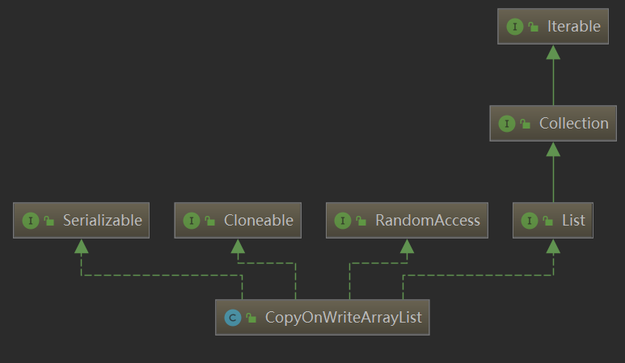
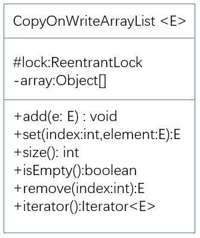

​	我在前面总结了Java集合中[ArrayList的源码细节](https://juejin.im/post/5d42ab5e5188255d691bc8d6)，其中也提到了ArrayList是线程不安全的，那么jdk中为我们提供的线程安全的List是什么呢，就是下面要说的CopyOnWriteList这个并发安全的集合类，它主要采用的就是`copy-on-write`思想，这个思想大概就是`读写分离：读时共享、写时复制(原本的array)更新(且为独占式的加锁)`，而我们下面分析的源码具体实现也是这个思想的体现

## 概述

​	还是先贴上CopyOnWriteList的继承体系吧，可以看到其实现了Serializable、Cloneable和RandomAccess接口，具有随机访问的特点，实现了List接口，具备List的特性。



​	我们单独看一下CopyOnWriteList的主要属性和下面要主要分析的方法有哪些。从图中看出：

- 每个CopyOnWriteList对象里面有一个array数组来存放具体元素

- 使用ReentrantLock独占锁来保证只有写线程对array副本进行更新。关于ReentrantLock可以参考我另一篇[AQS的应用之ReentrantLock](https://juejin.im/post/5d40e5f26fb9a06b317b3e0d)。

- CopyOnWriteArrayList在遍历的使用不会抛出ConcurrentModificationException异常，并且遍历的时候就不用额外加锁

  下面还是主要看CopyOnWriteList的实现



## 成员属性

```java
//这个就是保证更新数组的时候只有一个线程能够获取lock，然后更新
final transient ReentrantLock lock = new ReentrantLock();
//使用volatile修饰的array，保证写线程更新array之后别的线程能够看到更新后的array.
//但是并不能保证实时性：在数组副本上添加元素之后，还没有更新array指向新地址之前，别的读线程看到的还是旧的array
private transient volatile Object[] array;
//获取数组，非private的，final修饰
final Object[] getArray() {
    return array;
}
//设置数组
final void setArray(Object[] a) {
    array = a;
}
```

## 构造方法

(1)无参构造，默认创建的是一个长度为0的数组

```java
//这里就是构造方法，创建一个新的长度为0的Object数组
//然后调用setArray方法将其设置给CopyOnWriteList的成员变量array
public CopyOnWriteArrayList() {
    setArray(new Object[0]);
}
```

(2)参数为Collection的构造方法

```java
//按照集合的迭代器遍历返回的顺序，创建包含传入的collection集合的元素的列表
//如果传递的参数为null，会抛出异常
public CopyOnWriteArrayList(Collection<? extends E> c) {
    Object[] elements; //一个elements数组
    //这里是判断传递的是否就是一个CopyOnWriteArrayList集合
    if (c.getClass() == CopyOnWriteArrayList.class)
        //如果是，直接调用getArray方法，获得传入集合的array然后赋值给elements
        elements = ((CopyOnWriteArrayList<?>)c).getArray();
    else {
        //先将传入的集合转变为数组形式
        elements = c.toArray();
        //c.toArray()可能不会正确地返回一个 Object[]数组，那么使用Arrays.copyOf()方法
        if (elements.getClass() != Object[].class)
            elements = Arrays.copyOf(elements, elements.length, Object[].class);
    }
    //直接调用setArray方法设置array属性
    setArray(elements);
}
```

(3)创建一个包含给定数组副本的list

```java
public CopyOnWriteArrayList(E[] toCopyIn) {
    setArray(Arrays.copyOf(toCopyIn, toCopyIn.length, Object[].class));
}
```

上面介绍的是CopyOnWriteList的初始化，三个构造方法都比较易懂，后面还是主要看看几个主要方法的实现

## 添加元素

​	下面是add(E e)方法的实现 ，以及详细注释

```java
public boolean add(E e) {
    //获得独占锁
    final ReentrantLock lock = this.lock;
    //加锁
    lock.lock();
    try {
        //获得list底层的数组array
        Object[] elements = getArray();
        //获得数组长度
        int len = elements.length;
        //拷贝到新数组，新数组长度为len+1
        Object[] newElements = Arrays.copyOf(elements, len + 1);
        //给新数组末尾元素赋值
        newElements[len] = e;
        //用新的数组替换掉原来的数组
        setArray(newElements);
        return true; 
    } finally {
        lock.unlock();//释放锁
    }
}
```

​	总结一下add方法的执行流程

- 调用add方法的线程会首先获取锁，然后调用lock方法对list进行加锁（了解ReentrantLock的知道这是个独占锁，所以多线程下只有一个线程会获取到锁）
- 只有线程会获取到锁，所以只有一个线程会去更新这个数组，此过程中别的调用add方法的线程被阻塞等待
- 获取到锁的线程继续执行
  - 首先获取原数组以及其长度，然后将其中的元素复制到一个新数组中(newArray的长度是原长度+1)
  - 给定数组下标为len+1处赋值
  - 将新数组替换掉原有的数组

- 最后释放锁

​	所以总结起来就是，多线程下只有一个线程能够获取到锁，然后使用复制原有数组的方式添加元素，之后再将新的数组替换原有的数组，最后释放锁（别的add线程去执行）。

​	最后还有一点就是，数组长度不是固定的，每次写之后数组长度会+1，所以CopyOnWriteList也没有length或者size这类属性，但是提供了size()方法，获取集合的实际大小，size()方法如下

```java
public int size() {
    return getArray().length;
}
```

## 获取元素

​	使用get(i)可以获取指定位置i的元素，当然如果元素不存在就会抛出数组越界异常。

```java
public E get(int index) {
    return get(getArray(), index);
}
final Object[] getArray() {
    return array;
}
private E get(Object[] a, int index) {
    return (E) a[index];
}
```

​	当然get方法这里也体现了`copy-on-write-list`的弱一致性问题。我们用下面的图示简略说明一下。图中给的假设情况是：threadA访问index=1处的元素

- ①获取array数组
- ②访问传入参数下标的元素

​	因为我们看到get过程是没有加锁的（假设array中有三个元素如图所示）。假设threadA执行①之后②之前，threadB执行remove(1)操作，threadB或获取独占锁，然后执行写时复制操作，即`复制一个新的数组neArray`，然后在newArray中执行remove操作(1)，更新array。threadB执行完毕array中index=1的元素已经是item3了。

​	然后threadA继续执行，但是因为threadA操作的是原数组中的元素，这个时候的index=1还是item2。所以最终现象就是虽然threadB删除了位置为1处的元素，但是threadA还是访问的原数组的元素。这就是`若一致性问题`


## 修改元素

​	修改也是属于`写`，所以需要获取lock，下面就是set方法的实现

```java
public E set(int index, E element) {
    //获取锁
    final ReentrantLock lock = this.lock;
    //进行加锁
    lock.lock();
    try {
        //获取数组array
        Object[] elements = getArray();
        //获取index位置的元素
        E oldValue = get(elements, index);
        // 要修改的值和原值不相等
        if (oldValue != element) {
            //获取旧数组的长度
            int len = elements.length;
            //复制到一个新数组中
            Object[] newElements = Arrays.copyOf(elements, len);
            //在新数组中设置元素值
            newElements[index] = element;
            //用新数组替换掉原数组
            setArray(newElements);
        } else {
            // Not quite a no-op; ensures volatile write semantics
            //为了保证volatile 语义，即使没有修改，也要替换成新的数组
            setArray(elements);
        }
        return oldValue; //返回旧值
    } finally {
        lock.unlock();//释放锁
    }
}
```

​	看了set方法之后，发现其实和add方法实现类似。

- 获得独占锁，保证同一时刻只有一个线程能够修改数组
- 获取当前数组，调用get方法获取指定位置的数组元素
- 判断get获取的值和传入的参数
  - 相等，为了保证volatile语义，还是需要重新这只array
  - 不相等，将原数组元素复制到新数组中，然后在新数组的index处修改，修改完毕用新数组替换原数组

- 释放锁

## 删除元素

​	下面是remove方法的实现，总结就是

- 获取独占锁，保证只有一个线程能够去删除元素
- 计算要移动的数组元素个数
  - 如果删除的是最后一个元素，那么上面的计算结果是0，就直接将原数组的前len-1个作为新数组替换掉原数组
  - 删除的不是最后一个元素，那么按照index分为前后两部分，分别复制到新数组中，然后替换即可
- 释放锁

```java
public E remove(int index) {
    //获取锁
    final ReentrantLock lock = this.lock;
    //加锁
    lock.lock();
    try {
        //获取原数组
        Object[] elements = getArray();
        //获取原数组长度
        int len = elements.length;
        //获取原数组index处的值
        E oldValue = get(elements, index);
        //因为数组删除元素需要移动，所以这里就是计算需要移动的个数
        int numMoved = len - index - 1;
        //计算的numMoved=0，表示要删除的是最后一个元素，
        //那么旧直接将原数组的前len-1个复制到新数组中，替换旧数组即可
        if (numMoved == 0)
            setArray(Arrays.copyOf(elements, len - 1));
        //要删除的不是最后一个元素
        else {
            //创建一个长度为len-1的数组
            Object[] newElements = new Object[len - 1];
            //将原数组中index之前的元素复制到新数组
            System.arraycopy(elements, 0, newElements, 0, index);
            //将原数组中index之后的元素复制到新数组
            System.arraycopy(elements, index + 1, newElements, index,
                             numMoved);
            //用新数组替换原数组
            setArray(newElements);
        }
        return oldValue;//返回旧值
    } finally {
        lock.unlock();//释放锁
    }
}
```

## 迭代器

​	迭代器的基本使用方式如下，hashNext()方法用来判断是否还有元素，next方法返回具体的元素。

```java
CopyOnWriteArrayList list = new CopyOnWriteArrayList();
Iterator<?> itr = list.iterator();
while(itr.hashNext()) {
    //do sth
    itr.next();
}
```

​	那么在CopyOnWriteArrayList中的迭代器是怎样实现的呢，为什么说是弱一致性呢(`先获取迭代器的，但是如果在获取迭代器之后别的线程对list进行了修改，这对于迭代器是不可见的`)，下面就说一下CopyOnWriteArrayList中的实现

```java
//Iterator<?> itr = list.iterator();
public Iterator<E> iterator() {
    //这里可以看到，是先获取到原数组getArray()，这里记为oldArray
    //然后调用COWIterator构造器将oldArray作为参数，创建一个迭代器对象
    //从下面的COWIterator类中也能看到，其中有一个成员存储的就是oldArray的副本
    return new COWIterator<E>(getArray(), 0);
}
static final class COWIterator<E> implements ListIterator<E> {
    //array的快照版本
    private final Object[] snapshot;
    //后续调用next返回的元素索引(数组下标)
    private int cursor;
    //构造器
    private COWIterator(Object[] elements, int initialCursor) {
        cursor = initialCursor;
        snapshot = elements;
    }
    //变量是否结束：下标小于数组长度
    public boolean hasNext() {
        return cursor < snapshot.length;
    }
    //是否有前驱元素
    public boolean hasPrevious() {
        return cursor > 0;
    }
    //获取元素
    //hasNext()返回true，直接通过cursor记录的下标获取值
    //hasNext()返回false，抛出异常
    public E next() {
        if (! hasNext())
            throw new NoSuchElementException();
        return (E) snapshot[cursor++];
    }
    //other method...
}
```

​	在上面的代码中我们能看处，list的iterator()方法实际上返回的是一个COWIterator对象，COWIterator对象的snapshot成员变量保存了`当前`list中array存储的内容，但是snapshot可以说是这个array的一个快照，为什么这样说呢

>我们传递的是虽然是当前的`array`，但是可能有别的线程对`array`进行了修改然后将原本的`array`替换掉了，那么这个时候list中的`array`和`snapshot`引用的`array`就不是一个了，作为原`array`的快照存在，那么迭代器访问的也就不是更新后的数组了。这就是弱一致性的体现

​	我们看下面的例子

```java
public class TestCOW {

    private static CopyOnWriteArrayList<String> list = new CopyOnWriteArrayList();

    public static void main(String[] args) throws InterruptedException {
        list.add("item1");
        list.add("item2");
        list.add("item3");

        Thread thread = new Thread() {
            @Override
            public void run() {
                list.set(1, "modify-item1");
                list.remove("item2");
            }
        };
        //main线程先获得迭代器
        Iterator<String> itr = list.iterator();
        thread.start();//启动thread线程
        thread.join();//这里让main线程等待thread线程执行完，然后再遍历看看输出的结果是不是修改后的结果
        while (itr.hasNext()) {
            System.out.println(Thread.currentThread().getName() + "线程中的list的元素:" + itr.next());
        }
    }
}

```

运行结果如下。实际上再上面的程序中我们先向list中添加了几个元素，然后再thread中修改list，同时让`main线程先获得list的迭代器`，并等待thread执行完然后打印list中的元素，发现 main线程并没有发现list中的array的变化，输出的还是原来的list，这就是弱一致性的体现。

>main线程中的list的元素:item1
>main线程中的list的元素:item2
>main线程中的list的元素:item3

## 总结

- CopyOnWriteArrayList是如何保证`写`时线程安全的：使用ReentrantLock独占锁，保证同时只有一个线程对集合进行`写`操作
- 数据是存储在CopyOnWriteArrayList中的array数组中的，并且array长度是动态变化的（`写`操作会更新array）
- 在修改数组的时候，并不是直接操作array，而是复制出来了一个新的数组，修改完毕，再把旧的数组替换成新的数组
- 使用迭代器进行遍历的时候不用加锁，不会抛出ConcurrentModificationException异常，因为使用迭代器遍历操作的是数组的副本（当然，这是在别的线程修改list的情况）

## set方法细节

​	注意到set方法中有一段代码是这样的

```java
else { //oldValue = element（element是传入的参数）
    // Not quite a no-op; ensures volatile write semantics
    //为了保证volatile 语义，即使没有修改，也要替换成新的数组
    setArray(elements);
}
```

​	其实就是说要指定位置要修改的值和数组中那个位置的值是相同的，但是还是需要调用set方法更新array，这是为什么呢，参考这个[帖子](https://stackoverflow.com/questions/28772539/why-setarray-method-call-required-in-copyonwritearraylist)，总结就是为了`维护happens-before原则`。首先看一下这段话

> java.util.concurrent 中所有类的方法及其子包扩展了这些对更高级别同步的保证。尤其是： 线程中将一个对象放入任何并发 collection 之前的操作 happen-before 从另一线程中的 collection 访问或移除该元素的**`后续操作`**。

​	可以理解为这里是为了保证set操作之前的系列操作happen-before与别的线程访问array（不加锁）的`后续操作`，参照下面的例子

```java
// 这是两个线程的初始情况
int nonVolatileField = 0; //一个不被volatile修饰的变量
//伪代码
CopyOnWriteArrayList<String> list = {"x","y","z"}

// Thread 1
// (1)这里更新了nonVolatileField
nonVolatileField = 1;
// (2)这里是set()修改（写）操作，注意这里会对volatile修饰的array进行写操作
list.set(0, "x");

// Thread 2
// (3)这里是访问（读）操作
String s = list.get(0);
// (4)使用nonVolatileField
if (s == "x") {
    int localVar = nonVolatileField;
}
```

> 假设存在以上场景，如果能保证只会存在这样的轨迹：(1)->(2)->(3)->(4).根据上述java API文档中的约定有
>
> ​	(2)happen-before与(3)，在线程内的操作有（1）happen-before与（2）,（3）happen-before与（4），根据happen-before的传递性读写nonVolatileField变量就有（1）happen-before与（4）
>
> ​	所以Thread 1对nonVolatileField的写操作对Thread 2中a的读操作可见。如果CopyOnWriteArrayList的set的else里没有setArray(elements)`对volatile变量的写`的话，(2)happen-before与(3)就不再有了，上述的可见性也就无法保证。

​	所以就是为了保证set操作之前的系列操作happen-before与别的线程访问array（不加锁）的`后续操作`，

