在并发编程中，我们可能经常需要用到线程安全的队列，JDK提供了两种模式的队列：阻塞队列和非阻塞队列。阻塞队列使用锁实现,非阻塞队列使用CAS实现。ConcurrentLinkedQueue是一个基于链表实现的无界线程安全队列，对于。下面看看JDK是如何使用非阻塞的方式来实现线程安全队列ConcurrentLinkedQueue的。

## 成员属性

​	ConcurrentLinkedQueue由head和tail节点组成，节点与节点之间通过next连接，从而来组成一个链表结构的队列。

```java
private transient volatile Node<E> head;
private transient volatile Node<E> tail;
```

## Node类

​	Node有两个属性item和指向下一个节点的next，item和next都被声明成volatile类型，使用CAS来保证更新的线程安全。

```java
private static class Node<E> {
    volatile E item;
    volatile Node<E> next;

    Node(E item) {
        UNSAFE.putObject(this, itemOffset, item);
    }
	//更改Node中的数据域item	
    boolean casItem(E cmp, E val) {
        return UNSAFE.compareAndSwapObject(this, itemOffset, cmp, val);
    }
    //更改Node中的指针域next
    void lazySetNext(Node<E> val) {
        UNSAFE.putOrderedObject(this, nextOffset, val);
    }
    //更改Node中的指针域next
    boolean casNext(Node<E> cmp, Node<E> val) {
        return UNSAFE.compareAndSwapObject(this, nextOffset, cmp, val);
    }

    private static final sun.misc.Unsafe UNSAFE;
    private static final long itemOffset;
    private static final long nextOffset;

    static {
        try {
            UNSAFE = sun.misc.Unsafe.getUnsafe();
            Class<?> k = Node.class;
            itemOffset = UNSAFE.objectFieldOffset
                (k.getDeclaredField("item"));
            nextOffset = UNSAFE.objectFieldOffset
                (k.getDeclaredField("next"));
        } catch (Exception e) {
            throw new Error(e);
        }
    }
}
```

## 构造方法

​	默认的无参构造，head和tail默认情况下指向item为null的Node哨兵结点。元素入队时被加入队尾，出队时候从队列头部获取一个元素。

```java
public ConcurrentLinkedQueue() {
    head = tail = new Node<E>(null);
}
```

## offer方法

​	在读源码并按照其执行流程分析之前，先给个结论：`tail不一定指向对象真正的尾节点`，后面我们分析之后会发现这个特点。

```java
private static void checkNotNull(Object v) {
    if (v == null)
        throw new NullPointerException();
}
public boolean offer(E e) {
    //（1）如果e为null会抛出空指针异常
    checkNotNull(e);
    //（2）创建一个新的Node结点，Node的构造函数中会调用Unsafe类的putObject方法
    final Node<E> newNode = new Node<E>(e);
    //（3）从尾节点插入新的结点
    for (Node<E> t = tail, p = t;;) {
        //q为尾节点的next结点，但是在多线程中，如果有别的线程修改了tail结点那么在本线程中可以看到p!=null（后
        //面的CAS就是这样做的）
        Node<E> q = p.next;
        //（4）如果q为null，说明现在p是尾节点，那么可以执行添加
        if (q == null) {
            //（5）这里使用cas设置p结点的next结点为newNode
            //（传入null，比较p的next是否为null，为null则将next设置为newNode）
            if (p.casNext(null, newNode)) {
                //（6）下面是更新tail结点的代码
                //在CAS执行成功之后，p（原链表的tail）结点的next已经是newNode，这里就设置tail结点为newNode
                if (p != t) // hop two nodes at a time
                    // 如果p不等于t，说明有其它线程先一步更新tail
                    // 也就不会走到q==null这个分支了
                    // p取到的可能是t后面的值
                    // 把tail原子更新为新节点
                    casTail(t, newNode);  // Failure is OK.
                return true;
            }
        }
        //如果被移除了
        else if (p == q)
            //（7）多线程操作的时候，可能会有别的线程使用poll方法移除元素后可能会把head的next变成head，所以这里需要找到新的head：这里请参考后面的poll方法的讲解图示进行理解
            p = (t != (t = tail)) ? t : head;
        else
            // （8）查询尾节点
            p = (p != t && t != (t = tail)) ? t : q;
    }
}
```

​	上面是offer方法的实现以及注释，这里我们分为单线程执行和多线程执行两种情况，按照上面的源码实现一步步分析整个的流程。先讨论单线程执行的过程

### 单线程执行

​	在单线程环境下执行，那么就直接按照方法实现一步步执行判断即可，下面通过适当的图示来说明这个过程

1. 首先当一个线程调用offer方法的时候，在代码（1）处进行非空检查，为null抛出异常，不为null执行`（2）`

2. 代码（2）`Node<E> newNode = new Node<E>(e)`使用item作为构造函数的参数，创建一个新的结点

3. 代码（3）`for (Node<E> t = tail, p = t;;)`从队列尾部开始自旋循环，保证从队列尾部添加新的结点

4. 获得`tail`的`next`结点(`q`)，此时的队列情况如下图所示（`默认构造方法中将head和tail都指向的是一个item为null的结点`）。此时的`q`指向的是null

   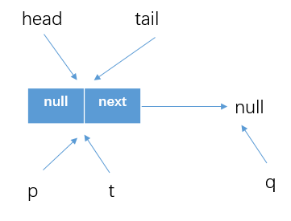
   
5. 代码（4）`if (q == null)`处执行判断`q==null`为true

6. 代码（5）`if (p.casNext(null, newNode))`处执行的是将`p`的next结以CAS方式更新为我们创建的`newNode`。（其中CAS会判断p的next是否为null，为null才更新为`newNode`）

7. 此时的`p==t`,所以不会执行更新tail的代码块（6）`casTail(t, newNode)`，而是从offer方法退出。这时候队列情况如下所示

   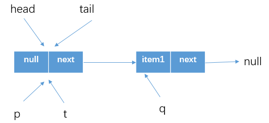

8. 那么这一个线程执行完，可是tail还没有改变呢：实际上第二次进行offer的时候，会发现`p=tail,p.next!=null`，就会执行代码（8）`p = (p != t && t != (t = tail)) ? t : q`，简单分析一下：

   - `p != t`：p为tail，t为tail，所以为`false`
   - `t != (t = tail)`：显然也是false

9. 所以结果就是p=q，然后进行下一次循环，之后判断的`p.next`就是null，所以可以CAS成功，也因为`p!=t`，所以会更新tail结点。

​	所以上面给的结论在这里就体现了，即`tail并不总是指向队列的尾节点`，那么实际上也可以换种方式让tail指向尾节点，即如下这样实现

```java
if (e == null)
    throw new NullPointerException();
Node<E> n = new Node<E>(e);
for (;;) {
    Node<E> t = tail;
    if (t.casNext(null, n) && casTail(t, n)) {
        return true;
    }
}
```

​	但是如果大量的入队操作，那么每次都需要以CAS方式更新tail指向的结点，当数据量很大的时候对性能的影响是很大的。所以最终实现上，是以减少CAS操作来提高大数量的入队操作的性能：每间隔1次（tail指向和真正的尾节点之间差1）进行CAS操作更新tail指向尾节点（但是距离越长带来的负面效果就是每次入队时定位尾节点的时间就越长，因为循环体需要`多循环一次来定位出尾节点（将指向真正的尾节点，然后添加newNode）`）。其实在前面分析成员属性时候也知道了，tail是被volatile修饰的，而CAS方式本质上还是对于volatile变量的读写操作，而volatile的写操作开销大于读操作的，所以`Concurrent Linked Queue的是线上是通过增加对于volatile变量的读操作次数从而相对的减少对其写操作`。下面是单线程执行offer方法的时候tail指向的变化简图示意

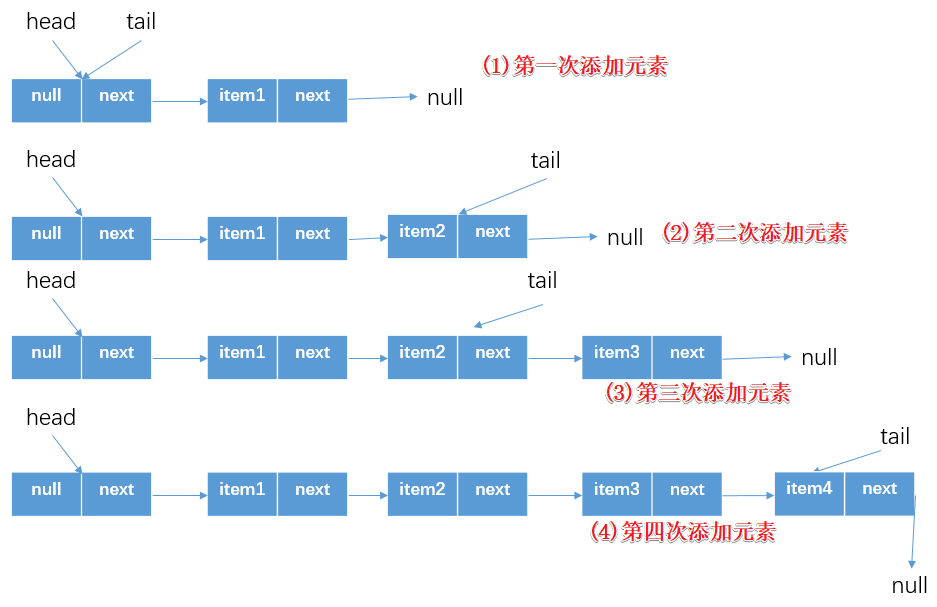

### 多线程执行

​	上面演示的单个线程的执行，那么当在多线程环境下执行的话会发生什么情况，这里假设两个线程并发的执行.

#### 	情况1

​	`这里分析的其实就是假设多个线程都会执行到CAS更新p.next结点的代码`,我们下面看一下，假设threadA调用offer(item1)，threadB调用offer（item2）都执行到`p.casNext(null, newNode)`位置处

- CAS操作的原子性，假设threadA先执行了上面那行代码，并成功更新了`p.next为newNode`
- 这时候threadB自然在进行CAS比较的时候就会失败了（`p.next!=null`），所以会进行下一次循环重新获取tail结点然后尝试更新

这时候的队列情况如下


- threadB获得tail结点之后，发现其`q!=null`（`q=p.next,p=tail`）

- 继续判断`p==q`也是`false`，所以执行代码（8）

- 分析一下`p = (p != t && t != (t = tail)) ? t : q`这个代码

  1. `p != t`：p为tail，t为tail，所以为`false`
  2. `t != (t = tail)`：显然也是false
  3. 所以上面三目运算的结果就是`p=q`，如下图所示结果

  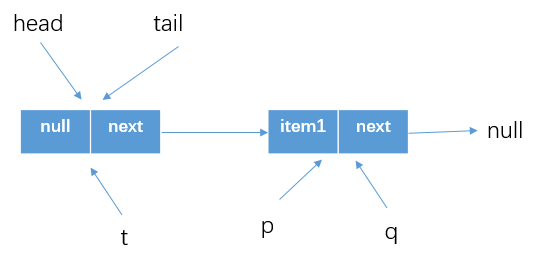

- 然后再次执行循环，这时候`p.next`就是null了，所以可以执行代码（5）`p.casNext(null,newNode)`。这个时候CAS判断得到`p.next == null`，所以可以设置`p.next=Node(item2)`

- CAS成功后，判断`p!=t`(如上图所示)，所以就可以设置tail为Node(item2)了。然后从offer退出，这个时候队列情况为

  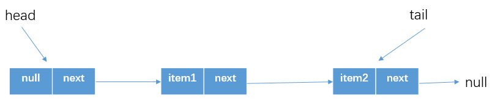


​	可以看出，`情况1`中假设两个线程初始时候都拿到的是`p=tail,p.next=null`，那么都会执行CAS尝试添加`newNode`，但是只有一个线程能够在第一次循环的时候添加成功然后返回true(`但是这时候的tail还没有变化，类似单线程总结那块的tail和真正的尾节点差1或0`)，所以另一个线程会在第二次循环中重新尝试，这个时候就会改变p的指向，即`p = (p != t && t != (t = tail)) ? t : q`代码处。然后再第三次循环中才能真正CAS添加成功(当然我们这里分析的是假想的两个线程情况，实际多线程环境肯定更复杂，但是逻辑还是差不多的)

#### 情况2

​	这里分析的是主要是代码`p = (p != t && t != (t = tail)) ? t : q`的另一种情况，即`p=t`的情况,还是先分析一下这行，假设现在

- `p != t`为true，
- t != (t = tail) : 也为true（左边的t是再循环开始的时候获得的指向tail的信息，括号中重新获得tail并赋值给t，这个时候有可能别的线程已经更改了 `volatile`修饰的tail了）

​	那么结果就是p 重新指向队列的尾节点tail了，下面假想一种这样的情况

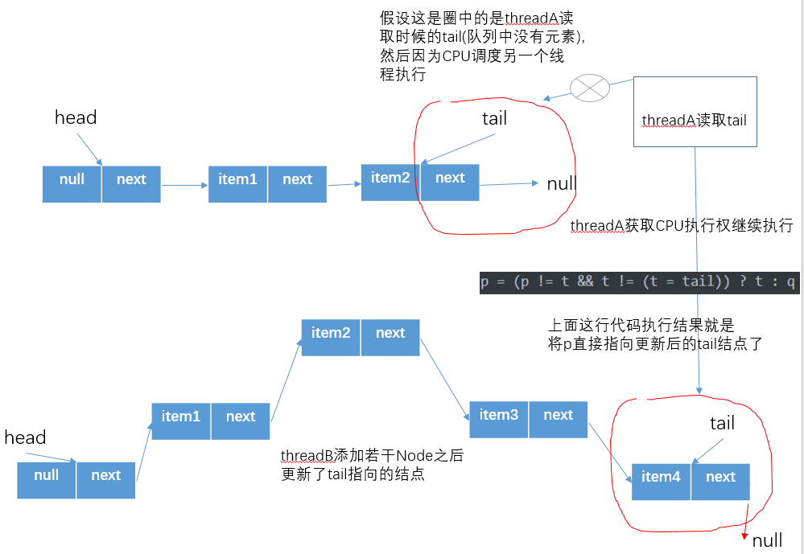

​	实际上这种是利用`volatile的可见性`，`快速将一个要添加元素的线程找到当前队列的尾节点`，避免多余的循环。 如图，假设threadA此时读取了变量tail，threadB刚好在这个时候添加若干Node后，此时会修改tail指针,那么这个时候线程A再次执行t=tail时t会指向另外一个节点，所以threadA前后两次读取的变量t指向的节点不相同，即`t != (t = tail)`为true,并且由于t指向节点的变化`p != t`也为true，此时该行代码的执行结果为p和t最新的t指针指向了同一个节点，并且此时t也是队列真正的尾节点。那么，现在已经定位到队列真正的队尾节点，就可以执行offer操作了。

#### 	情况3

​	上面我们讨论的都是多线程去添加元素的操作，那么当既有线程offer也有线程调用poll方法的时候呢，这里就要调用offer方法中的代码块（7）了。因为还没有说到poll方法，所以这里的代码就先不做解释，下面讲poll方法在多线程中的执行的时候，会拿offer-poll-offer这种情况进行说明，那么offer方法就可能执行这几行代码了。

```java
else if (p == q)
    //（7）多线程操作的时候，可能会有别的线程使用poll方法移除元素后可能会把head的next变成head，所以这里需要找到新的head
    p = (t != (t = tail)) ? t : head;
```

## add方法

```java
public boolean add(E e) {
    return offer(e);//这里还是调用的offer方法，上面说到了，这里就不说明了
}
```

## poll方法

​	poll方法是在队列头部获取并移除一个元素，如果队列为空就返回null，下面先看下poll方法的源码，然后还是分别分析单线程和多线程下的执行

```java
public E poll() {
    //标记
    restartFromHead:
    for (;;) {//自旋循环
        for (Node<E> h = head, p = h, q;;) {
            //(1)保存当前结点的item
            E item = p.item;
            //（2）如果当前结点的值不为null，那就将其变为null
            if (item != null && p.casItem(item, null)) {
                //（3）CAS成功之后会标记当前结点，并从链表中移除
                if (p != h) // hop two nodes at a time
                    updateHead(h, ((q = p.next) != null) ? q : p);
                return item;
            }
            //（4）如果队列为空会返回null
            else if ((q = p.next) == null) {
                updateHead(h, p);
                return null;
            }
            //（5）如果当前结点被自引用了，重新找寻新的队列头节点
            else if (p == q)
                continue restartFromHead;
            else
                p = q; //进行下一次循环，改变p的指向位置
        }
    }
}
final void updateHead(Node<E> h, Node<E> p) {
    if (h != p && casHead(h, p))
        h.lazySetNext(h);
}
```

上面我们已经看了poll方法的源码，下面我们就按照这个方法的实现通过图示的方式来理解一下。

### 单线程执行

​	poll操作是从队头获取元素，所以：

- 从head结点开始循环，首先`for (Node<E> h = head, p = h, q;;)`获得当前队列的头节点，当然如果队列一开始就为空的时候，就如下所示

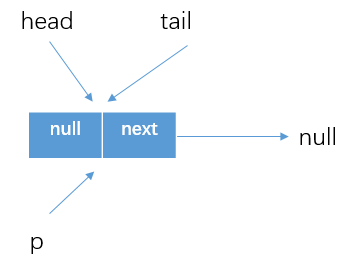

​	由于head结点是作为哨兵结点存在的，所以会执行到代码（4）`else if ((q = p.next) == null)`，因为队列为空，所以直接执行`updateHead(h, p)`，而`updateHead`方法中判断的`h=p`，所以直接返回null。

- 上面是队列为空的情况 ，那么当队列不为空的时候呢，假设现在队列情况如下所示

  ![[]](./queue/con-queue7.png)

- 所以在代码(4)`else if ((q = p.next) == null)`处的判断结果是false，

- 所以执行下一个判断`else if (p == q)`，判断结果还是false

- 最后执行`p=q`，完了之后下一次循环队列状态为

  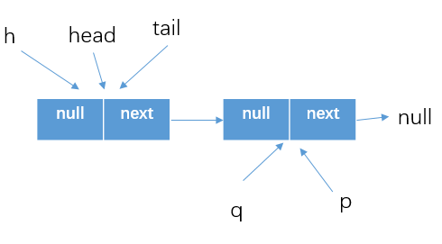

- 在新的一次循环中，可以判断得到item!=null，所以使用CAS方式将item设置为null，（这是单线程情况下的测试）所以继续执行`if(p!=h)`，判断结果为true。所以执行if中的内容：`updateHead(h, ((q = p.next) != null) ? q : p)`，什么意思呢？如下所示，所以我们这里的结果就是q=null，所以传入的参数为p（p指向的位置如上图所示）

  ```java
  //updateHead方法的参数（Node h,Node p）
  q = p.next;
  if(null != q) {
  	//第二个参数就是q
  } else {
      //第二个参数就是p
  }
  ```

  然后执行updateHead方法，这里我们需要再看一下该方法的细节
  
  ```java
  final void updateHead(Node<E> h, Node<E> p) {
      //如果h！=p，就以CAS的方式将head结点设置为p
      if (h != p && casHead(h, p))
          //这里是将h结点的next结点设置为自己（h）
          h.lazySetNext(h);
  }
  //Node类中的方法
  void lazySetNext(Node<E> val) {
      UNSAFE.putOrderedObject(this, nextOffset, val);
  }
  ```
  
  那么执行完这些之后，队列中状态是什么样呢，如下图所示。执行完毕就返回被移除的元素怒item1
  
  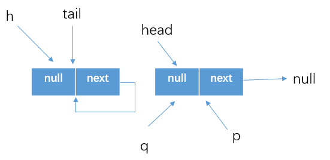

### 多线程执行offer、poll

​	上面分析了单线程下，调用poll方法的执行流程。其实刚刚再将offer方法的时候还有一个坑没有解决。如下描述的情况

- 假设原有队列中有一个元素item1 

  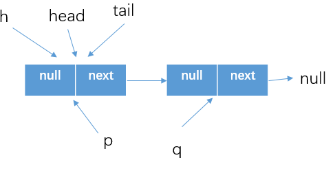

- 假设在thread1调用offer方法的时候，别的线程刚好调用poll方法将head结点移除了，按照上面的分析，poll方法调用后队列的情况如下

  

- (这里回忆一下offer的执行流程)所以在thread1继续执行的时候，执行的`for (Node<E> t = tail, p = t;;)`之后获得tail指向的位置如上图所示，但是这个tail指向的结点的next指针指向的位置还是自己。所以`Node<E> q = p.next`执行之后q=tail=p。所以在offer方法中就会执行以下判断

  ```java
  else if (p == q)
      //（7）多线程操作的时候，可能会有别的线程使用poll方法移除元素后可能会把head的next变成head，所以这里需要找到新的head
      p = (t != (t = tail)) ? t : head;
  ```

  还是简单分析一下`p = (t != (t = tail)) ? t : head`这句，如下所示。简单分析之后就能得出，p指向了poll方法调用完毕后的新的head结点（如上图所示的head结点），然后调用offer的线程就能正常的添加结点了，具体流程还是和上面讲到的一样。（那这个tail又在什么时候被指向队尾结点呢，实际上在调用offer方法添加完元素之后`p.casNext(null, newNode)`，就会判断得出`p != t `，那完了之后就会更新tail指向的位置了）

  ```java
  //在最开始时候获得的t=tail
  t=tail; //for循环中赋值t
  //...offer的其他代码
  if(t != (t = tail)) { //这里还是一样：tail为volatile修饰，所以重新读取tail变量
      p = t; //这里表示tail结点不变（按照上图poll执行完后的情况，tail指向位置没有变化，所以p不会被赋值为t）
  } else {
      p = head; //注意这时候的head已经指向的新的首结点
  }
  ```

### 多线程执行poll、poll

​	分析这么多，我们发现跟offer方法留坑一样，poll还有一处代码还没有分析，所以下面还是通过图示进行分析，先看下这个代码框架。

```java
//标记
restartFromHead:
for (;;) {//自旋循环
    for (Node<E> h = head, p = h, q;;) {
        //...other code
        //这是自旋循环体中的一个判断
        else if (p == q)
            continue restartFromHead;
    }
}
```

​	还是假设现在两个线程去执行poll方法，

- 初始情况下的队列状态为


- 假设threadA执行poll方法，并成功的执行`if (item != null && p.casItem(item, null))`这块，将item1设置为了null，如下图所示。

  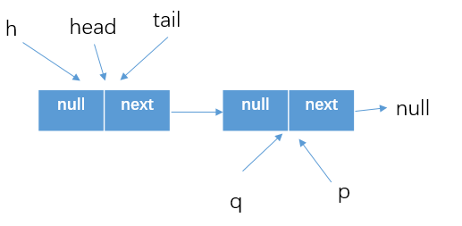

- 但是threadA还没有执行updateHead方法，这个时候threadB执行poll之后，p指向了上图中的head，如下所示

  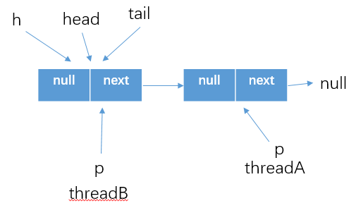

- 之后threadA执行updateHead方法更新了head的指向，并将原head的next结点指向自己.那么线程B执行`q=p.next`，自然得到的就是`p==q`的结果了，所以这个时候就需要跳到外层循环重新获取最新的head结点，然后继续执行

  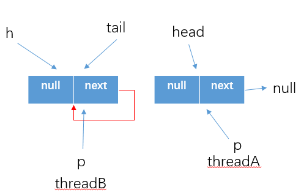

### poll方法总结

​	poll方法在移除头部元素的时候，使用CAS操作将头节点的item设置为了null，然后通过冲洗设置头节点head的指向位置来达到删除队列元素的效果。这个时候原来的头部哨兵结点就是一个孤立的结点了，会被回收掉。当然，如果线程执行poll方法的时候发现head结点被修改（上面说的这种情况），就需要跳转到最外层循环重新获取新的结点。

## peek方法

​	获取队列头部的第一个元素但不删除，如果队列为空则返回null。下面是该方法的实现

```java
public E peek() {
    restartFromHead:
    for (;;) {
        for (Node<E> h = head, p = h, q;;) {
            E item = p.item;
            if (item != null || (q = p.next) == null) {
                updateHead(h, p);
                return item;
            }
            else if (p == q)
                continue restartFromHead;
            else
                p = q;
        }
    }
}
```

​	需要注意的是，第一次调用peek方法的时候会删除哨兵结点，并让队列中的head结点指向队列中的第一个元素或者null.

## size方法

​	计算当前队列元素个数，但是因为使用的是CAS的方式在并发环境下可能因为别的线程删除或者增加元素导致计算结果不准确。

```java
public int size() {
    int count = 0;
    for (Node<E> p = first(); p != null; p = succ(p))
        if (p.item != null)
            // Collection.size() spec says to max out
            if (++count == Integer.MAX_VALUE)
                break;
    return count;
}
//找到队列中的第一个元素（head指向的item为null的结点不算（就是哨兵结点）），
//没有则返回null
Node<E> first() {
    restartFromHead:
    for (;;) {
        for (Node<E> h = head, p = h, q;;) {
            boolean hasItem = (p.item != null);
            if (hasItem || (q = p.next) == null) {
                updateHead(h, p);
                return hasItem ? p : null;
            }
            else if (p == q)
                continue restartFromHead;
            else
                p = q;
        }
    }
}
```

## remove方法

​	传入的参数为要删除的元素，如果队列中存在该元素就删除找到的第一个，然后返回true，否则返回false

```java
public boolean remove(Object o) {
    if (o != null) { //如果传入参数为null，直接返回false
        Node<E> next, pred = null;
        for (Node<E> p = first(); p != null; pred = p, p = next) {
            boolean removed = false;
            E item = p.item;
            //找到相等的就使用cas设置为null，只有一个线程操作成功
            //别的循环查找是否又别的匹配的obj
            if (item != null) {
                if (!o.equals(item)) {
                    //获取next元素
                    next = succ(p);
                    continue;
                }
                removed = p.casItem(item, null);
            }

            next = succ(p);
            if (pred != null && next != null) // unlink
                pred.casNext(p, next);
            if (removed)
                return true;
        }
    }
    return false;
}
```

