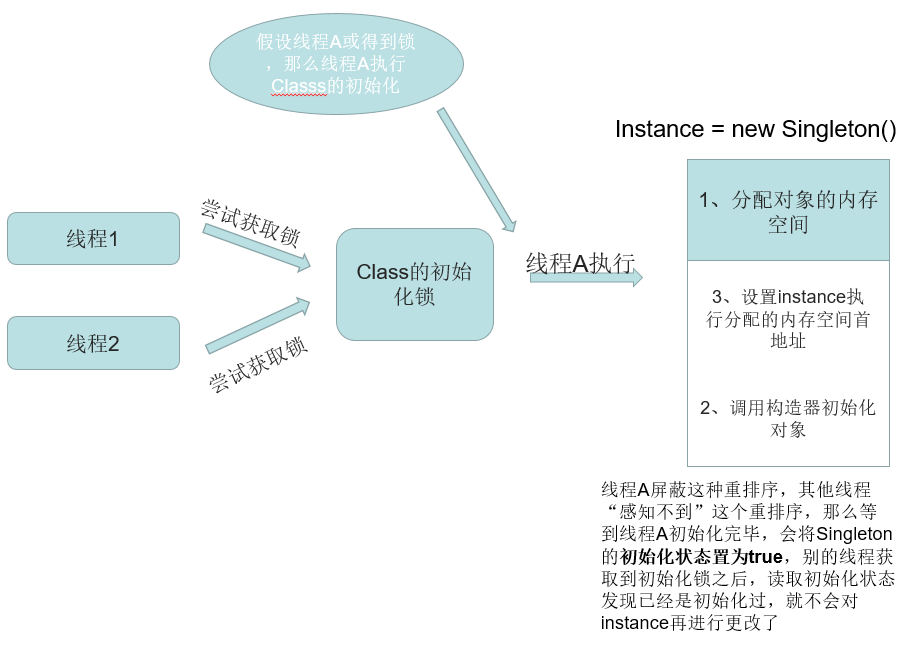

[多线程中的设计模式](#多线程中的设计模式)

- [单例模式的几种实现](#单例模式的几种实现)
- [单例模式中的Holder方式解释](#Holder方式实现单例的原理)
- [观察者模式与线程的生命周期](#观察者模式与线程的生命周期)
- [单线程执行设计模式](#单线程执行设计模式)
- [观察者模式与线程的生命周期](#观察者模式与线程的生命周期)
- [读写锁设计模式](#读写锁设计模式)
- [不可变对象以及线程安全对象](#不可变对象以及线程安全对象)
- [Future设计模式](#Future设计模式)
- [GuradedSuspension模式](#GuradedSuspension模式)
- [ThreadLocal使用与原理](#ThreadLocal使用与原理)
- [多线程上下文](#多线程上下文)
- [Balking设计模式](#Balking设计模式)
- [生产者消费者模式](#生产者消费者模式)

- [Thread-Per-Message模式](#ThreadPerMessage模式)
- [Two-Phase Termination设计模式](#TwoPhaseTermination设计模式)
- [多线程Work-Thread设计模式](#多线程Work-Thread设计模式)
- [Active Object-接收任务异步消息的主动对象](#ActiveObject接收任务异步消息的主动对象)

# 多线程中的设计模式

## 单例模式的几种实现

### 立即加载/"饿汉模式"

```java
//饿汉式是线程安全的，因为虚拟机保证只会装载一次，使用的时候是已经加载初始化好的instance。
public class SingletonPattern1 {

    private static final SingletonPattern1 instance = new SingletonPattern1();

    private SingletonPattern1() {
        //do sth about init
    }

    public static SingletonPattern1 getInstance() {
        return instance;
    }
}
```

### 延迟加载/"懒汉模式"

①线程不安全的懒汉模式

```java
//线程不安全的懒汉式
public class SingletonPattern2 {
    private static SingletonPattern2 instance;

    private SingletonPattern2() {
        //do sth about init
    }

    public static SingletonPattern2 getInstance() {
        //假设两个线程执行thread1、thread2；
        //(1)其中thread1执行到if判断的时候instance为null，这时候恰好因为线程调度thread1失去执行权；	
        //(2)thread2也执行到此处，并进入if代码块new一个instance，然后返回；
        //(3)thread1再次从此处执行，因为判断到的instance为null，也同样new一个instance然后返回；
        //(4)这样thread1和thread2的instance实际上并不是相同的了
        if(null == instance) {
            instance = new SingletonPattern2();
        }
        return SingletonPattern2.instance;
    }
}
```

②使用synchronized解决

```java
//使用synchronized的线程安全的懒汉式
public class SingletonPattern2 {
    private static SingletonPattern2 instance;

    private SingletonPattern2() {
        //do sth about init
    }
	//缺点：实际上只有一个线程是写的操作（获得monitor之后new一个instance），后面的线程因为因为已经创建了instance，就是相当于读的操作，但是read的操作还是加锁同步了（串行化了），效率较低
    public synchronized static SingletonPattern2 getInstance() {
        if(null == instance) {
            instance = new SingletonPattern2();
        }
        return SingletonPattern2.instance;
    }
}
```

③使用DCL机制(无volatile)

```java
//double check的方式
public class SingletonPattern3 {
    private static SingletonPattern3 instance;

    private SingletonPattern3() {
        //do sth about init
    }

    public static SingletonPattern3 getInstance() {
        //假设两个线程执行thread1、thread2，都判断instance为null
        if (null == instance) {
            synchronized (SingletonPattern3.class) {
                //(1)其中thread1进入同步代码块之后，new了一个instance
                //(2)在thread1退出同步代码块之后，thread2进入同步代码块，因为instance不为null，所以直接退出同步块，返回创建好的instance
                if(null == instance) {
                    instance = new SingletonPattern3();
                }
            }
        }
        //(3)现在已经创建好了instace，后面的线程在调用getInstance()方法的时候就会直接到此处，返回instance
        return SingletonPattern3.instance;
    }
}
```

④使用volatile的DCL

```java
//double check + volatile的方式
public class SingletonPattern3 {
    
    //volatile禁止指令重排序(happens-before中有一条volatile变量规则：对一个volatile变量的写的操作先行发生与对这个变量的读操作)
    private volatile static SingletonPattern3 instance;

    //SingletonPattern3其他的一些引用类型的属性PropertyXXX  propertyxxx;
    
    private SingletonPattern3() {
        //do sth about init
    }

    public static SingletonPattern3 getInstance() {
        if (null == instance) {
            synchronized (SingletonPattern3.class) {
                if(null == instance) {
                    //instance = new SingletonPattern3();这句，这里看起来是一句话，但实际上它并不是一个原
                    //子操作，在被编译后在JVM执行的对应汇编代码做了大致3件事情： 
                    //(1)分配内存
                    //(2)调用构造器
                    //(3)将instance对象指向分配的内存空间首地址(这时候的instance不为null)
                    //但由于指令重排序(Java编译器允许处理器乱序执行)的存在，上面三个步骤可能是1-2-3也可能是
                    //1-3-2，注意，如果是1-3-2的情况就可能出现问题，我们来分析一下可能出现的问题：
                    //I：假设现在两个线程thread1、thread2，现在threa1获取到monitor，然后按照上面的1-3-2执行，
                    //II：假设在3执行完毕、2未执行之前(或者说2只执行一部分，SingletonPattern3中的引用类型
                    //的属性一部分还是null)，这个时候切换到thread2上，
                    //III：这时候instance因为已经在thread1内执行过了(3)，instance已经是非空了，所以
                    //thread2直接拿走instance，然后使用，但是实际上instance指向的内存地址并没有调用构造器
                    //初始化的，这就可能会出现问题了。
                    instance = new SingletonPattern3();
                }
            }
        }
        return SingletonPattern3.instance;
    }
}
```

### Holer方式

参照下面的介绍[Holder方式实现单例的原理](#Holder方式实现单例的原理)

### 枚举方式

```java
//枚举方式实现
public class SingletonPattern5 {

    //枚举型不允许被继承、是线程安全的，只被实例化一次(同样下面使用类似Holder的方式)
    private enum EnumHolderSingleton {
        INSTANCE;

        private final SingletonPattern5 instance;

        EnumHolderSingleton() {
            this.instance = new SingletonPattern5();
        }

        private SingletonPattern5 getInstance() {
            return instance;
        }
    }

    public SingletonPattern5 getInstance()  {
        return EnumHolderSingleton.INSTANCE.getInstance();
    }
}
```

## Holder方式实现单例的原理

​	其中关于主动引用参考总结的[JVM之虚拟机类加载机制](https://www.cnblogs.com/fsmly/p/10394972.html)中讲到的主动引用和被动引用。我们下面会专门详解这种方式的原理。首先我们看看这种方式的实现

```java
//Holder方式：延迟加载、不加锁、线程安全
public class SingletonPattern4 {

    private SingletonPattern4() {
        //do sth about init
    }

    //在静态内部类中，有SingletonPattern4的实例，并且直接被初始化
    private static class Holder {
        private static SingletonPattern4 instance = new SingletonPattern4();
    }

    //返回的是Holer的静态成员instance
    public static SingletonPattern4 getInstance() {
        //在SingletonPattern4中没有instance的静态成员，而是将其放到了静态内部类Holder之中，因此在
        //SingletonPattern4类的初始化中并不会创建Singleton(延迟加载)的实例，Holder中定义了
        //SingletonPattern4的静态变量，并且直接进行了初始化。当Holder被主动引用的时候会创建
        //SingletonPattern4的实例，SingletonPattern4实例的创建过程在Java程序编译时候由同步方法<clinit>()
        //方法执行，保证内存的可见性、JVM指令的顺序性和原子性。
        return Holder.instance;
    }
}
```

​	在《深入理解Java虚拟机》的虚拟机类加载机制哪一章中我们知道类加载大致分为加载、链接（验证、准备、解析）、初始化这几个阶段，而上面这种方式的实现主要就是利用初始化阶段的一些规则来保证的。

​	JVM 在类的初始化阶段（即在 Class 被加载后，且被线程使用之前），会执行类的初始化（初始化阶段执行了类构造器<clinit()>方法）。关于<clinit()>方法的其他特点和细节我们暂不做讨论，这里我们关注其中一点：即JVM保证一个类的<clinit()>方法在多线程环境中被正确的加锁、同步，如果多个线程同时去初始化一个类，那么只有一个类能够执行这个类的<clinit()>方法，其他的线程都需要阻塞等待。比如下面的例子

```java
public class TestClinitThreadSafety {

    public static void main(String[] args) {

        new Thread() {
            @Override
            public void run() {
                new SimpleObject();
            }
        }.start();

        new Thread() {
            @Override
            public void run() {
                new SimpleObject();
            }
        }.start();
    }

    private static class SimpleObject {
        private static AtomicBoolean flag = new AtomicBoolean(true);
        static {
            System.out.println(Thread.currentThread().getName() + " init this static code.");
            while(flag.get()) {
                //do nothing
                //在多线程环境中如果同时去对这个类进行初始化，只有一个线程能够执行到这里。
            }
            System.out.println(Thread.currentThread().getName() + " finish this static code.");
        }
    }
}
```

​	我们通过下面的图来说明。Java 语言规范规定，对于每一个类或接口 C，都有一个唯一的初始化锁 LC 与之对应。从 C 到 LC 的映射，由 JVM 的具体实现去自由实现。JVM 在类初始化期间会获取这个初始化锁，并且每个线程至少获取一次锁来确保这个类已经被初始化过了(即每个线程如果要使用这个类，去初始化的时候都会获得这把锁确认初始化过了)。大概的处理过程如下：

​	①通过在 Class 对象上同步（即获取 Class 对象的初始化锁），来控制类或接口的初始化。这个获取锁的线程会一直等待，直到当前线程能够获取到这个初始化锁。假设 Class 对象当前还没有被初始化（初始化状态 state 此时被标记为 state = false），且有两个线程 A 和 B 试图同时初始化这个 Class 对象。

​	②线程 A 获取到初始化锁之后，执行类的初始化，同时线程 B 在初始化锁对应的初始化锁上等待。

​	③线程 A 执行完毕，将初始化状态设置为 state = true，然后唤醒在初始化锁上等待的所有线程。

​	④线程B(这里统一表示其他竞争这个初始化锁的线程)读取state=true，结束初始化退出(同一个类加载器下，保证一个类型只被初始化一次)。




## 观察者模式与线程的生命周期

## 单线程执行设计模式

## 读写锁设计模式

## 不可变对象以及线程安全对象

## Future设计模式

## GuradedSuspension模式

## ThreadLocal使用与原理

## 多线程上下文

## Balking设计模式

## 生产者消费者模式

## ThreadPerMessage模式

## TwoPhaseTermination设计模式

## 多线程Work-Thread设计模式

## ActiveObject接收任务异步消息的主动对象