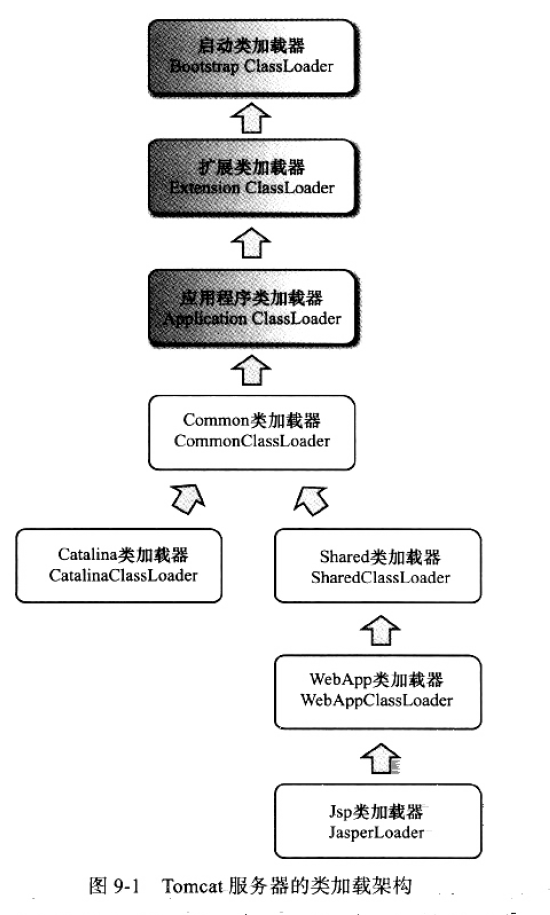
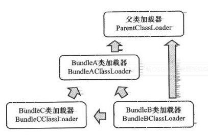

# ClassLoader
[TOC]


JVMS的描述

There are two kinds of class loaders: the bootstrap class loader supplied by the Java Virtual Machine, and user-defined class loaders. Every user-defined class loader is an instance of a subclass of the abstract class ClassLoader. Applications employ user-defined class loaders in order to extend the manner in which the Java Virtual Machine dynamically loads and thereby creates classes. User-defined class loaders can be used to create classes that originate from user-defined sources. For example, a class could be downloaded across a network, generated on the fly, or extracted from an encrypted file.


正确理解类加载器能够帮你解决NoClassDefFoundError和java.lang.ClassNotFoundException，因为它们和类的加载相关。


类加载器负责加载文件系统、网络或其他来源的类文件。


**Bootstrap** 类加载器负责加载rt.jar中的JDK类文件，它是所有类加载器的父加载器。Bootstrap类加载器没有任何父类加载器，如果你调用String.class.getClassLoader()，会返回`null`，任何基于此的代码会抛出NUllPointerException异常。Bootstrap加载器被称为`初始类加载器`。

**Extension** 将加载类的请求先`委托`给它的父加载器，也就是`Bootstrap`，如果没有成功加载的话，再从`jre/lib/ext`目录下或者`java.ext.dirs`系统属性定义的目录下加载类。Extension加载器由sun.misc.Launcher$ExtClassLoader实现。

**Application** 类加载器（又叫作System类加载器）。它负责从`classpath`环境变量中加载某些应用相关的类，classpath环境变量通常由-classpath或-cp命令行选项来定义，或者是JAR中的Manifest的classpath属性。Application类加载器是Extension类加载器的子加载器。通过sun.misc.Launcher$AppClassLoader实现。


小归纳：

+ Bootstrap类加载器 – JRE/lib/rt.jar
+ Extension类加载器 – JRE/lib/ext或者java.ext.dirs指向的目录
+ Application类加载器 – CLASSPATH环境变量, 由-classpath或-cp选项定义,或者是JAR中的Manifest的classpath属性定义.

## classLoader的工作原理


Java类加载器的作用就是在运行时加载类。Java类加载器基于三个机制：委托、可见性和单一性

+ 委托：将加载一个类的请求交给父类加载器，如果这个父类加载器`不能够找到或者加载`这个类，那么再加载它。

+ 可见性：子类的加载器可以看见所有的父类加载器加载的类，而父类加载器看不到子类加载器加载的类。

+ 单一性：仅加载一个类一次，这是由委托机制确保子类加载器不会再次加载父类加载器加载过的类。


tips: classpath定义的是类文件的加载目录，而PATH是定义的是可执行程序如javac，java等的执行路径。


### 委托机制

+ `检查类是否已加载`：调用 findLoadedClass(String) 
+ `委托父级加载`：loadClass(String) ，如果父级加载器为null，调用system class loader
+ 如果还是找不到，调用本加载器的findClass(String)，`自己加载`
+ 如果class在上述步骤找到了，然后resolve=true，调用resolveClass(Class)。


子类应该去重写 findClass(String)而不是loadClass方法，这个方法用getClassLoadingLock 锁住整个class加载过程。

```java
public abstract class ClassLoader {
    public Class<?> loadClass(String name) throws ClassNotFoundException {
        return loadClass(name, false);
    }
    /**
     * 加载类
     */
    protected Class<?> loadClass(String name, boolean resolve)
        throws ClassNotFoundException
    {
        synchronized (getClassLoadingLock(name)) {
            // 1. 检查类是否已经加载
            Class<?> c = findLoadedClass(name);
            if (c == null) {
                long t0 = System.nanoTime();
                try {
                    // 2. 委托父级加载器去加载
                    if (parent != null) {
                        c = parent.loadClass(name, false);
                    } else {
                        //  system 加载器去加载
                        c = findBootstrapClassOrNull(name);
                    }
                } catch (ClassNotFoundException e) {
                    // 当parent!=null，找不到类，抛出 ClassNotFoundException 
                }
            
                if (c == null) {
                    long t1 = System.nanoTime();
                    // 还是没找到，使用本加载器去加载
                    c = findClass(name);

                    // 一些监控信息，跳过
                    sun.misc.PerfCounter.getParentDelegationTime().addTime(t1 - t0);
                    sun.misc.PerfCounter.getFindClassTime().addElapsedTimeFrom(t1);
                    sun.misc.PerfCounter.getFindClasses().increment();
                }
            }
            if (resolve) {
                resolveClass(c);
            }
            return c;
        }
    }

}
```

调用自己的加载流程：
+ 查找到文件资源
+ 解析二进制为class对象


```java
public class URLClassLoader extends SecureClassLoader implements Closeable {
    
    protected Class<?> findClass(final String name) throws ClassNotFoundException
    {
        final Class<?> result;
        try {
            result = AccessController.doPrivileged(
                new PrivilegedExceptionAction<Class<?>>() {
                    public Class<?> run() throws ClassNotFoundException {
                        String path = name.replace('.', '/').concat(".class");
                        Resource res = ucp.getResource(path, false);
                        if (res != null) {
                            try {
                                // 把二进制数据转换为class 对象，核心调用还是native
                                return defineClass(name, res);
                            } catch (IOException e) {
                                throw new ClassNotFoundException(name, e);
                            }
                        } else {
                            return null;
                        }
                    }
                }, acc);
        } catch (java.security.PrivilegedActionException pae) {
            throw (ClassNotFoundException) pae.getException();
        }
        if (result == null) {
            throw new ClassNotFoundException(name);
        }
        return result;
    }
}
```

### 可见性


```java
public class ClassLoaderDemo {

    public static void main(String[] args) throws ClassNotFoundException {
        
        ClassLoader appLoader = ClassLoaderDemo.class.getClassLoader();
        ClassLoader extLoader = appLoader.getParent();
        System.out.println(appLoader);//sun.misc.Launcher$AppClassLoader@18b4aac2
        System.out.println(extLoader);//sun.misc.Launcher$ExtClassLoader@6debcae2

        Class.forName("classloader.ClassLoaderDemo",true,appLoader);
        // 虽然apploader已经撞在了，但是ext是不知道的。
        // 重新装载，因为ext目录下找不到，这里抛出ClassNotFoundException:，
        Class.forName("classloader.ClassLoaderDemo",true,extLoader);
    }
}
```
### 单一性

根据这个机制，父加载器加载过的类不能被子加载器加载第二次。虽然重写违反委托和单一性机制的类加载器是`可能的`，但这样做并不可取。自己写的类加载器的时候应该严格遵守这三条机制。


[类加载器的工作原理](http://www.importnew.com/6581.html)


## 类加载器的常见用法


### Tomcat中的类加载器

在Tomcat目录结构中，有三组目录（“/common/*”,“/server/*”和“shared/*”）可以存放公用Java类库，

此外还有第四组Web应用程序自身的目录“/WEB-INF/*”，把java类库放置在这些目录中的含义分别是：
+ common：类库可被Tomcat和所有的Web应用程序共同使用。
+ server：类库可被Tomcat使用，但对所有的Web应用程序都不可见。
+ shared：类库可被所有的Web应用程序共同使用，但对Tomcat自己不可见。
+ /WebApp/WEB-INF：类库仅仅可以被此Web应用程序使用，对Tomcat和其他Web应用程序都不可见。




### OSGi：动态模块化


OSGI（Open Service GatewayInitiative）是OSGI联盟制定的一个基于Java语言的动态模块化规范。



OSGI的类加载器之间的关系不在是“双亲委派模型”的树形结构，而是已经进一步发展成了一种更为复杂的、运行时才能确定的网状结构。上图是一个概念模型，因为不同的依赖关系，其实际委派加载关系也是不同的。

#### 模块划分
       
OSGI中的每个模块称为`Bundle`，与普通的Java类库区别不大，都是以JAR格式进行封装，并且内部存储的都是Java Package和Class。但是一个Bundle可以声明它所依赖的Java Package（通过Import-Package描述），也可以声明它允许导出发布的Java Package（通过Export-Package描述）。


#### 精准的类库可见性控制
       
在OSGI里面，Bundle之间的依赖关系从传统的上层模块依赖底层模块转变为平级模块之间的依赖，而且类库的可见性能得到非常精准的控制，一个模块里只有被 `Export` 过的Package才可能由`外界访问`，其他的Package和Class将会隐藏起来。

#### 模块级的热插拔

由于其具有精准的类库可见性控制能力，基于OSGI的程序很可能可以实现模块级的`热插拔`功能，当程序升级更新或调试除错时，可以只停用、重新安装然后启动程序的其中一部分，这是一个对企业级程序开发很好的特性。


## 类的加载过程


当执行 java xxx.class 的时:

1. java.exe 会帮助我们找到 JRE ，接着找到位于 JRE 内部的 jvm.dll(jre\bin\server\jvm.dll)，这才是真正的 Java 虚拟机器， 最后加载动态库，激活 Java 虚拟机器。

2. 虚拟机器激活以后，会先做一些初始化的动作，比如说读取系统参数等。一旦初始化动作完成之后，就会产生第一个类加载器―― `Bootstrap Loader` 

3. Bootstrap Loader 由 C++ 所撰写而成， Bootstrap Loader 所做的初始工作中，最重要的就是加载 Launcher.java 之中的 `ExtClassLoader` ，并设定其 Parent 为 null ，代表其父加载器为 BootstrapLoader 。（Launcher.java在rt.jar）

4. 然后 Bootstrap Loader 再要求加载 Launcher.java 之中的 `AppClassLoader` ，并设定其 Parent 为之前产生的 ExtClassLoader 实体。这两个加载器都是以静态类的形式存在的。

&emsp;&emsp;这里要注意的是： Launcher\$ExtClassLoader.class 与 Launcher\$AppClassLoader.class 都是由 Bootstrap Loader 所加载，所以 Parent 和由哪个类加载器加载没有关系。parent的语义，这里建议叫做父级，不叫父类。 


