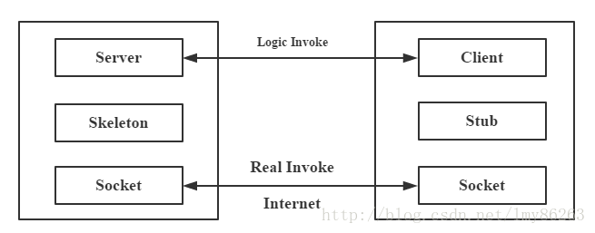

[TOC]


## RMI的通信模型


从客户端-服务器模型来看，客户端程序直接调用服务端，两者之间是通过JRMP（ Java Remote Method Protocol）协议通信，这个协议类似于HTTP协议，规定了客户端和服务端通信要满足的规范。


实际上，`客户端`只与代表远程主机中对象的`Stub`对象进行通信，丝毫不知道`Server`的存在。客户端只是调用`Stub`对象中的本地方法，`Stub`对象是一个本地对象，它实现了远程对象向外暴露的接口，也就是说它的方法和远程对象暴露的方法的签名是相同的。客户端认为它是调用远程对象的方法，实际上是调用Stub对象中的方法。可以理解为`Stub`对象是远程对象在本地的一个`代理`，`当客户端调用方法的时候，Stub对象会将调用通过网络传递给远程对象`。




## 数据的传递问题

对象的传递有两种解决方法：

1. 每当客户端调用服务，对象序列化后传输到服务端，服务端反序列化解析。

2. 分布式共享对象。所有客户端都保存了服务端 对应对象的副本，每次修改都会同步到整个系统


对象序列化必须满足两个条件之一：
+ 是Java的基本类型；
+ 实现java.io.Serializable接口（String类即实现了该接口）
    + 对于容器类，如果其中的对象是可以序列化的，那么该容器也是可以序列化的；
    + 可序列化的子类也是可以序列化的；


RMI中的`参数传递`和`结果返回`可以使用的三种机制（取决于数据类型）：

+ 简单类型：按值传递，直接传递数据拷贝；
+ 远程对象引用（实现了Remote接口）：`共享对象`，以远程对象的引用传递；
+ 远程对象引用（未实现Remote接口）：按值传递，通过`序列化`对象传递副本，本身不允许序列化的对象不允许传递给远程方法；


## 远程对象的发现问题


### 注册中心

服务的提供者和服务的消费者可以是毫无关系的，那如何定位服务就成为一个问题。这时候需要一个中间人，register,注册中心。注册中心负责 维护 服务别名到服务地址的映射，并提供查询服务。


### 服务地址

+ 服务地址表示为：`rmi://host:port/name`，host指明注册表运行的注解，port表明接收调用的端口，name是一个标识该对象的简单名称。
+ 主机和端口都是可选的，如果省略主机，则默认运行在本地；如果端口也省略，则默认端口是1099；


## 代码示例


实现RMI所需的API几乎都在：

+ java.rmi：提供客户端需要的类、接口和异常；
+ java.rmi.server：提供服务端需要的类、接口和异常；
+ java.rmi.registry：提供注册表的创建以及查找和命名远程对象的类、接口和异常；


### sdk 包部分：

```java
public class User implements Serializable {
    // 该字段必须存在
    private static final long serialVersionUID = 42L;
    // setter和getter可以没有
    String name;
    int id;

    public User(String name, int id) {
        this.name = name;
        this.id = id;
    }
}
```
```java
public interface UserHandler extends Remote {
    String getUserName(int id) throws RemoteException;
    int getUserCount() throws RemoteException;
    User getUserByName(String name) throws RemoteException;
}
```

+ 只有在注册中心绑定了的方法，才能被客户端调用

子接口的实现类应该直接或者间接继承java.rmi.server.UnicastRemoteObject类，该类提供了很多支持RMI的方法，具体来说，这些方法可以通过`JRMP协议`导出一个远程对象的引用，并通过`动态代理`构建一个可以和远程对象交互的`Stub`对象。


### provider包部分：
```java
/**
 * 子接口的每个方法都必须声明抛出java.rmi.RemoteException异常
 *     该异常是使用RMI时可能抛出的大多数异常的父类。
 * 子接口的实现类应该直接或者间接继承java.rmi.server.UnicastRemoteObject类，该类提供了很多支持RMI的方法
 *    这些方法可以通过JRMP协议导出一个远程对象的引用，并通过动态代理构建一个可以和远程对象交互的Stub对象。
 */
public class UserHandlerImpl extends UnicastRemoteObject implements UserHandler {
    // 该构造期必须存在，因为集继承了UnicastRemoteObject类，其构造器要抛出RemoteException
    public UserHandlerImpl() throws RemoteException {
        super();
    }

    @Override
    public String getUserName(int id) throws RemoteException {
        return "lmy86263";
    }

    @Override
    public int getUserCount() throws RemoteException {
        return 1;
    }

    @Override
    public User getUserByName(String name) throws RemoteException {
        return new User("lmy86263", 1);
    }
}
```

```java
public class Provider {

    public static void main1(String[] args) {
        /**
         * 此方法需要手动启动注册中心
         *     在classpath 目录 手动运行 rmiregistry <port>,然后再启动
         *     如果出现classNotFind...Exception，一般是注册中心启动的位置不对
         */

        UserHandler userHandler = null;
        try {
            userHandler = new UserHandlerImpl();
            // 把名称映射到对象引用
            Naming.rebind("user", userHandler);
            System.out.println(" rmi server is ready ...");
        } catch (Exception e) {
            e.printStackTrace();
        }
    }

    public static void main(String[] args) {
        //自带注册机制
        UserHandler userHandler = null;
        Registry registry = null;
        try {
            registry = LocateRegistry.createRegistry(1099);
            userHandler = new UserHandlerImpl();
            registry.rebind("user", userHandler);
            System.out.println(" rmi server is ready ...");
        } catch (RemoteException e) {
            e.printStackTrace();
        }
    }
}
```

### consumer:

```java

public class Consumer {
    public static void main(String[] args) {
        try {
            // 需外部启动
            UserHandler handler = (UserHandler) Naming.lookup("user");
            int count = handler.getUserCount();
            String name = handler.getUserName(1);
            System.out.println("name: " + name);
            System.out.println("count: " + count);
            System.out.println("user: " + handler.getUserByName("lmy86263"));
        } catch (Exception e) {
            e.printStackTrace();
        }
    }
}

```


参考：[从懵逼到恍然大悟之Java中RMI的使用](https://blog.csdn.net/lmy86263/article/details/72594760)

