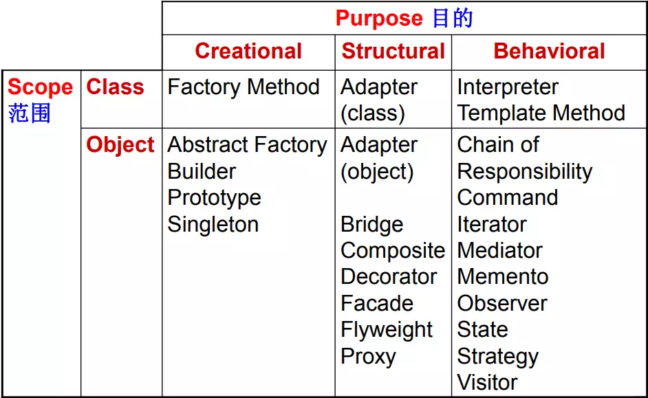
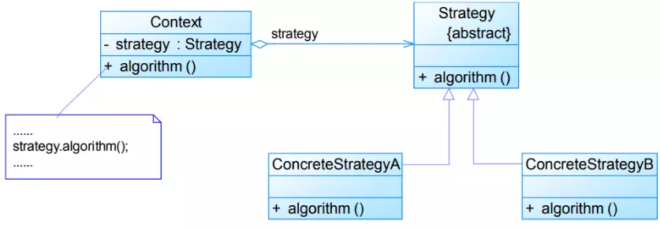
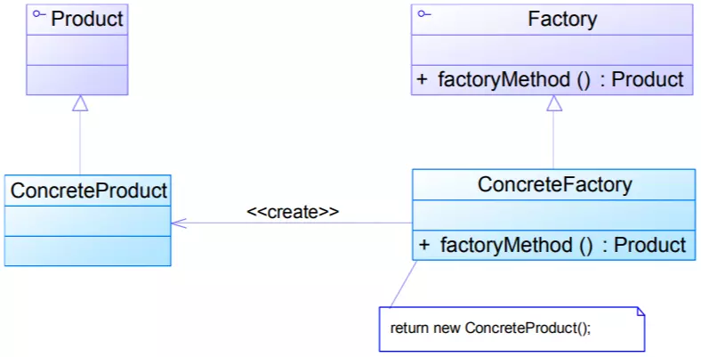
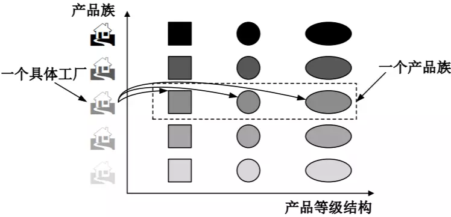
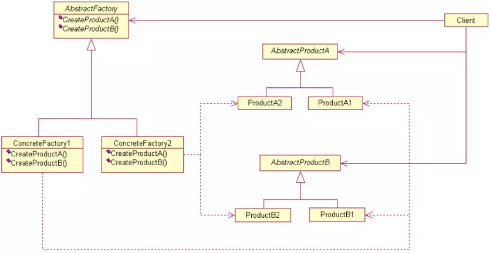
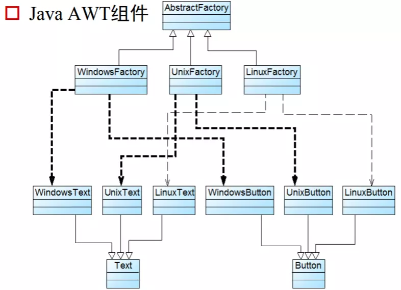
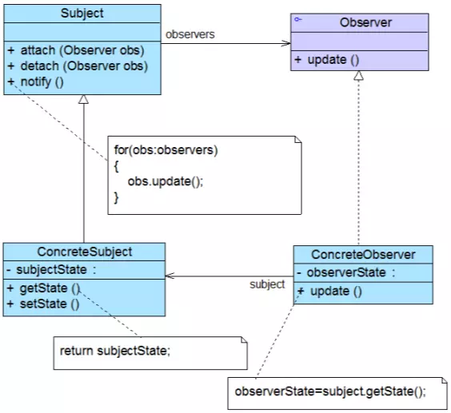

@import ".assets/common.js" 

[TOC]


# 设计模式

设计模式(Design Pattern)是一套被反复使用、多数人知晓的、经过分类编目的、代码设计经验的总结，使用设计模式是为了可重用代码、让代码更容易被他人理解、保证代码可靠性





根据目的：
+ 创建型:（Creational）：
    + 将软件模块中对象的创建和对象的使用分离
    + 隐藏了类的实例的创建细节
+ 结构型（Structural）：用于处理类或对象的组合
    + 类结构型：关注类之间的继承和实现
    + 对象结构型：关注类和对象的组合
+ 行为型（Behavioral）：关注类或对象的职责划分和交互
    + 类行为型模式：通过继承机制分配行为
    + 对象行为型模式：通过聚合分配行为

根据范围：
+ 类模式：处理类和子类之间的关系，通过继承建立，在编译刻确定，静态
+ 对象模式：处理对象间的关系，运行时，动态


## 单例模式(Singleton)


> 单例模式确保某一个类只有一个实例，而且自行实例化并向整个系统提供这个实例，这个类称为单例类，它提供全局访问的方法

### 动机
对于系统中的某些类来说，只有一个实例很重要

要点有三个：
+ 某个类只能有一个实例
+ 它必须自行创建这个实例
+ 它必须自行向整个系统提供这个实例

### 定义

> Ensure a class only has one instance, and provide a global point of access to it.
> 保证一个类仅有一个实例，并提供一个访问它的全局访问点


### 分析
```java
/**
 * 懒汉式单例
 */
public class Singleton {
    //静态私有成员变量
    private static Singleton instance = null;
    
    private Singleton() { 
        //私有构造方法
    }
    //静态公有工厂方法，返回唯一实例
    public static Singleton getInstance() {
        if (instance == null)
        instance = new Singleton();
        return instance;
    }
}


/**
 * 饿汉式单例
 */
public class Singleton {
    ...
    //在类初始化时创建唯一实例
    private static final Car car = new Car();
```

### 优缺点

#### 单例模式的优点

+ 提供了对唯一实例的受控访问。可以严格`控制客户怎样以及何时访问`对象，并为设计及开发团队提供了共享的概念。

+ `复用对象`，由于在系统内存中只存在一个对象，因此可以节约系统资源，对于一些需要频繁创建和销毁的对象，单例模式无疑可以提高系统的性能。
+ `允许可变数目的实例`。可以基于单例模式进行扩展，使用与单例控制相似的方法来获得指定个数的对象实例。


#### 单例模式的缺点

+ 没有抽象层，`难以扩展`。
+ 单例类的`职责过重`，自己负责创建自己，负责对外发布自己，在一定程度上违背了“单一职责原则”。
+ 垃圾回收的技术的不恰当应用可能导致`对象状态的丢失`。


### 适用环境

+ 系统`只需要或只能`创建单实例
	+ 业务环节要求，如单Connection
	+ 资源消耗太大而只允许创建一个对象

+ 客户调用类的单个实例只允许使用`单一公共访问点`，除了该公共访问点，不能通过其他途径访问该实例。

+ 系统要求固定实例数，在状态上的注意

> 来来回回都是你

## 策略模式(Strategy)


###  Problem

实现某一功能可以有许多算法（如查找/排序的算法），一种传统的做法是将多种算法硬编码在一个类中，通过if或switch来区分,不利于扩展.


### Solution


> Define a family of algorithms, encapsulate each one, and make them interchangeable
解决方案：把一系列具体的算法抽象为`可替换的策略类`


> Strategy lets the algorithm vary independently from clients that use it.
可替换：Strategy模式使得算法可独立于客户端而变化




+ Context：环境角色
	+ 持有一个Strategy类的引用
+ Strategy：抽象策略角色
	+ 这是一个抽象角色，此角色给出所有具体策略类所需的接口
+ Concrete Strategy：具体策略角色
	+ 包装了相关的算法或行为


+ 策略模式是对算法的封装，它把算法的责任和算法本身分割开，委派给不同的对象管理。


### Consequences


```java {.line-numbers}
public abstract class AbstractStrategy {
	public abstract void algorithm();
} 

public class ConcreteStrategyA extends AbstractStrategy {
	public void algorithm() { 
		//do something
	}
} 
...
public class Context {
	//客户端决定使用哪种算法
	public void algorithm(String type) {
		AbstractStrategy strategy=null;
		if (type == "strategyA") { 
			strategy=new ConcreteStrategyA()
		}
		else if (type == "strategyB") { 
			strategy=new ConcreteStrategyB()
		}
		else if (type == "strategyC") { 
			strategy=new ConcreteStrategyC()
		}
		strategy.algorithm();
	}
} 
```

+ 提高了系统的灵活性，策略可以灵活切换


### 优点

+ “`开闭原则`”的完美实践，可以在不修改原有系统的基础上选择算法或行为也可以灵活地增加新的算法或行为
+ 策略模式提供了`管理相关的算法族`的办法
+ 策略模式提供了可以`替换继承关系`的办法
+ 使用策略模式可以`避免使用多重条件转移语句`


### 缺点
+ 客户端负责选择并实例化具体策略，`增加了客户端的使用难度`
+ 策略模式将产生很多策略类


### 适用环境

+ 完成同一个目标在`不同环境需要不同的策略`

+ 一个算法使用了客户端不应该知道的算法，使用策略模式来`避免对客户端暴露复杂且与算法相关的数据结构`。

+ 一个类定义了多个行为，并且这些行为的触发依赖于`多个控制条件`，避免使用多个控制条件，将相关的策略抽离到它们具体的策略类中


### 应用举例

Java JDK中的策略模式

+  布局管理器LayoutManager
	+ Context角色：Container类
	+ Strategy角色：LayoutManager接口
	+ Concrete Strategy角色：BorderLayout, FlowLayout, … …

+ Swing中的组件边框Border
	+ Context角色：JComponent类
	+ Strategy角色：Border接口
	+ Concrete Strategy角色：TitledBorder, LineBorder, … …

> 心之所向，法有千万

## 工厂模式(Factory)


+ 简单工厂模式(Simple Factory)
+ 工厂方法模式(Factory Method)
+ 抽象工厂模式(Abstract Factory)


### 3.1 问题
依赖倒置原则（Dependency-Inversion Principle）

+ 依赖于抽象，面向接口编程


在客户端需要：
```java

Shape square=new Square();
Shape circle=new Circle();
```
客户端依赖于具体的类。

>简单工厂模式并不属于GoF23个经典设计模式，但通常将它作为学习其他工厂模式的基础。


### 简单工厂模式 (Simple Factory Pattern)
also called:__Static Factory Method__

#### 背景


+ 客户端与具体类耦合
+ 客户端选择具体类需要 繁琐的 if...else
+ 具体类的创建可能还需要初始化
+ 客户端承担过多职责，容易出错

#### 定义

+ 简单工厂模式专门定义一个类来负责创建其他类的实例，被创建的实例通常都具有共同的父类。


+ 可以将静态工厂方法的参数存储在配置文件中

#### 优点

+ `分割责任`，免除了客户端直接创建产品对象的责任，`客户端专注于“消费”产品`
+ 客户端只需要知道产品对应的工厂参数即可，`减少使用者需要的信息`
+ 通过引入`配置文件`，可以在不修改任何客户代码的情况下更换产品类，在一定程度上提高了系统的灵活性

#### 缺点

+ 如果工厂类`集中了太多产品的创建逻辑`，`职责过重`，一旦不能正常工作，整个系统都可能受到影响

+ 使用简单工厂模式将会增加系统中类的个数，在一定程度上增加了系统的复杂度和理解难度

+ `系统扩展困难`，一旦添加新产品就不得不修改工厂逻辑，在产品类型较多时，有可能造成工厂逻辑过于复杂，不利于系统的扩展和维护,可以通过反射来改善


#### 适用环境

+ 工厂类负责`创建的对象比较少`
	+ 不会造成工厂方法中的业务逻辑太过复杂
	+ 如果创建的对象类型很少，使用工厂模式或抽象工厂有`过度设计的嫌疑`
+ 客户只知道传入工厂类的参数，对于如何创建对象不关心
	+ 客户只需要知道类型所对应的参数


### 工厂方法模式 (Factory Method)

#### 动机

+ __简单工厂__ 存在过多的条件分支语句，难以维护
+ __简单工厂__ 难以扩展，扩展需要修改工厂逻辑，违背了`开闭原则`


#### 定义



+ 工厂父类 定义了创建产品的接口（规范）

> Factory Method lets a class defer instantiation to subclasses. 

+ 工厂子类负责具体产品的创建

#### 分析

+ 是简单工厂的进一步抽象，`克服了简单工厂的不易扩展`，保持其优点

+ 父类工厂负责创建的规范，具体工厂负责实现，`引入新产品符合开闭原则`

+ 谨防工厂模式退化为简单工厂


#### 3.3.4 优缺点


##### 优点
+ 符合`Demeter法则`，尽量少的信息量，用户只需要关心所需产品对应的工厂
+ 工厂可以自主确定创建何种产品对象，而如何创建这个对象的细节则完全封装在具体工厂内部

+ 加入新产品时只添加一个具体工厂和具体产品即可。符合“`开闭原则`”

##### 缺点

+ 添加一个新的产品，需要添加一个对应的具体工厂，`工厂和商品成对出现`，在一定程度上增加了系统的复杂度，类的增多增加系统开销

+ 由于考虑到系统的可扩展性，引入抽象层，在客户代码中均使用抽象层进行定义，增加了系统的`抽象性和理解难度`


#### 适应环境

+ 一个产品对应一个工厂
+ 一个类不知道它所需要的对象的类
	+ 客户需要知道创建具体产品的工厂类
+ 使用时用抽象产品声明
	+ 运行时确定，符合Liskov替换原则，使得系统更容易扩展


### 抽象工厂模式(Abstract Factory)

#### 动机

> 工厂模式一个工厂只能生产一种产品，而业务需要创建一系列产品


+ 产品等级结构：产品等级结构即产品的继承结构
	+ 不同工厂生产同种类型的产品
	+ 如：一个抽象类是电视，其子类有小米电视、乐视电视，抽象电视是父类，而具体品牌的电视是其子类

+ 产品族：在抽象工厂模式中，产品族是指由同一个工厂生产的，位于不同产品等级结构中的一组产品
	+ 同一个工厂生产的所有产品的类型构成产品族
	+ 如小米工厂生产：小米手机，小米电视...小米全家桶就是小米产品族


__抽象工厂是工厂模式的升级版__


+ 工厂方法模式针对的是一个产品等级结构，`不同工厂生产一种同类产品`，
+ 抽象工厂模式则需要面对多个产品等级结构，一个工厂等级结构可以负责多个不同产品等级结构中的产品对象的创建,`不同工厂生产一系列产品`



#### 定义
抽象工厂模式(Abstract Factory Pattern)
> Provide an interface for creating families of related or dependent objects without specifying their concrete classes.

提供一个创建一系列相关或相互依赖对象的接口，而无须指定它们具体的类



#### 优点
+ 所有工厂模式：`分离了具体类的生产和消费`
+ 应用抽象工厂模式可以实现高内聚低耦合的设计目的
	+ 当一个产品族中的多个对象被设计成一起工作时,`保证客户始终只使用同一个产品族中的对象`
	+ 一系列具体产品的构建被通过“产品族”的概念耦合在一个具体的工厂中
+ `易于增加新的具体工厂(也即产品族)`，无须修改已有系统，符合“开闭原则”

#### 缺点：

+ 难以扩展新的产品,整个产品体系都要修改，
+ 开闭原则有所倾斜（增加新的工厂和产品族容易，增加新的产品等级结构麻烦）


#### 适应环境

在以下情况下可以使用抽象工厂模式：

+ 对于所有类型的工厂模式，`一个系统不应当依赖于产品类实例被创建、组合和表达的细节`
+ 需要同时使用同一工厂的`一系列`产品，并可能切换产品族
+ `产品之间形成产品族`，系统提供一个产品类的库，所有的产品以同样的接口出现，从而使客户依赖于抽象产品




## 组合模式(Composite)


### 4.1 动机


> 在树形结构中，希望`一致对待集合对象和个体对象`

### 4.2 定义

> Compose objects into tree structures to represent part-whole hierarchies. Composite lets clients treat individual objects and compositions of objects uniformly.

组合多个对象形成树形结构以表示“整体-部分”的结构层次。组合模式使客户对单个对象（即叶子对象）和组合对象（即容器对象）的使用
具有一致性


+ Component—抽象构件角色
	+ 给出共有的接口及其默认行为
+ Leaf—叶子构件角色
	+ 没有下级的子对象，定义出参加组合的原始对象的行为
+ Composite—容器构件角色
	+ 给出树枝构件对象的行为

### 优点

+ 可以清楚地定义`分层次`的复杂对象，表示对象的全部或部分层次，使得增加新构件也更容易
+ 客户调用简单，客户可以`一致地使用`组合结构或其中单个对象
+ 树形结构易扩展，添加容器构建和叶子构建都可以

### 缺点


+ `使设计变得更加抽象`
	+ 如果组件的业务很复杂，实现起来比较麻烦
	+ 容器构件和叶子构件存在`行为差异`，抽象为一致的构建事实上是`对行为差异的掩耳盗铃`，而业务复杂也会增加行为差异
+ 增加新构件时，难以对容器中的构件类型进行限制


### 适用环境

+ 希望`一致性对待整体和部分`，忽略差异
+ 让客户能够`忽略不同对象层次的变化`，`针对抽象构件编程`，无须关心对象层次结构的细节


## 观察者模式(Observer)


### 动机

建立一种对象与对象之间的依赖关系，`一个对象发生改变时将自动通知其他对象，其他对象将自动做出改变`

+ 发生改变的对象：观察目标（主题）
+ 被通知的对象：观察者
+ 主题和观察者 一对多
+ 观察者之间没有关系
+ 主题提供订阅和取消订阅的服务，类似于订报纸，关注

### 定义

> Define a one-to-many dependency between objects so that when one object changes state, all its dependents are notified and updated automatically.

定义对象间的一种一对多的依赖关系，当一个对象的状态发生改变时，所有依赖于它的对象都得到通知并被自动更新


also called：

+ 发布-订阅模式（Publish-Subscribe）
+ 模型-视图模式（Model-View）
+ 源-监听器模式（Source-Listener）
+ 从属者模式（Dependents）



+ Subject：抽象主题角色
+ Observer：抽象观察者角色，向主题对象暴露接受通知的方法，以便响应通知
+ ConcreteSubject：具体主题角色，在内部状态改变时，通知所有已订阅的观察者
+ ConcreteObserver：具体观察者角色，实现对通知的响应逻辑

### 优点

+ 表示层和数据逻辑层分离，`不同观察者对同一通知表现出不一样的行为`
+ 定义了稳定的消息传递机制，通过接口定义`观察者规范`，具体观察者实现同一接口
+ 观察者模式支持广播通信
+ 观察者模式符合“`开闭原则`”，添加新的观察者类型或主题类型，不需要修改主要的程序


### 缺点

+ 主题对象的订阅者过多将导致线性遍历通知耗时太长，可以考虑通过多线程优化
+ 观察者和主题必须职责分明，如果在观察者和观察目标之间有循环依赖的话，观察目标会触发它们之间进行循环调用，可能导致系统崩溃

+ 观察者只知道 订阅主题发生了变化，不知道变化的原因


### 适用环境


> When an abstraction has two aspects, one dependent on the other. Encapsulating these aspects in separate objects lets you vary and reuse them independently.
当一个抽象模型有两个方面, 其中`一个方面依赖于另一方面`。将这二者封装在独立的对象中以使它们可以各自独立地改变和复用

+ `观察者依赖于主题的改变而改变`

> When a change to one object requires changing others, and you don't know how many objects need to be changed.
当对一个对象的改变将引起其它对象的改变, 而不知道具体有多少对象需要因之改变

+ 订阅者的`数目是不定的`

> When an object should be able to notify other objects without making assumptions about who these objects are. In other words, you don't want these objects tightly coupled.

当一个对象必须通知其它对象，而它又不能假定其它对象是谁。换言之, 你不希望这些对象是紧密耦合的

+ 希望`一致性地通知`订阅者，不关心具体的通知响应行为

> 订阅你的喜怒哀乐，开心你的开心，悲伤你的悲伤；


### Chain of Responsibility： 责任链模式

> Avoid coupling the `sender` of a request to its `receiver` by giving morethan one object a chance to handle the request. Chain the receivingobjects and pass the request along the chain until an objecthandles it.
> 通过给多个对象处理请求的机会，避免将请求的发送方耦合到接收方。链接接收对象，并沿着链传递请求，直到有一个对象拒绝它。


### Command:　命令模式

#### Intent

> Encapsulate a request as an object, there by letting you parameterize clients with different requests, queue or log requests, and support undoable operations.
> 将请求封装为`对象`，允许您使用不同的请求、队列或日志请求参数化客户端，并支持`可撤消`的操作。


Motivation： 动机


有时候，需要发出一个请求， 不需要知道请求对应的操作和请求的接收者。

Sometimes it's necessary to issue requests to objects without knowing anything about the operation being requested or the receiver of there quest. 我们不知道命令具体的执行


issue: 问题，发表的意思
carry out：  捕捉

## 总结


### 创建型设计模式 (Creational)

+ Singleton（单例）
	+ 保证一个类`仅有一个实例`，并提供一个访问它的全局访问点

+ Factory Method（工厂方法）
	+ 一个产品一个工厂，所有产品生产一种产品 
	+ 抽象工厂定义生产抽象产品的规范，具体工厂生产具体产品

+ Abstract Factory（抽象工厂）
	+ 每个工厂负责生产`一系列`产品
	+ 不同工厂能生产同一种产品
+ Builder（建造者）
	+ 将一个复杂对象的创建与它的表示分离，使得同样的创建过程可以创建不同的表示

+ Prototype（原型）
	+ 用原型实例指定创建对象的种类，并通过拷贝这个原型来创建新的对象


#### 结构型设计模式 (Structural)

+ Adapter（适配器）
	+ 转接口，一般用于老系统的维护，迫不得已而用
	+ 使得原本由于`接口不兼容`而不能一起工作的那些类可以一起工作
+ Bridge（桥接）
	+ 将抽象部分与它的实现部分分离，使它们都可以独立地变化
+ Composite（组合）
	+ 将对象组合成树形接口以表示“`部分-整体`”的层次结构，使得客户对单个对象和复合对象的使用具有一致性
+ Decorator（装饰）
	+ 动态地给一个对象添加一些额外的职责
	+ 就扩展功能而言，此模式比生成子类方式更为灵活
+ Facade（外观）
	+ 为子系统中的一组接口提供一个一致的界面
	+ 此模式定义了一个高层接口，这个接口使得这一子系统更加容易使用
+ Flyweight（享元）
	+ 运用共享技术有效地支持大量细粒度的对象
+ Proxy（代理）
	+ 为其他对象提供一个代理以控制对这个对象的访问

#### 行为型设计模式 (Behavioral)

行为模式涉及算法和对象之间的责任分配。


+ Interpreter（解释器）
	+ 给定一个语言，定义文法表示，定义解释器
	+ 该解释器使用该表示来解释语言中的句子
+ Template Method（模板方法）
	+ 定义一个操作中的算法骨架，将一些步骤延迟到子类中
	+ 使得子类可以不改变一个算法的结构即可重定义该算法中某些特定步+骤
+ Chain of Responsibility（责任链）
	+ 解耦：请求的发送者 <-->请求的接收者


+ Command（命令）
	+ 将一个请求封装为一个对象，使得可以用不同的请求对客户进行参数化
	+ 对请求排队或记录请求日志，支持撤销操作
+ Iterator（迭代器）
	+ 提供一种方法顺序访问一个聚合对象中各个元素，而无需暴露该对象的内部表示
+ Mediator（中介者）
	+ 用一个中介对象来封装一系列的对象交互
	+ 中介者使各对象不需要显式地相互引用（松散耦合），而且可以独立地改变它们之间的交互
+ Memento（备忘录）
	+ 在不破坏封装性的前提下，捕获一个对象的内部状态，并在该对象之外保存这个状态
	+ 便于将对象恢复到保存的状态,类似游戏存档功能
+ Observer（观察者）
	+ 定义对象间一对多的依赖关系
	+ 当`主题`状态发生变化时，所以`订阅者`都将得到通知并为之响应
+ State（状态）
	+ 允许一个对象在其内部状态改变时改变它的行为
	+ 对象看起来似乎修改了它所属的类
	+ 关注状态（属性）
+ Strategy（策略）
	+ 定义一系列的算法，对其进行封装，使其可以互相替换
	+ 使得`算法的变化可以独立于使用它的客户`
+ Visitor（访问者）
	+ 表示一个作用于某对象结构中的各元素的操作
	+ 使得可以在不改变各元素的类的前提下定义作用于这些元素的新操作
