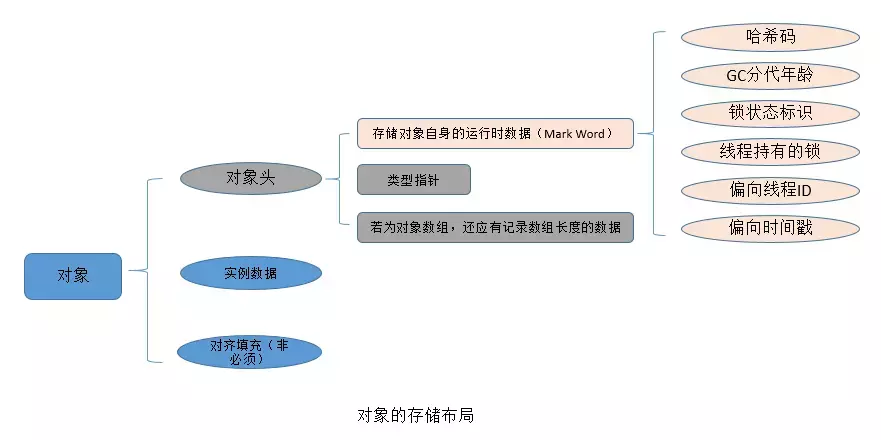
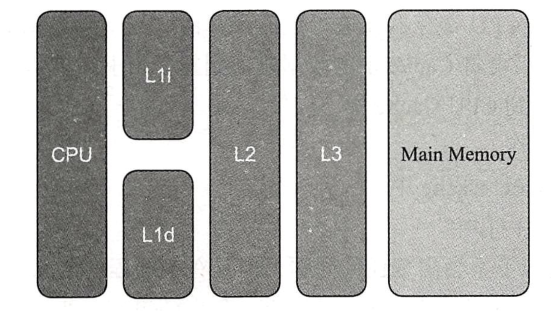
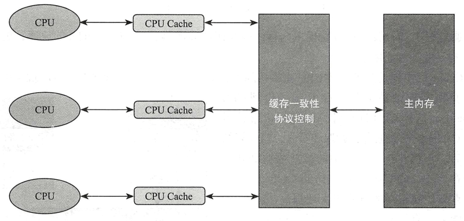
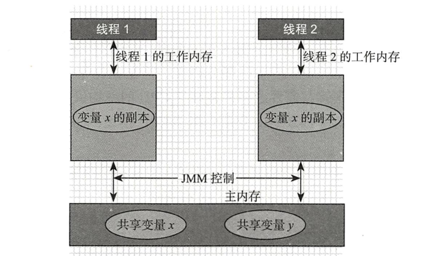
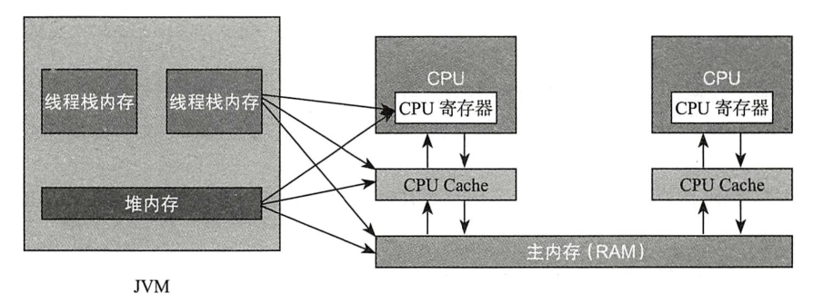
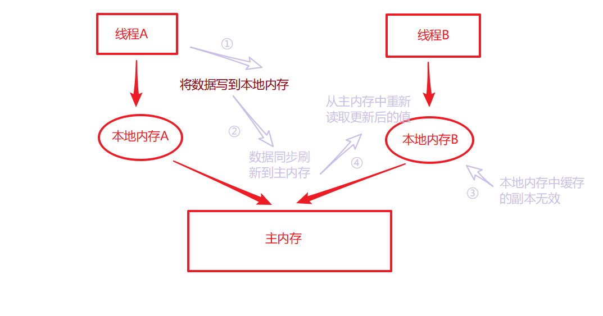

- [Java线程基础](#java线程基础)
  * [Java中的Thread创建和状态](#java中的thread创建和状态)
  * [Runnable接口](#runnable接口)
  * [守护线程](#守护线程)
  * [Join方法](#join方法)
  * [Stop方法](#stop方法)
  * [synchronized](#synchronized)
  * [锁优化](#锁优化)
  * [线程间通信与生产者消费者模型](#线程间通信与)
  * [wait和sleep的区别](#wait和sleep的区别)
  * [自定义显示锁](#自定义显示锁)
  * [自定义线程池实现](#自定义线程池实现)
  * [java内存模型](#java内存模型)
  * [volatile关键字](#volatile关键字)
  * [synchronized和volatile的区别](#synchronized和volatile的区别)
- [多线程中的设计模式](#多线程中的设计模式)
  * [单例模式的几种实现](#单例模式的几种实现)
  * [单例模式中的Holder方式解释](#单例模式中的holder方式解释)
  * [不可变对象以及线程安全对象](#-------------)
  * [Guraded Suspension模式](#guraded-suspension--)
  * [Balking模式](#balking--)
  * [生产者消费者模式](#--------)
  * [读写锁设计模式](#-------)
  * [Thread-Per-Message模式](#thread-per-message--)
  * [Future设计模式](#future----)
  * [Two-Phase Termination设计模式](#two-phase-termination----)
  * [Thread-Specjfic Stoge模式](#thread-specjfic-stoge--)
  * [Active Object-接收任务异步消息的主动对象](#active-object--------------)
- [JUC知识](#juc--)
  * [原子变量](#----)
  * [Unsafe类](#unsafe-)
  * [CountDownLatch](#countdownlatch)
  * [CylicBarrier](#cylicbarrier)
  * [Exchanger](#exchanger)
  * [ExecutorService](#executorservice)
  * [Phaser](#phaser)
  * [锁——ReentrantLock、ReadWriteLock、StampedLock](#---reentrantlock-readwritelock-stampedlock)
  * [Condition](#condition)
  * [Semaphore](#semaphore)
  * [ForkJoin](#forkjoin)
  * [ConcurrentHashMap](#concurrenthashmap)
  * [ConcurrentLinkedDeque](#concurrentlinkeddeque)
  * [ConcurrentSkipListMap](#concurrentskiplistmap)
  * [ConcurrentSkipSet](#concurrentskipset)
  * [CopyOnWriteArrayList](#copyonwritearraylist)
  * [CopyOnWriteArraySet](#copyonwritearrayset)
  * [DelayQueue](#delayqueue)
  * [LinkedBlockingDeque](#linkedblockingdeque)
  * [LinkedBlockingQueue](#linkedblockingqueue)
  * [LinkedTransferQueue](#linkedtransferqueue)
  * [PriorityBlockingQueue](#priorityblockingqueue)
  * [CompletableFuture](#completablefuture)
  * [自定义ThreadPoolExecutor](#---threadpoolexecutor)
  * [优先级线程池](#------)
  * [ThreadFactory](#threadfactory)
  * [自定义Lock](#---lock)
  * [自定义原子对象](#-------)

# Java线程基础

## Java中的Thread创建和状态


### (新建（New）

创建后尚未启动。ex：Thread t = new Thread(){//重写run方法};

### 可运行（Runnable）

可能正在运行，也可能正在等待 CPU 时间片。包含了操作系统线程状态中的 Running 和 Ready。

### 阻塞（Blocked）

等待获取一个排它锁，如果其线程释放了锁就会结束此状态。

### 无限期等待（Waiting）

等待其它线程显式地唤醒，否则不会被分配 CPU 时间片。

| 进入方法                                   | 退出方法                             |
| ------------------------------------------ | ------------------------------------ |
| 没有设置 Timeout 参数的 Object.wait() 方法 | Object.notify() / Object.notifyAll() |
| 没有设置 Timeout 参数的 Thread.join() 方法 | 被调用的线程执行完毕                 |
| LockSupport.park() 方法                    | LockSupport.unpark(Thread)           |

### 限期等待（Timed Waiting）

无需等待其它线程显式地唤醒，在一定时间之后会被系统自动唤醒。

调用 Thread.sleep() 方法使线程进入限期等待状态时，常常用“使一个线程睡眠”进行描述。

调用 Object.wait() 方法使线程进入限期等待或者无限期等待时，常常用“挂起一个线程”进行描述。

睡眠和挂起是用来描述行为，而阻塞和等待用来描述状态。

阻塞和等待的区别在于，阻塞是被动的，它是在等待获取一个排它锁。而等待是主动的，通过调用 Thread.sleep() 和 Object.wait() 等方法进入。

| 进入方法                                 | 退出方法                                        |
| ---------------------------------------- | ----------------------------------------------- |
| Thread.sleep() 方法                      | 时间结束                                        |
| 设置了 Timeout 参数的 Object.wait() 方法 | 时间结束 / Object.notify() / Object.notifyAll() |
| 设置了 Timeout 参数的 Thread.join() 方法 | 时间结束 / 被调用的线程执行完毕                 |
| LockSupport.parkNanos() 方法             | LockSupport.unpark(Thread)                      |
| LockSupport.parkUntil() 方法             | LockSupport.unpark(Thread)                      |

### 死亡（Terminated）

可以是线程结束任务之后自己结束，或者产生了异常而结束。

下面是Thread类的start方法源码(模板设计模式的应用)

```java
  public synchronized void start() {
        /**
         * threadStatus==0表示线程还没有start，所以不能两次启动thread，否则抛出异常IllegalThreadStateException
         */
        if (threadStatus != 0)
            throw new IllegalThreadStateException();

        /* 将线程添加到所属的线程组中，并减少线程组中unstart的线程数 */
        group.add(this);

        boolean started = false;
        try {
            start0();//调用本地方法，本地方法中调用run方法
            started = true;
        } finally {
            try {
                if (!started) {
                    group.threadStartFailed(this);
                }
            } catch (Throwable ignore) {
                /* */
            }
        }
```

## Runnable接口

重写Thread类的run方法和实现Runnable接口的run方法的不同：

​	①继承Thread类之后就不能继承别的类，而实现Runnable接口更灵活

​	②Thread类的run方法是不能共享的，线程A不能把线程B的run方法当做自己的执行单元，而使用Runnable接口能够实现这一点，即使用同一个Runnable的实例构造不同的Thread实例	

## 守护线程

​		守护线程是程序运行时在后台提供服务的线程，不属于程序中不可或缺的部分。当程序中没有一个非守护线程的时候，JVM也会退出，即当所有非守护线程结束时，程序也就终止，同时会杀死所有守护线程。main() 属于非守护线程。

​		在线程启动之前使用 setDaemon() 方法可以将一个线程设置为守护线程。如果一个线程已经start，再调用setDaemon方法就会抛出异常IllegalThreadStateException

```java
public class TestThread4 {

    public static void main(String[] args) {

        //thread  t作为当前处理业务的线程，其中创建子线程用于检测某些事项
        Thread t = new Thread() {
            @Override
            public void run() {
                Thread innerThread  = new Thread() {
                    @Override
                    public void run() {
                        try {
                            while (true) {
                                System.out.println("我是检测XX的线程");
                                TimeUnit.SECONDS.sleep(1);//假设每隔 1s check
                            }
                        } catch (InterruptedException e) {
                            e.printStackTrace();
                        }
                    }
                };
                innerThread.setDaemon(true);//设置为守护线程
                innerThread.start();

                try {
                    TimeUnit.SECONDS.sleep(1);
                } catch (InterruptedException e) {
                    e.printStackTrace();
                }
            }
        };
        t.start();
        //父线程t 执行完退出之后，他的子线程innerThread也会退出，
        //如果innerThread没有设置为守护线程，那么这个Application就会一直运行不会退出
        //设置为守护线程，那么这个Application完成任务或者被异常打断执行，这个子线程也会退出而不会继续执行check
        //t.setDaemon(true);//Exception in thread "main" java.lang.IllegalThreadStateException
    }
}
```

## Join方法

### join方法使用

​		在线程中调用另一个线程的 join() 方法，会将当前线程挂起，而不是忙等待，直到调用join方法的线程结束。对于以下代码，Work实现Runnable接口，并在构造方法传递调用join的线程，所以尽管main中start方法的调用是t3、t2、t1但是实际上的执行顺序还是t1先执行，然后t2，最后t3（t2会等待t1执行结束，t3会等待t2执行结束）

```java
package demo1;

public class TestThread5 {

    public static void main(String[] args) {

        Thread t1 = new Thread(new Work(null));
        Thread t2 = new Thread(new Work(t1));
        Thread t3 = new Thread(new Work(t2));
        t3.start();
        t2.start();
        t1.start();
    }
}

class Work implements Runnable {

    private Thread prevThread;

    public Work(Thread prevThread) {
        this.prevThread = prevThread;
    }

    public void run() {
        if(null != prevThread) {
            try {
                prevThread.join();
                for (int i = 0; i < 50; i++) {
                    System.out.println(Thread.currentThread().getName() + "-" + i);
                }
            } catch (InterruptedException e) {
                e.printStackTrace();
            }
        } else {
            System.out.println(Thread.currentThread().getName());
        }
    }
}
```

### join方法原理

下面是join方法的源码

```java
//默认的join方法
public final void join() throws InterruptedException {
    join(0);
}

public final synchronized void join(long millis)
    throws InterruptedException {
    long base = System.currentTimeMillis();
    long now = 0;

    if (millis < 0) {
        throw new IllegalArgumentException("timeout value is negative");
    }

    if (millis == 0) { //默认直接使用join方法的时候，会进入这个分支
        while (isAlive()) {
            wait(0); //注意这里调用的是wait方法，我们就需要知道wait方法的作用（调用此方法的当前线程需要释放锁，并等待唤醒）
        }
    } else { //设置join方法的参数(即调用者线程等待多久，目标线程还没有结束的话就不等待了)
        while (isAlive()) {
            long delay = millis - now;
            if (delay <= 0) {
                break; //结束等待
            }
            wait(delay); //设置的时间未到之前，继续等待
            now = System.currentTimeMillis() - base;
        }
    }
}
```

​		在上面的方法中，我们看到public final synchronized void join(long millis){}这是一个synchronized方法，了解过synchronized的知道，修饰方法的代表锁住对象实例(this)，那么这个this是什么呢，（调用者线程CallThread调用thread.join()方法，this就是当前的线程对象）。

​		CallThread线程调用join方法的时候，先持有当前的锁(线程对象thread)，然后在这里这里wait住了（释放锁，并进入阻塞等待状态），那么CallThread什么时候被notify呢，下面是jvm的部分源码，可以看到notify的位置。当thread执行完毕，jvm就是唤醒阻塞在thread对象上的线程（即刚刚说的CallThread调用者线程），那么这个调用者线程就能继续执行下去了。

[参考这个链接]: https://stackoverflow.com/questions/9866193/who-and-when-notify-the-thread-wait-when-thread-join-is-called

​		总结就是，假设当前调用者线程是main线程，那么：

​		①main线程在调用方法之后，会首先获取锁——thread对象实例；②进入其中一个分支之后，会调用wait方法，释放锁，并阻塞等待thread执行完之后被唤醒；③当thread执行完毕，会调用线程的exit方法，在下面的代码中我们能看出其中调用ensure_join方法，而在ensure_join中就会唤醒阻塞等待的thread对象上的线程；④main线程被notify，然后继续执行

```java
// 位于/hotspot/src/share/vm/runtime/thread.cpp中
void JavaThread::exit(bool destroy_vm, ExitType exit_type) {
    // ...

    // Notify waiters on thread object. This has to be done after exit() is called
    // on the thread (if the thread is the last thread in a daemon ThreadGroup the
    // group should have the destroyed bit set before waiters are notified).
    // join（ensure_join）
    ensure_join(this);

    // ...
}


static void ensure_join(JavaThread* thread) {
    // We do not need to grap the Threads_lock, since we are operating on ourself.
    Handle threadObj(thread, thread->threadObj());
    assert(threadObj.not_null(), "java thread object must exist");
    ObjectLocker lock(threadObj, thread);
    // Ignore pending exception (ThreadDeath), since we are exiting anyway
    thread->clear_pending_exception();
    // Thread is exiting. So set thread_status field in  java.lang.Thread class to TERMINATED.
    java_lang_Thread::set_thread_status(threadObj(), java_lang_Thread::TERMINATED);
    // Clear the native thread instance - this makes isAlive return false and allows the join()
    // to complete once we've done the notify_all below
    java_lang_Thread::set_thread(threadObj(), NULL);

    // thread就是当前线程，就是刚才例子中说的t线程
    lock.notify_all(thread);

    // Ignore pending exception (ThreadDeath), since we are exiting anyway
    thread->clear_pending_exception();
}
```

## Stop方法

### stop弊端

​		破坏原子逻辑，如下面的例子中，MultiThread实现了Runnable接口,run方法中加入了synchronized同步代码块,表示内部是原子逻辑,a的值会先增加后减少,按照synchronized的规则,无论启动多少个线程,打印出来的结果都应该是a=0。但是如果有一个正在执行的线程被stop,就会破坏这种原子逻辑.(下面面main方法中代码)

```java
public class TestStop4 {

    public static void main(String[] args) {
        MultiThread t = new MultiThread();
        Thread testThread = new Thread(t,"testThread");
        // 启动t1线程
        testThread.start();
        //（1）这里是保证线程t1先线获得锁，线程t1启动,并执行run方法,由于没有其他线程同步代码块的锁,
        //所以t1线程执行自加后执行到sleep方法开始休眠,此时a=1.
        try {
            TimeUnit.MILLISECONDS.sleep(100);
        } catch (InterruptedException e) {
            e.printStackTrace();
        }
        //（2）JVM又启动了5个线程,也同时运行run方法,由于synchronized关键字的阻塞作用,这5个线程不能执行自增和自减操作,等待t1线程释放线程锁.
        for (int i = 0; i < 5; i++) {
            new Thread(t).start();
        }
        //（3）主线程执行了t1.stop方法,终止了t1线程,但是由于a变量是线程共享的,所以其他5个线程获得的a变量也是1.（synchronized的可见性保证）
        testThread.stop();
        //（4）其他5个线程获得CPU的执行机会,打印出a的值.
    }
}
class MultiThread implements Runnable {
    int a = 0;
    private Object object = new Object();
    public void run() {
        // 同步代码块，保证原子操作
        synchronized (object) {
            // 自增
            a++;
            try {
                // 线程休眠0.1秒
                Thread.sleep(200);
            } catch (InterruptedException e) {
                e.printStackTrace();
            }
            // 自减
            a--;
            String tn = Thread.currentThread().getName();
            System.out.println(tn + ":a =" + a);
        }
    }
}
```

### 实现“**stop**”线程

下面是两种优雅的关闭线程的方式

①使用自定义标志位配合volatile实现

```java
public class ThreadStop1 {
    private static class Work extends Thread {
        private volatile boolean flag = true;
        public void run() {
            while (flag) {
                //do something
            }
        }
        public void shutdown() {
            this.flag = false;
        }
    }
    public static void main(String[] args) {
        Work w = new Work();
        w.start();
        try {
            TimeUnit.SECONDS.sleep(2);
        } catch (InterruptedException e) {
            e.printStackTrace();
        }
        w.shutdown();
    }

}
```

②使用中断

```java
public class ThreadStop2 {
    private static class Work extends Thread{
        public void run() {
            while (true) {
                try {
                    TimeUnit.SECONDS.sleep(2);
                } catch (InterruptedException e) {
                    break; //别的线程中断该线程
                }
            }
        }
    }
    public static void main(String[] args) {
        Work w = new Work();
        w.start();
        try {
            TimeUnit.SECONDS.sleep(1);
            w.interrupt();
        } catch (InterruptedException e) {
            e.printStackTrace();
        }
    }
}

```

## synchronized

可以参考我总结的[Java中Lock和synchronized](https://www.cnblogs.com/fsmly/p/10703804.html)。这里在说一下synchronized的相关知识

### synchronized用法

①当synchronized作用在实例方法时，**监视器锁（monitor）便是对象实例（this）**；

②当synchronized作用在静态方法时，**监视器锁（monitor）便是对象的Class实例**，因为Class数据存在于永久代，**因此静态方法锁相当于该类的一个全局锁**；

③当synchronized作用在某一个对象实例时，**监视器锁（monitor）便是括号括起来的对象实例**；

```java
public class TestSynchronized1 {
	//静态代码块
    static {
        synchronized (TestSynchronized1.class) {
            System.out.println(Thread.currentThread().getName() + "==>static code");
            try {
                TimeUnit.SECONDS.sleep(3);
            } catch (InterruptedException e) {
                e.printStackTrace();
            }
        }
    }
    //static
    private synchronized static void m1() {
        System.out.println(Thread.currentThread().getName() + "==>method:m1");
        try {
            TimeUnit.SECONDS.sleep(3);
        } catch (InterruptedException e) {
            e.printStackTrace();
        }
    }
    //this
    private synchronized void m2() {
        System.out.println(Thread.currentThread().getName() + "==>method:m2");
        try {
            TimeUnit.SECONDS.sleep(3);
        } catch (InterruptedException e) {
            e.printStackTrace();
        }
    }
	//普通方法
    private void m3() {
        System.out.println(Thread.currentThread().getName() + "==>method:m3");
        try {
            TimeUnit.SECONDS.sleep(3);
        } catch (InterruptedException e) {
            e.printStackTrace();
        }
    }
    //static
    private synchronized static void m4() {
        System.out.println(Thread.currentThread().getName() + "==>method:m4");
        try {
            TimeUnit.SECONDS.sleep(3);
        } catch (InterruptedException e) {
            e.printStackTrace();
        }
    }
    public static void main(String[] args) {
        final TestSynchronized1 test = new TestSynchronized1();
        new Thread() {
            @Override
            public void run() {
                test.m2();
            }
        }.start();

        new Thread() {
            @Override
            public void run() {
                TestSynchronized1.m1();
            }
        }.start();

        new Thread() {
            @Override
            public void run() {
                test.m3();}
        }.start();

        new Thread() {
            @Override
            public void run() {
                TestSynchronized1.m4();
            }
        }.start();
    }
}

```

### synchronized的原理

(关于锁与原子交换指令硬件原语可以参考[从同步原语看非阻塞同步](https://www.cnblogs.com/fsmly/p/11019223.html) 的介绍)

①Java 虚拟机中的同步(Synchronization)**基于进入和退出管程(Monitor)对象实现**。同步代码块是使用monitorenter和monitorexit来实现的，同步方法 并不是由 monitorenter 和 monitorexit 指令来实现同步的，而是由方法调用指令读取运行时常量池中方法的 **ACC_SYNCHRONIZED** 标志来隐式实现的(但是实际上差不多)。monitorenter指令是在编译后插入同步代码块的起始位置，而monitorexit指令是在**方法结束处和异常处**，每个对象都有一个monitor与之关联，当一个monitor被持有后它就会处于锁定状态。

②synchronized用的锁是存在**Java对象头**（非数组类型包括Mark Word、类型指针，数组类型多了数组长度）里面的，对象头中的Mark Word存储**对象的hashCode，分代年龄和锁标记位**，类型指针指向对象的元数据信息，JVM通过这个指针确定该对象是那个类的实例等信息。



③当在对象上加锁的时候，数据是记录在对象头中，对象头中的Mark Word里存储的数据会随着锁标志位的变化而变化（无锁、轻量级锁00、重量级锁10、偏向锁01）。当执行synchronized的同步方法或者同步代码块时候会在对象头中记录锁标记，锁标记指向的是monitor对象（也称为管程或者监视器锁）的起始地址。由于每个对象都有一个monitor与之关联，monitor和与关联的对象一起创建（当线程试图获取锁的时候）或销毁，当monitor被某个线程持有之后，就处于锁定状态。

④Hotspot虚拟机中的实现，通过ObjectMonitor来实现的。

### 关于synchronized的说明

①synchronized能够保证原子性、可见性、有序性

②在定义同步代码块的时候，不要将常量对象作为锁对象

③synchronized锁的是对象，而不是引用

④当同步方法出现异常的时候会自动释放锁，不会影响其他线程的执行

⑤synchronized是可重入的

### 实现一个会发生死锁的程序

```java
public class TestDeadLock {
    private final Object lock1 = new Object();
    private final Object lock2 = new Object();
    private void m1() {
        synchronized (lock1) {
            System.out.println(Thread.currentThread().getName() + " get lock:lock1");
            try {
                TimeUnit.SECONDS.sleep(1);
            } catch (InterruptedException e) {
                e.printStackTrace();
            }
            synchronized (lock2) {
                System.out.println(Thread.currentThread().getName() + " get lock:lock2");
            }
        }
    }

    private void m2() {
        synchronized (lock2) {
            System.out.println(Thread.currentThread().getName() + " get lock:lock2");
            try {
                TimeUnit.SECONDS.sleep(2);
            } catch (InterruptedException e) {
                e.printStackTrace();
            }
            synchronized (lock1) {
                System.out.println(Thread.currentThread().getName() + " get lock:lock1");
            }
        }
    }

    public static void main(String[] args) {
        final TestDeadLock test = new TestDeadLock();
        new Thread(){
            @Override
            public void run() {
                test.m1();
            }
        }.start();
        new Thread(){
            @Override
            public void run() {
                test.m2();
            }
        }.start();
    }
}

```

## 锁优化

​	从JDK6开始，对synchronized的实现机制进行了较大调整，**比如自适应的CAS自旋、锁消除、锁粗化、偏向锁、轻量级锁这些优化策略**等等，是为了解决线程之间更加高效的共享数据，解决竞争问题。

## 线程间通信与生产者消费者模型

### wait/notify的消息通知机制


​	结合上面说到的synchronized，在上图中，ObjectMonitor中有两个队列（**EntryList、WaitSet**(Wait Set是一个虚拟的概念)）以及锁持有者**Owner**标记，其中WaitSet是哪些**调用wait方法之后被阻塞等待的线程**队列，**EntryList是ContentionList中能有资格获取锁的线程队列**。当多个线程并发访问同一个同步代码时候，**首先会进入EntryList**，当线程获得锁之后monitor中的Owner标记会记录此线程，并在该monitor中的计数器执行递增计算代表当前锁被持有锁定，而没有获取到的线程继续在EntryList中阻塞等待。如果**线程调用了wait方法，则monitor中的计数器执行赋0运算，并且将Owner标记赋值为null，代表当前没有线程持有锁**，同时**调用wait方法的线程进入WaitSet队列中阻塞等待**，直到持有锁的执行线程调用notify/notifyAll方法唤醒WaitSet中的线程，唤醒的线程进入EntryList中等待锁的获取。除了使用wait方法可以将修改monitor的状态之外，显然持有锁的线程的同步代码块执行结束也会释放锁标记，monitor中的Owner会被赋值为null，计数器赋值为0。如下图所示是一个线程状态转换图。


**①wait**

​		该方法用来将当前线程置入BLOCKED状态（或者进入WAITSET中），直到接到通知或被中断为止。在调用 wait()之前，线程必须要**获得该对象的MONITOR**，即只能在**同步方法或同步块**中调用 wait()方法。调用wait()方法之后，当前线程会释放锁。如果调用wait()方法时，线程并未获取到锁的话，则会抛出**IllegalMonitorStateException**异常，这是个RuntimeException。被唤醒之后，如果再次获取到锁的话，当前线程才能从wait()方法处成功返回。

**②notify**

​		该方法也要在同步方法或同步块中调用，即在调用前，线程也必须要**获得该对象的MONITOR**，如果调用 notify()时没有持有适当的锁，也会抛出 **IllegalMonitorStateException**。 该方法任意从在该MONITOR上的WAITTING状态的线程中挑选一个进行通知，使得调用wait()方法的线程从等待队列移入到同步队列中，等待有机会再一次获取到锁，从而使得调用wait()方法的线程能够从wait()方法处退出。调用notify后，当前线程不会马上释放该对象锁，要等到程序退出同步块后，当前线程才会释放锁。

**③notifyAll** 

​		该方法与 notify ()方法的工作方式相同，重要的一点差异是： notifyAll 使所有原来在该对象的MONITOR上 wait 的线程统统退出WAITTING状态，使得他们全部从等待队列中移入到同步队列中去，等待下一次能够有机会获取到对象监视器锁。

### notify早期通知

​		假设现在有两个线程，threadWait、threadNotify，在测试程序中让使得threadWait还没开始 wait 的时候，threadNotify已经 notify 了。再这样的前提下，尽管threadNotify进行了notify操作，但是这个通知是没有任何响应的（threadWait还没有进行wait），当 threadNotify退出 synchronized 代码块后，threadWait再开始 wait，便会一直阻塞等待，直到被别的线程打断。比如在下面的示例代码中，就模拟出notify早期通知带来的问题：

```java
public class EarlyNotify {

    private static final Object object = new Object();

    public static void main(String[] args) {
        Thread threadWait = new Thread(new ThreadWait(object),"threadWait");
        Thread threadNotify = new Thread(new ThreadNotify(object), "threadNotify");
        threadNotify.start(); //唤醒线程线启动
        try {
            TimeUnit.SECONDS.sleep(1);
        } catch (InterruptedException e) {
            e.printStackTrace();
        }
        //wait线程后启动
        threadWait.start();
    }

    private static class ThreadWait implements Runnable {
        private Object lock;
        public ThreadWait(Object lock) {
            this.lock = lock;
        }
        public void run() {
            synchronized (lock) {
                System.out.println(Thread.currentThread().getName() + "进入代码块");
                System.out.println(Thread.currentThread().getName() + "进入wait set");
                try {
                    lock.wait();
                } catch (InterruptedException e) {
                    e.printStackTrace();
                }
                System.out.println(Thread.currentThread().getName() + "退出wait set");
            }
        }
    }

    private static class ThreadNotify implements Runnable {
        private Object lock;
        public ThreadNotify(Object lock) {
            this.lock = lock;
        }
        public void run() {
            synchronized (lock) {
                System.out.println(Thread.currentThread().getName() + "进入代码块");
                System.out.println(Thread.currentThread().getName() + "开始notify");
                lock.notify();
                System.out.println(Thread.currentThread().getName() + "notify结束");
            }
        }
    }
}

```

​		运行之后使用jconsole查看如下


### wait的条件发生变化

​		等待线程wait的条件发生变化，如果没有再次检查等待的条件就可能发生错误。看一下下面的程序实例以及运行结果。

```Java
//运行出现下面的结果
/*
 * consumerThread1 list is empty
 * producerThread  begin produce
 * consumerThread2 取出元素element0
 * consumerThread1 end wait, begin consume
 * Exception in thread "consumerThread1" java.lang.IndexOutOfBoundsException: Index: 0, Size: 0
*/
public class WaitThreadUncheckCondition {
    private static List<String> lock = new ArrayList<String>();
    public static void main(String[] args) {
        Thread producerThread = new Thread(new ProducerThread(lock),"producerThread");
        Thread consumerThread1 = new Thread(new ConsumerThread(lock), "consumerThread1");
        Thread consumerThread2 = new Thread(new ConsumerThread(lock), "consumerThread2");
        consumerThread1.start();
        consumerThread2.start();
        producerThread.start();
    }
    private static class ProducerThread implements Runnable {
        private List<String> lock;
        private int i = 0;
        public ProducerThread(List<String> lock) {
            this.lock = lock;
        }
        public void run() {
            synchronized (lock) {
                System.out.println(Thread.currentThread().getName() + " begin produce");
                lock.add("element" + i++);
                lock.notifyAll();
            }
        }
    }
    private static class ConsumerThread implements Runnable {
        private List<String> list;
        public ConsumerThread(List<String> list) {
            this.list = list;
        }
        public void run() {
            synchronized (lock) {
                try {
                    if (lock.isEmpty()) {
                        System.out.println(Thread.currentThread().getName() + " list is empty");
                        lock.wait();
                        System.out.println(Thread.currentThread().getName() + " end wait, begin consume");
                    }
                    System.out.println(Thread.currentThread().getName() + " 取出元素" + lock.remove(0));
                } catch (InterruptedException e) {
                    e.printStackTrace();
                }
            }
        }
    }
}
```

​		在这个例子中一共开启了3个线程，consumerThread1,consumerThread2以及producerThread。首先consumerThread1在获取到lock之后判断isEmpty为true，然后调用了wait方法进入阻塞等待状态，并且将对象锁释放出来。然后，consumerThread2能够获取对象锁，从而进入到同步代块中，当执行到wait方法时判断isEmpty也为true，同样的也会释放对象锁。因此，producerThread能够获取到对象锁，进入到同步代码块中，向list中插入数据后，通过notifyAll方法通知处于WAITING状态的consumerThread1和consumerThread2线程。consumerThread2得到对象锁后，从wait方法出退出然后继续向下执行，删除了一个元素让List为空，方法执行结束，退出同步块，释放掉对象锁。这个时候consumerThread1获取到对象锁后，从wait方法退出，继续往下执行，这个时候consumerThread1再执行`lock.remove(0);`就会出错，因为List由于Consumer1删除一个元素之后已经为空了。

### 修改的生产者消费者模型

```java
//多生产者消费者的情况，需要注意如果使用notify方法会导致程序“假死”，即所有的线程都wait住了，没有能够唤醒的线程运行：假设当前多个生产者线程会调用wait方法阻塞等待，当其中的生产者线程获取到对象锁之后使用notify通知处于WAITTING状态的线程，如果唤醒的仍然是生产者线程，就会造成所有的生产者线程都处于等待状态。这样消费者得不到消费的信号，就也是一直处于wait状态
public class ProducersAndConsumersPattern {

    private int sth = 0;
    private volatile boolean isProduced = false;
    private final Object object = new Object();

    private void producer() {
        synchronized (object) {
            //如果不需要生产者生产
            while (isProduced) {
                //生产者进入等待状态
                try {
                    object.wait();
                } catch (InterruptedException e) {
                    e.printStackTrace();
                }
            }
            //生产者进行生产
            sth++;
            System.out.println(Thread.currentThread().getName() + " producer: " + sth);
            //唤醒消费者
            object.notifyAll();
            isProduced = true; //消费者可以进行消费
        }
    }

    private void consumer() {
        synchronized (object) {
            //消费者不可以消费，进入等待阻塞状态
            while (!isProduced) {
                try {
                    object.wait();
                } catch (InterruptedException e) {
                    e.printStackTrace();
                }
            }
            System.out.println(Thread.currentThread().getName() + " consumer: " + sth);
            object.notifyAll();
            isProduced = false;//生产者生产
        }
    }

    public static void main(String[] args) {
        final ProducersAndConsumersPattern producerAndConsumerPattern = new ProducersAndConsumersPattern();
        for (int i = 0; i < 3; i++) {
            new Thread("consumer thread-" + i) {
                @Override
                public void run() {
                    while (true) {
                        producerAndConsumerPattern.consumer();
                    }
                }
            }.start();
        }
        for (int i = 0; i < 3; i++) {
            new Thread("producer thread-" + i) {
                @Override
                public void run() {
                    while (true) {
                        producerAndConsumerPattern.producer();
                    }
                }
            }.start();
        }
    }
}

```

## wait和sleep的区别

(1)wait是Object的方法，而sleep是Thread的方法

(2)wait会释放monitor，并将线程加入wait-set中，但是sleep不会释放monitor

(3)使用wait必须要首先获取monitor，但是sleep不需要

(4)调用sleep不需要被唤醒，但是wait调用者需要被唤醒

## 自定义显示锁

使用synchronized、wait、notify/notifyAll

### 自定义Lock接口

```java
/**
 * 自定义显示锁接口
 */
public interface Lock {
    class TimeOutException extends Exception {
        public TimeOutException(String msg) {
            super(msg);
        }
    }
    /**
     * 获取lock
     * @throws InterruptedException
     */
    void lock() throws InterruptedException;

    /**
     * 指定时间的lock
     * @param millis
     * @throws InterruptedException
     * @throws TimeOutException
     */
    void lock(long millis) throws InterruptedException,TimeOutException;

    /**
     * 释放锁
     */
    void unlock();

    /**
     * 获取阻塞在当前monitor上的线程
     * @return
     */
    Collection<Thread> getBlockedThreads();

    /**
     * 获取当前阻塞队列的大小
     * @return
     */
    int getBlockedSize();
}

```

### BooleanLock实现类

```java
/**
 * 实现Lock接口：通过一个boolean类型的变量表示同步状态的获取
 */
public class BooleanLock implements Lock {

    //获取锁的标志
    //true：表示当前lock被获取
    //false：表示当前lock没有被获取
    private boolean initValue;

    //阻塞在lock monitor上的线程集合
    private Collection<Thread> blockedThreads = new ArrayList<Thread>();

    //当前获取到锁的线程:用于在迪调用unlock的时候进行check（只有是获得lock monitor的线程才能unlock monitor）
    private Thread currentGetLockThread;

    public BooleanLock() {
        this.initValue = false;
    }

    /**
     * 原子性的获取锁
     *
     * @throws InterruptedException
     */
    public synchronized void lock() throws InterruptedException {
        //当initValue为true的时候，表示获取失败，就加入阻塞队列中
        while (initValue) {
            blockedThreads.add(Thread.currentThread());
            this.wait(); //加入阻塞队列中，然后调用wait进入(这里的monitor是当前类的instance)
        }
        //这里表示可以获取锁，就置标志位位true，并将自己移除阻塞队列
        blockedThreads.remove(Thread.currentThread());
        this.initValue = true;
        //设置当前获得到lock monitor的线程
        this.currentGetLockThread = Thread.currentThread();
    }
    
    /**
     * 设置带有超时的lock方法
     * @param millis
     * @throws InterruptedException
     * @throws TimeOutException
     */
    public synchronized void lock(long millis) throws InterruptedException, TimeOutException {
        if (millis <= 0) {
            lock();
        }
        long holdTime = millis;
        long endTime = System.currentTimeMillis() + millis;
        while (initValue) {
            //如果已经超时
            if (holdTime <= 0) {
                throw new TimeOutException("TimeOut");
            }
            //已经被别的线程获取到lock monitor,就将当前线程加入blockedThreads中
            blockedThreads.add(Thread.currentThread());
            this.wait(millis); //等待指定时间，如果还没有获取锁，下一次循环判断的时候就会抛出TimeOutException
            holdTime  =endTime - System.currentTimeMillis();
            System.out.println(holdTime);
        }
        this.initValue = true;
        currentGetLockThread = Thread.currentThread();
    }

    /**
     * 原子性的释放锁
     */
    public synchronized void unlock() {
        //检查是否是当前获取到lock monitor的线程释放
        if (Thread.currentThread() == currentGetLockThread) {
            this.initValue = false;
            System.out.println(Thread.currentThread().getName() + " release the lock monitor.");
            this.notifyAll(); //当前线程释放掉锁之后，唤醒别的阻塞在这个monitor上的线程
        }
    }

    public Collection<Thread> getBlockedThreads() {
        //这里的blockedThreads是read only的
        return Collections.unmodifiableCollection(blockedThreads); //设置不允许修改
    }

    public int getBlockedSize() {
        return blockedThreads.size();
    }
}

```

## 自定义线程池实现

​		线程池的使用主要是解决两个问题：①当执行大量异步任务的时候线程池能够提供更好的性能，在不使用线程池时候，每当需要执行异步任务的时候直接new一个线程来运行的话，线程的创建和销毁都是需要开销的。而线程池中的线程是可复用的，不需要每次执行异步任务的时候重新创建和销毁线程；②线程池提供一种资源限制和管理的手段，比如可以限制线程的个数，动态的新增线程等等。

​		下面是Java中的线程池的处理流程，参考我总结的[Java并发包中线程池ThreadPoolExecutor原理探究](https://www.cnblogs.com/fsmly/p/11007334.html)。

​		①corePoolSize：线程池核心线程个数；

​		②workQueue：用于保存等待任务执行的任务的阻塞队列（比如基于数组的有界阻塞队列ArrayBlockingQueue、基于链表的无界阻塞队列LinkedBlockingQueue等等）；

​		③maximumPoolSize：线程池最大线程数量；

​		④ThreadFactory：创建线程的工厂；

​		⑤RejectedExecutionHandler：拒绝策略，表示当队列已满并且线程数量达到线程池最大线程数量的时候对新提交的任务所采取的策略，主要有四种策略：AbortPolicy（抛出异常）、CallerRunsPolicy（只用调用者所在线程来运行该任务）、DiscardOldestPolicy（丢掉阻塞队列中最近的一个任务来处理当前提交的任务）、DiscardPolicy（不做处理，直接丢弃掉）；

​		⑥keepAliveTime：存活时间，如果当前线程池中的数量比核心线程数量多，并且当前线程是闲置状态，该变量就是这些线程的最大生存时间；

​		⑦TimeUnit：存活时间的时间单位。


​		下面是自定义一个简单的线程池实现。

```java
/**
 * 自定义线程池实现
 */
public class SimpleThreadPool extends Thread {

    //线程池线程数量
    private int size;
    //任务队列大小
    private int queueSize;
    //任务队列最大大小
    private static final int MAX_TASK_QUEUE_SIZE = 200;
    //线程池中线程name前缀
    private static final String THREAD_PREFIX = "SIMPLE-THREAD-POLL-WORKER";
    //线程池中的线程池所在的THREADGROUP
    private static final ThreadGroup THREAD_GROUP = new ThreadGroup("SIMPLE-THREAD-POLL-GROUP");
    //任务队列
    private static final LinkedList<Runnable> TASK_QUEUE = new LinkedList<>();
    //线程池中的工作线程集合
    private static final List<Worker> WORKER_LIST = new ArrayList<>();
    //线程池中的线程编号
    private AtomicInteger threadSeq = new AtomicInteger();
    //拒绝策略
    private RejectionStrategy rejectionStrategy;
    //默认的拒绝策略：抛出异常
    public final static RejectionStrategy DEFAULT_REJECTION_STRATEGY = () -> {
        throw new RejectionException("Discard the task.");
    };
    //线程池当前状态是否为shutdown
    private boolean destroy = false;
    //增加线程池自动维护功能的参数
    //默认初始化的时候的线程池中的线程数量
    private int minSize;
    //默认初始化时候线程数量不够时候，扩充到activeSize大小
    private int activeSize;
    //线程池中线程最大数量：当任务队列中的数量大于activeSize的时候，会再进行扩充
    //当执行完毕，会回收空闲线程，数量变为activeSize
    private int maxSize;

    /**
     * 默认构造
     */
    public SimpleThreadPool() {
        this(2, 4, 8, MAX_TASK_QUEUE_SIZE, DEFAULT_REJECTION_STRATEGY);
    }

    /**
     * 指定线程池初始化时候的线程个数
     * @param minSize
     * @param activeSize
     * @param maxSize
     * @param queueSize
     * @param rejectionStrategy
     */
    public SimpleThreadPool(int minSize, int activeSize, int maxSize, int queueSize, RejectionStrategy rejectionStrategy) {
        if (queueSize <= MAX_TASK_QUEUE_SIZE) {
            this.minSize = minSize;
            this.activeSize = activeSize;
            this.maxSize = maxSize;
            this.queueSize = queueSize;
            this.rejectionStrategy = rejectionStrategy;
            init();
        }
    }

    /**
     * 线程池本身作为一个线程，run方法中维护线程中的线程个数
     */    
    @Override
    public void run() {
        while (!destroy) {
            System.out.printf("Pool===#Min:%d; #Active:%d; #Max:%d; #Current:%d; QueueSize:%d\n",
                    this.minSize, this.activeSize, this.maxSize, this.size, this.TASK_QUEUE.size());
            try {
                TimeUnit.SECONDS.sleep(5);
                //下面是扩充逻辑
                //当前任务队列中的任务数多于activeSize（扩充到activeSize个线程）
                if (TASK_QUEUE.size() > activeSize && size < activeSize) {
                    for (int i = size; i < activeSize; i++) {
                        createWorkerTask();
                    }
                    size = activeSize;
                    System.out.println("Thread pool's capacity has increased to activeSize.");
                }
                if (TASK_QUEUE.size() > maxSize && size < maxSize) { //扩充到maxSize
                    for (int i = size; i < maxSize; i++) {
                        createWorkerTask();
                    }
                    size = maxSize;
                    System.out.println("Thread pool's capacity has increased to maxSize.");
                }
                //当任务队列为空时候，需要将扩充的线程回收
                //以activeSize为界限，大于activeSize并且线程池空闲的时候回收空闲的线程
                //先获取WORKER_LIST的monitor
                //这样就会在回收空闲线程的时候，防止提交任务
                synchronized (WORKER_LIST) {
                    if (TASK_QUEUE.isEmpty() && size > activeSize) {
                        int releaseNum = size - activeSize;
                        for (Iterator<Worker> iterator = WORKER_LIST.iterator(); iterator.hasNext(); ) {
                            if (releaseNum <= 0) {
                                break;
                            }
                            Worker work = (Worker) iterator.next();
                            work.close();
                            work.interrupt();
                            iterator.remove();
                            System.out.println(Thread.currentThread().getName() + "===============Closed " + work.getName());
                            releaseNum--;
                        }
                        size = activeSize;
                        System.out.println("Thread pool's capacity has reduced to activeSize.");
                    }
                }
            } catch (InterruptedException e) {
                e.printStackTrace();
            }
        }
    }

    /**
     * 初始化线程池
     */
    private void init() {
        for (int i = 0; i < minSize; i++) {
            createWorkerTask();
            size++;
        }
    }

    /**
     * 线程池/线程状态
     */
    private enum TaskState {
        FREE, RUNNING, BLOCKED, TERMINATED
    }

    /**
     * 提交任务到线程池
     * @param runnable
     */
    public void execute(Runnable runnable) {
        if (destroy == false) {
            if (null != runnable) {
                synchronized (TASK_QUEUE) {
                    if (TASK_QUEUE.size() >= queueSize) {
                        rejectionStrategy.throwExceptionDirectly();
                    }
                    TASK_QUEUE.addLast(runnable);
                    TASK_QUEUE.notify();//这里使用notify方法而不是使用notifyAll方法，是因为能够确定必然有工作者线程Worker被唤醒，所以比notifyAll会有更小的开销（避免了将等待队列中的工作线程全部移动到同步队列中竞争任务）
                }
            }
        } else {
            throw new IllegalStateException("线程池已经关闭");
        }
    }

    /**
     * 向线程池中添加工作线程
     */
    private void createWorkerTask() {
        Worker worker = new Worker(THREAD_GROUP, THREAD_PREFIX + threadSeq.getAndIncrement()); //创建一个工作线程
        worker.start(); //启动工作者线程
        WORKER_LIST.add(worker); //向线程池的工作线程集合中加入该线程
    }

    public void shutdown() {
        //任务队列中还有任务
        while (!TASK_QUEUE.isEmpty()) {
            try {
                TimeUnit.SECONDS.sleep(20);
            } catch (InterruptedException e) {
                e.printStackTrace();
            }
        }
        synchronized (WORKER_LIST) {
            int curNum = WORKER_LIST.size(); //获取工作线程集合中的线程个数
            while (curNum > 0) {
                for (Worker work : WORKER_LIST) {
                    if (work.getTaskState() == TaskState.BLOCKED) {
                        work.interrupt();
                        work.close();
                        System.out.println(Thread.currentThread().getName() + "=============Closed.");
                        curNum--;
                    } else {
                        try {
                            TimeUnit.SECONDS.sleep(4);
                        } catch (InterruptedException e) {
                            e.printStackTrace();
                        }
                    }
                }
            }
        }
        this.destroy = true;
        System.out.println("Thread-Pool shutdown.");
    }

    /**
     * 线程池的工作线程定义
     */
    private static class Worker extends Thread {

        //volatile类型的taskState，用于在关闭线程的时候调用
        private volatile TaskState taskState = TaskState.FREE;

        public Worker(ThreadGroup group, String name) {
            super(group, name);
        }

        /**
         * 返回线程状态
         *
         * @return
         */
        public TaskState getTaskState() {
            return this.taskState;
        }

        @Override
        public void run() {
            BEGIN:
            while (this.taskState != TaskState.TERMINATED) {
                Runnable runnable = null;
                //从任务队列中取任务（首先获取TASK_QUEUE的monitor）
                synchronized (TASK_QUEUE) {
                    //判断任务队列是否为空
                    while (TASK_QUEUE.isEmpty()) {
                        try {
                            this.taskState = TaskState.BLOCKED;
                            TASK_QUEUE.wait(); //任务队列为空，当前线程就进入等待状态
                        } catch (InterruptedException e) {
                            System.out.println("Interrupted Close.");
                            break BEGIN; //被打断之后，重新执行自己的run方法
                        }
                    }
                    //被唤醒之后，且判断任务队列不为空，就从任务队列中获取一个Runnable
                    runnable = TASK_QUEUE.removeFirst();
                }
                if (null != runnable) {
                    this.taskState = TaskState.RUNNING;//当前执行任务的线程为RUNNING
                    runnable.run();//执行run
                    this.taskState = TaskState.FREE; //任务执行完毕，状态变为FREE
                }
            }
        }

        public void close() {
            this.taskState = TaskState.TERMINATED;
        }
    }

    public interface RejectionStrategy {
        //直接抛出异常
        void throwExceptionDirectly() throws RejectionException;
    }

    //自定义异常类：拒绝策略——抛出异常
    public static class RejectionException extends RuntimeException {
        public RejectionException(String msg) {
            super(msg);
        }
    }
    //测试编写的SimpleThreadPool
    public static void main(String[] args) {
        SimpleThreadPool simpleThreadPool = new SimpleThreadPool();
        for (int index = 0; index < 50; index++) {
            simpleThreadPool.execute(new Runnable() {
                @Override
                public void run() {
                    System.out.println(Thread.currentThread().getName() + " start the task");
                    //do sth
                    int i = 0;
                    while (i++ < 50) { }
                    System.out.println(Thread.currentThread().getName() + " finish the task");
                }
            });
        }
        simpleThreadPool.start(); //线程池维护参数
        simpleThreadPool.shutdown();
    }    
}
```


## java内存模型

### CPU-cache模型

​		在计算机中，运算操作都是由CPU的寄存器完成的，而指令的执行过程涉及数据的读取和写入操作，CPU能访问的数据通常只能是计算机的主存(没有引入cache之前)，虽然CPU的处理速度不断提高，但是访存速度却成为整个处理系统性能提升的瓶颈。所以为了解决这种速度矛盾，在它们出现在CPU和内存之间增加缓存的设计。如图所示。



​	因为程序指令和程序数据的行为和热点(使用情况)分布差异很大，所以L1-Cache被划分为指令cache（L1i（instruction））和数据cache（L1d（data））这两种将数据和指令用于各自功能的缓存。CPU Cache是由很多个cache line（缓存行）构成。

### CPU缓存一致性问题

​	加入高速缓存带来了一个新的问题：缓存一致性。如果多个缓存共享同一块主内存区域，那么多个缓存的数据可能会不一致。比如：对于i++操作，需要：

​	①将主内存中cache调入自己的CPU cache的缓存行中中；

​	②对i进行+1操作；

​	③将结果写到CPU Cache中；

​	④将数据刷新到主内存中。

​	这种操作在单线程下没有问题，但是多线程状况下，由于本地内存（cache）的存在，假设两个程都将初始值为0的i调入自己的本地内存中，然后计算，之后刷新到主内存。这样虽然计算两次结果计算是1(一次的结果)，这就是典型的缓存不一致性问题。

​	所以需要解决缓存不一致的问题，比如通过对总线加锁(悲观/串行化的方式，需要对整个总线加锁)，或者通过缓存一致性协议实现。

​	其中缓存一致性协议的核心思想是：①当写入数据的时候，如果发现该数据是被共享的(其他CPU的cache中有该数据的变量)，会发出一个信号，通知其他的CPU对该共享数据的缓存无效；②当其他CPU对该数据进行读取的时候，会重新从主内存中读取。



(关于更多详细内容可以参考学过的组原和系统结构)

### Java内存模型

​	线程通信的机制主要有两种：共享内存和消息传递。①共享内存：线程之间共享程序的公共状态，通过写-读共享内存中的公共状态来进行隐式通信；②消息传递：线程之间没有公共状态，线程之间 必须通过发送消息来显式通信。Java并发采用的是共享内存模型。那什么是Java内存模型呢，大概的抽象关系是这些：

​	①规定了所有的共享变量都**存储在主内存中**，每个线程够可以访问(线程之间存在共享状态)

​	②每个线程中还有自己的**工作内存**

​	③线程的工作内存中保存了被该线程所使用到的变量（这些变量是从主内存中拷贝而来的副本）

​	④工作内存和java内存模型一样是一个抽象的概念，它涵盖了缓存、寄存器、编译器优化等，可以由虚拟机实现着充分的自由空间利用机器的硬件实现。

​	根据java内存模型的特点可以看出，线程对变量的所有操作（读取，赋值）都必须在工作内存中进行。不同线程之间也无法直接访问对方工作内存中的变量，**线程间变量值的传递均需要通过主内存来完成**。如下图所示。



​	java内存模型是一个抽象的概念，与计算机的硬件架构并不完全一样，比如计算机物理内存中不为有栈内存和堆内存的概念，但是不管是栈内存还是堆内存都会对应到具体的物理内存上，当然CPU调度线程运行的时候也有一部分堆栈内存的数据会调入cache寄存器中。我们来看一下java内存模型和CPU-cache硬件架构的交互图。



### 原子性

**Ⅰ：原子性概念**

一个操作或者多个操作 要么全部执行并且执行的过程不会被任何因素打断，要么就都不执行。

**Ⅱ：JMM中的原子性**

​	在java中对基本数据类型的b变量的读取赋值操作都是原子性的，这类操作是不可被中断的，要么全部执行要么不执行。下面是集中情况

```java
x=10;//赋值操作
```

​	这个操作是原子性的，执行线程先将x=10写入工作内存中，然后同步到主内存中(有可能在刷新到主内存的过程中别的线程也在进行同步刷新操作，假设另一个线程刷新x=11，那么最终主内存的结果要么是10，要么是11，不会出现别的情况。)所以单单就这种赋值来看是原子性的。

```java
y=x;//赋值操作
```

​	这个操作是非原子性的。他包含2个步骤：①执行线程先从主内存中获取x的值，然后存入自己的工作线程，如果x在工作内存中就直接获取；②执行线程将工作内存中的值修改为x的值，然后刷新到主内存中。其中第一个操作是对基本类型x的简单读取操作，第二个操作是基本类型y的写操作，但是两个操作在一起就不是原子操作了。

```java
y++;//自增操作
```

​	这个操作是非原子的。包含这几个步骤：①执行线程从主内存中如y的值，然后存入自己的工作内存中，如果工作内存中由就直接获取；②执行+1操作；③执行线程将+1的结果写入工作内存；④刷新到主内存中。这几个步骤在一起就不是原子性的了。

```java
y=y+1;//加1操作，同y++。
```

**Ⅲ：总结**

​	①多个原子性操作在一起如果不加额外措施，就不是原子性操作了；②java中只提供简单类型的读取和赋值操作是原子性的，但是想y=x这样将另一个变量的值赋值给一个变量就不是原子性的了；③使用synchronized或者juc中的Lock可以使得某个代码片段操作具备原子性。

### 可见性

Ⅰ：可见性概念

**当一个线程修改了共享变量的值，其他线程能够立即得到这个修改的状况**。

Ⅱ：JMM与可见性

java中提供volatile来提供可见性保证，除了volatile，Java中synchronized和juc下面的Lock也能保证可见性。

### 有序性

Ⅰ：有序性概念

即程序执行的顺序按照代码的先后顺序执行。（单线程中指令重排序的结果和按照代码顺序执行的最终结果一致）

Ⅱ：JMM与有序性

​	Java提供了volatile和synchronized两个关键字来保证线程之间操作的有序性，volatile关键字本身就包含了**禁止指令重排序**的语义，而synchronized则是由“一个变量在同一时刻只允许一条线程对其进行lock操作”这条规则获得的，这个规则决定了持有同一个锁的两个同步块只能串行地进入，JUC下的Lock也具备这样的效果。

### happens-before原则

​	Java内存模型具备一些先天的“有序性”，即不需要通过任何手段就能够得到保证的有序性，这个通常也称为 happens-before 原则。如果两个操作的执行次序无法从happens-before原则推导出来，那么它们就不能保证它们的有序性，虚拟机可以随意地对它们进行重排序

①程序次序规则：在一个线程内，按照程序控制流（包括分支、循环）顺序执行。

②锁定规则：一个unlock操作先行发生于后面对**同一个锁**的lock操作。

③volatile变量规则：对一个volatile变量的写操作先行发生于后面对这个变量的读操作。

④线程启动规则：Thread对象的start方法先行发生于此线程的每个动作。

⑤线程终止规则：线程中的所有操作都先行发生于此线程的终止检测，我们可以通过Thread.join()方法结束/Thread.isAlive()的返回值等手段检测到线程已经终止执行。

⑥线程中断规则：对线程interrupt()方法的调用先行发生于被中断线程的代码检测到中断事件的发生，可以通过Thread.interrupted()方法检测到是否有中断发生。

⑦对象终结规则：一个对象的初始化完成（构造函数执行结束）先行发生于他的finalize方法的开始、

⑧传递性：如果操作A先行发生于操作B，操作B先行发生于操作C，那么操作A先行发生于操作C。

## volatile关键字

详细介绍参考总结之[Java并发编程基础之volatile](https://www.cnblogs.com/fsmly/p/10587767.html)

### volatile作用与原理

**Ⅰ：可见性保证**

​	保证共享变量的可见性，即被volatile修饰的变量在线程之间的可见性，保证volatile变量能够被一致性的更新。在编写多线程程序中，使用volatile修饰的共享变量在进行**写操作**的时候，编译器生成的汇编代码中会多出一条lock#指令，这条lock指令的作用是**将这个变量所在缓存行的数据写会到系统内存**(确保了如果有其他线程对声明了volatile变量进行使用，主内存中数据是更新的)。然后通过**缓存一致性协议**，即每个处理器检查自己缓存的数据是不是过期，如果发现自己缓存的数据被修改就会将缓存行的数据置为无效状态，当对这个数据再次使用的时候需要从主内存中重新读入到自己的缓存中。

​	volatile的实现原则（可见性保证的实现）：

​	①将当前处理器**缓存行**中的数据**写回到系统内存**
​	②这个写回内存的操作会**使得其他CPU里缓存了该内存地址的数据无效**，当需要使用的时候不再从缓存中获取，而是直接从系统内存中获取。



**Ⅱ：禁止指令重排序**

​	lock前缀指令实际上相当于一个内存屏障（也成内存栅栏），它确保**指令重排序时不会把其后面的指令排到内存屏障之前的位置，也不会把前面的指令排到内存屏障的后面；**确保了在执行到这个内存屏障时前面的指令全部执行完。

### volatile建立的happens-before关系

​	对一个volatile变量的写的操作先行发生与对这个变量的读操作。

### volatile的一个简单例子

```java
public class TestVolatile1 {

    private volatile static int INIT_VALUE = 0;
    private final static int MAX_VALUE = 5;

    public static void main(String[] args) {

        //读取volatile类型的变量INIT_VALUE
        new Thread("READER-THREAD ") {
            @Override
            public void run() {
                int localValue = INIT_VALUE;
                while (localValue < MAX_VALUE) {
                    if (localValue != INIT_VALUE) {
                        System.out.printf("[%s]: The INIT_VALUE update to [%d]\n", Thread.currentThread().getName(), INIT_VALUE);
                        localValue = INIT_VALUE;
                    }
                }
            }
        }.start();

        //更新volatile类型的变量MAX_VALUE
        new Thread("UPDATER-THREAD") {
            @Override
            public void run() {
                int localValue = INIT_VALUE;
                while (INIT_VALUE < MAX_VALUE) {
                    System.out.printf("[%s]: Update the value to [%d]\n", Thread.currentThread().getName(), ++localValue);
                    INIT_VALUE = localValue;
                    try {
                        TimeUnit.SECONDS.sleep(2);
                    } catch (InterruptedException e) {
                        e.printStackTrace();
                    }
                }
            }
        }.start();
    }
}
//输出结果
/*
[UPDATER-THREAD]: Update the value to [1]
[READER-THREAD ]: The INIT_VALUE update to [1]
[UPDATER-THREAD]: Update the value to [2]
[READER-THREAD ]: The INIT_VALUE update to [2]
[UPDATER-THREAD]: Update the value to [3]
[READER-THREAD ]: The INIT_VALUE update to [3]
[UPDATER-THREAD]: Update the value to [4]
[READER-THREAD ]: The INIT_VALUE update to [4]
[UPDATER-THREAD]: Update the value to [5]
[READER-THREAD ]: The INIT_VALUE update to [5]
*/
```

### volatile的典型应用场景

①开关控制

```java
public class TestVolatile3 extends Thread {

    //利用volatile的可见性保证，当其他线程调用close方法的时候，TestVolatile3线程能够立刻感知到shutdown的变化（别的线程更改了volatile类型的shutdown的值，由缓存一致性协议，TestVolatile3线程将本地内存中的shutdown置为无效，并冲洗从主内存中获取）
    //如果没有使用volatile修饰，那么可能当别的线程修改了shutdown的值之后，没有及时的刷新到主内存中，或者说TestVolatile3线程一直使用的是本地线程的变量值(因为对shutdown一直是读的操作，所以可能不会访问主存获取刷新后的值)
    private volatile boolean shutdown = false;

    @Override
    public void run() {
        while(shutdown) {
            //do work
        }
    }

    public void close() {
        this.shutdown = true;
    }
}
```

②状态标记

```java
//这是一段伪代码，其中使用不带volatile的boolean类型的变量表示context是否被加载过，在单线程下不管怎样进行指令重排序肯定是没有问题的，都会返回context。
//但是如果在多线程下，如果存在指令重排序，比入在threadA将initialized = true排序到了context = loadContext()前面，并且initialized也被刷新到了主内存，threadB刚刚好重新从主内存加载到initialized的值为true，就在if判断的时候直接返回context，但是问题来了，在threadA中context是未被初始化完毕的，那么threadB使用context不就会出现问题了吗
//但是如果使用了volatile修饰之后，就会禁止指令重排序，从上面的原理可以得到，context = loadContext()不能被排序到initialized = true之前，即确保了执行到initialized = true的时候，context已经初始化完毕。
public class TestVolatile4 {
    private volatile boolean initialized = false;

    private Context context;

    public Context load() {
        if (!initialized) {
            context = loadContext();
            initialized = true;
        }
        return context;
    }

    private Context loadContext() {
        return new Context();//这里仅仅是一个示例，实际上loadContext可能会做很多事情
    }
    
    class Context {
        //比如读取一些配置文件操作
        //do sth
    }
}
```

③double-check结合volatile实现线程安全的单例模式(后面的单例模式部分会介绍这种实现)

## synchronized和volatile的区别

### 使用上的区别

①volatile只能用于修饰实例变量或者类变量，不能修饰方法以及方法参数和局部变量、常量等；

②synchronized关键字不能用于对变量的修饰，只能用于修饰方法或者代码块；

③volatile修饰的变量可以为null，但是synchronized关键字同步块的monitor不能为null。

### 对原子性的保证

①volatile不能保证原子性；

②synchronized是一种排他的机制，所以是可以保证原子性的。

### 对可见性的保证

①二者都可以保证共享资源在多线程间的可见性，但是实现机制不同；

②synchronized使用JVM提供的指令monitor enter和monitor exit通过排他的方式实现同步代码块的串行执行。在monitor exit之后，会将共享资源刷新到主内存中；

③volatile使用机器指令(带有lock#前缀的指令)迫使其他线程工作内存中的数据失效，需要到主内存中重新加载.

### 对有序性的保证

①volatile禁止编译器以及处理器的指令重排序，能够保证有序性；

②synchronized能保证有序性，但是这种有序性相当于屏蔽掉外部线程的感知。具体而言就是：多线程之间串行化的执行，获取到monitor的线程。在执行synchronized同步块的时候，同步块中的指令还是可以进行重排序的，但是因为串行化，所以别的线程执行不会因为这种重排序出现问题。

### 阻塞与非阻塞

①volatile不会使线程阻塞；

②synchronized会使线程阻塞(获取monitor失败的时候)。

# 多线程中的设计模式

## 单例模式的几种实现

### 立即加载/"饿汉模式"

```java
//饿汉式是线程安全的，因为虚拟机保证只会装载一次，使用的时候是已经加载初始化好的instance。
public class SingletonPattern1 {

    private static final SingletonPattern1 instance = new SingletonPattern1();

    private SingletonPattern1() {
        //do sth about init
    }

    public static SingletonPattern1 getInstance() {
        return instance;
    }
}
```

### 延迟加载/"懒汉模式"

①线程不安全的懒汉模式

```java
//线程不安全的懒汉式
public class SingletonPattern2 {
    private static SingletonPattern2 instance;

    private SingletonPattern2() {
        //do sth about init
    }

    public static SingletonPattern2 getInstance() {
        //假设两个线程执行thread1、thread2；
        //(1)其中thread1执行到if判断的时候instance为null，这时候恰好因为线程调度thread1失去执行权；	
        //(2)thread2也执行到此处，并进入if代码块new一个instance，然后返回；
        //(3)thread1再次从此处执行，因为判断到的instance为null，也同样new一个instance然后返回；
        //(4)这样thread1和thread2的instance实际上并不是相同的了
        if(null == instance) {
            instance = new SingletonPattern2();
        }
        return SingletonPattern2.instance;
    }
}
```

②使用synchronized解决

```java
//使用synchronized的线程安全的懒汉式
public class SingletonPattern2 {
    private static SingletonPattern2 instance;

    private SingletonPattern2() {
        //do sth about init
    }
	//缺点：实际上只有一个线程是写的操作（获得monitor之后new一个instance），后面的线程因为因为已经创建了instance，就是相当于读的操作，但是read的操作还是加锁同步了（串行化了），效率较低
    public synchronized static SingletonPattern2 getInstance() {
        if(null == instance) {
            instance = new SingletonPattern2();
        }
        return SingletonPattern2.instance;
    }
}
```

③使用DCL机制(无volatile)

```java
//double check的方式
public class SingletonPattern3 {
    private static SingletonPattern3 instance;

    private SingletonPattern3() {
        //do sth about init
    }

    public static SingletonPattern3 getInstance() {
        //假设两个线程执行thread1、thread2，都判断instance为null
        if (null == instance) {
            synchronized (SingletonPattern3.class) {
                //(1)其中thread1进入同步代码块之后，new了一个instance
                //(2)在thread1退出同步代码块之后，thread2进入同步代码块，因为instance不为null，所以直接退出同步块，返回创建好的instance
                if(null == instance) {
                    instance = new SingletonPattern3();
                }
            }
        }
        //(3)现在已经创建好了instace，后面的线程在调用getInstance()方法的时候就会直接到此处，返回instance
        return SingletonPattern3.instance;
    }
}
```

④使用volatile的DCL

```java
//double check + volatile的方式
public class SingletonPattern3 {
    
    //volatile禁止指令重排序(happens-before中有一条volatile变量规则：对一个volatile变量的写的操作先行发生与对这个变量的读操作)
    private volatile static SingletonPattern3 instance;

    //SingletonPattern3其他的一些引用类型的属性PropertyXXX  propertyxxx;
    
    private SingletonPattern3() {
        //do sth about init
    }

    public static SingletonPattern3 getInstance() {
        if (null == instance) {
            synchronized (SingletonPattern3.class) {
                if(null == instance) {
                    //instance = new SingletonPattern3();这句，这里看起来是一句话，但实际上它并不是一个原子操作，在被编译后在JVM执行的对应汇编代码做了大致3件事情： 
                    //(1)分配内存
                    //(2)调用构造器
                    //(3)将instance对象指向分配的内存空间首地址(这时候的instance不为null)
                    //但由于指令重排序(Java编译器允许处理器乱序执行)的存在，上面三个步骤可能是1-2-3也可能是1-3-2，注意，如果是1-3-2的情况就可能出现问题，我们来分析一下可能出现的问题：
                    //I：假设现在两个线程thread1、thread2，现在threa1获取到monitor，然后按照上面的1-3-2执行，
                    //II：假设在3执行完毕、2未执行之前(或者说2只执行一部分，SingletonPattern3中的引用类型的属性一部分还是null)，这个时候切换到thread2上，
                    //III：这时候instance因为已经在thread1内执行过了(3)，instance已经是非空了，所以thread2直接拿走instance，然后使用，但是实际上instance指向的内存地址并没有调用构造器初始化的，这就可能会出现问题了。
                    instance = new SingletonPattern3();
                }
            }
        }
        return SingletonPattern3.instance;
    }
}
```

### Holder方式

其中关于主动引用参考总结的[JVM之虚拟机类加载机制](https://www.cnblogs.com/fsmly/p/10394972.html)中讲到的主动引用和被动引用。我们下面会专门详解这种方式的原理。

```java
//Holder方式：延迟加载、不加锁、线程安全
public class SingletonPattern4 {

    private SingletonPattern4() {
        //do sth about init
    }

    //在静态内部类中，有SingletonPattern4的实例，并且直接被初始化
    private static class Holder {
        private static SingletonPattern4 instance = new SingletonPattern4();
    }

    //返回的是Holer的静态成员instance
    public static SingletonPattern4 getInstance() {
        //在SingletonPattern4中没有instance的静态成员，而是将其放到了静态内部类Holder之中，因此在SingletonPattern4类的初始化中并不会创建Singleton(延迟加载)的实例，Holder中定义了SingletonPattern4的静态变量，并且直接进行了初始化。当Holder被主动引用的时候会创建SingletonPattern4的实例，SingletonPattern4实例的创建过程在Java程序编译时候由同步方法<clinit>()方法执行，保证内存的可见性、JVM指令的顺序性和原子性。
        return Holder.instance;
    }
}
```

### 枚举方式

```java
//枚举方式实现
public class SingletonPattern5 {

    //枚举型不允许被继承、是线程安全的，只被实例化一次(同样下面使用类似Holder的方式)
    private enum EnumHolderSingleton {
        INSTANCE;

        private final SingletonPattern5 instance;

        EnumHolderSingleton() {
            this.instance = new SingletonPattern5();
        }

        private SingletonPattern5 getInstance() {
            return instance;
        }
    }

    public SingletonPattern5 getInstance()  {
        return EnumHolderSingleton.INSTANCE.getInstance();
    }
}
```

## 单例模式中的Holder方式解释


## 多线程程序衡量标准

## SingleThreadExecution

## 不可变对象以及线程安全对象

## Guraded Suspension模式

## Balking模式

## 生产者消费者模式

## 读写锁设计模式

## Thread-Per-Message模式

## Future设计模式

## Two-Phase Termination设计模式

## Thread-Specjfic Stoge模式

## Active Object-接收任务异步消息的主动对象

# JUC知识

## 原子变量

## Unsafe类

## CountDownLatch

## CylicBarrier

## Exchanger

## ExecutorService

## Phaser

## 锁——ReentrantLock、ReadWriteLock、StampedLock

## Condition

## Semaphore

## ForkJoin

## ConcurrentHashMap

## ConcurrentLinkedDeque

## ConcurrentSkipListMap

## ConcurrentSkipSet

## CopyOnWriteArrayList

## CopyOnWriteArraySet

## DelayQueue

## LinkedBlockingDeque

## LinkedBlockingQueue

## LinkedTransferQueue

## PriorityBlockingQueue

## CompletableFuture

## 自定义ThreadPoolExecutor

## 优先级线程池

## ThreadFactory

## 自定义Lock

## 自定义原子对象


