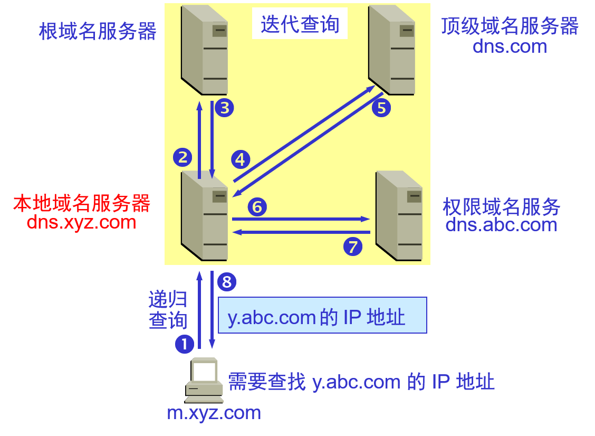
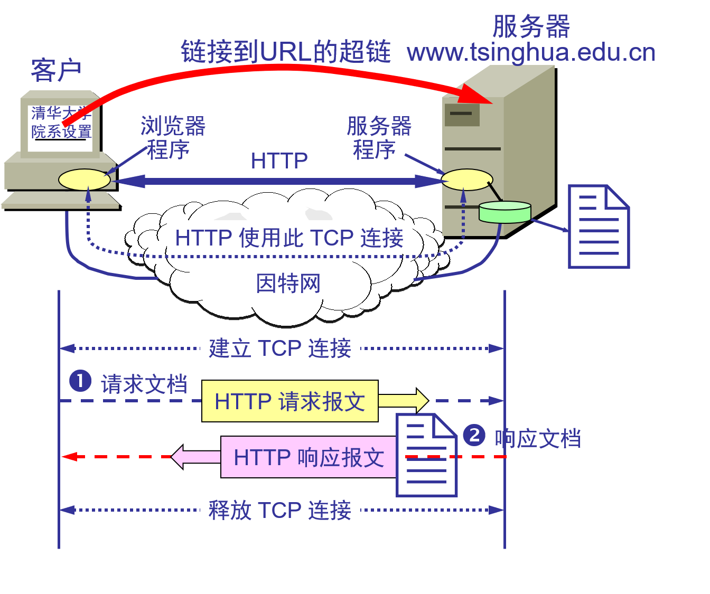
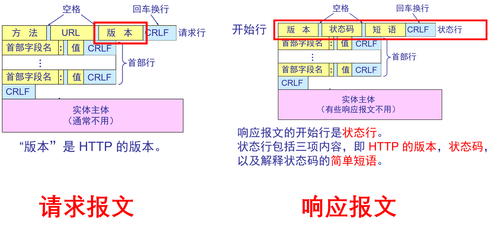
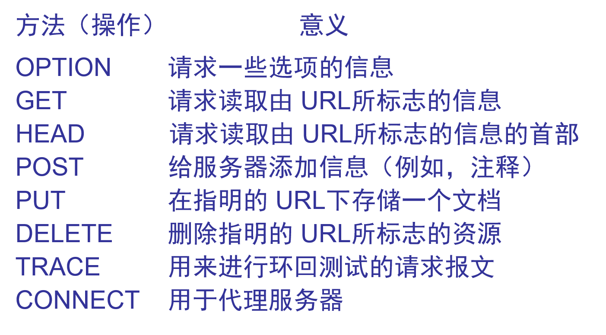
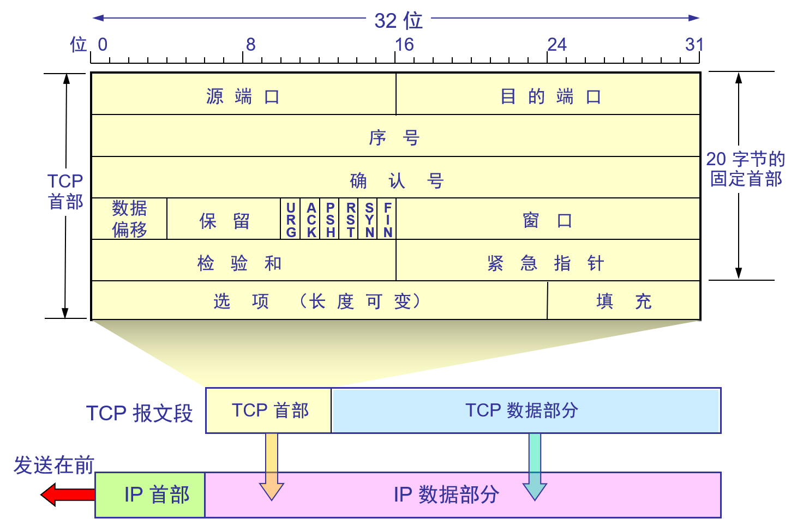

### 1、简述DNS域名系统及其工作原理

**DNS：**Domain Name System，域名系统，是互联网使用的命名系统，用来便于把人们使用的机器名字转换为IP地址。

#### 查询过程



如上图，m.xyz.com需要查找y.abc.com的IP地址：

```markdown
# 1、主机m.xyz.com向本地域名服务器进行递归查询。
	a)主机向本地域名服务器查询时一般使用递归查询。
	递归查询：就是如果本地域名服务器没有所需域名的IP地址，本地域名服务器就以客户的方式向其他根域名服务器继续查询，而不是主机自己进行查询。
	b)本地域名服务器向其他根域名服务器进行查询的时一般使用迭代查询。
	迭代查询： 当某个根域名服务器收到本地域名服务器的请求报文时，要么告诉它所需域名的IP地址，要么告诉它下一步应该向哪个服务器发起询问。然后让本地域名服务器自己去查询。

# 2、本地域名服务器迭代查询，先向一个根域名服务器查询。
# 3、根域名服务器告诉本地域名服务器，下一步应该向顶级域名服务器dns.com查询。
# 4、顶级域名服务器dns.com告诉本地域名服务器，下一步查找权限域名服务器：dns.adc.com。
# 5、本地域名服务器向权限域名服务器发起查询。权限域名服务器告诉本地服务器所需的IP地址，本地服务器在告诉给本地主机。
```

#### 域名服务器的分类

```markdown
# 1、根域名服务器
	最高层也是最重要的服务器，所有的根域名服务器都知道所有的顶级域名服务器的域名地址或者IP地址。
# 2、顶级域名服务器
	这些域名服务器负责管理再该顶级域名服务器上注册的所有的二级域名。
# 3、权限域名服务器
	负责一个区域的域名服务器，如果当前权限域名服务器不能给出所需要的IP地址，那么会返回给客户需要找哪一个权限服务器
# 4、本地域名服务器
	本地DNS一般指的是电脑上网的时候IPV4或者IPV6设置中填写的那个DNS。这个有可能是手工指定或者DHCP走动分配的。当一台主机发送DNS请求报文的时候，这个查询报文就发送给本地域名服务器。
```

### 2、简述HTTP协议以及一次HTTP操作过程

​	HTTP 是面向事务的(transaction-oriented)应用层协议，它是万维网上能够可靠地交换文件（包括文本、声音、图像等各种多媒体文件）的重要基础。

```markdown
# HTTP 是面向事务的客户服务器协议。

# HTTP 1.0 协议是无状态的(stateless)。

# HTTP 协议本身也是无连接的，虽然它使用了面向连接的 TCP 向上提供的服务。
```



#### 1、一次HTTP操作的过程

```markdown
# 浏览器分析超链指向页面的 URL。

# 浏览器向 DNS 请求解析 www.tsinghua.edu.cn 的 IP 地址。

# 域名系统 DNS 解析出服务器的 IP 地址。

# 浏览器与服务器建立 TCP 连接

# 浏览器发出取文件命令：GET /chn/yxsz/index.htm。

# 服务器给出响应，把文件 index.htm 发给浏览器。

# TCP 连接释放。

# 浏览器显示与请求王爷有关的所有文本。
```

#### 2、HTTP报文的格式？

​	HTTP报文分为两类：请求报文和响应报文。它们都由三部分组成：开始行、首部行、实体主体。区别就是开始行不同。


- **首部行：** 用来说明服务器、浏览器、或报文主体的一些信息。

- **实体主体：** 一般不用。

- **开始行：**对于请求报文来说，就是请求行。对于响应报文来说，就是状态行。

  > **请求行：** 包括三个内容：方法，URL以及HTTP的版本。后面有关于方法的详解。
  >
  > **状态行：** 包括三个内容：HTTP版本、状态码以及状态码的简单短语。后面有关于状态码的详解。

#### 3、HTTP请求报文中的方法有哪些？



#### 4、HTTP1.0、HTTP1.1和HTTP2.0的区别？

1）Http1.0与Http1.1的区别

HTTP1.0最早再网页中使用是在1996年，那个时候只是使用一些较为简单的网页上和请求上，而Http1.1则是再199年才开始广泛使用再现在的各大浏览器网络请求中，同时Http1.1版本也是现在使用最广泛的Http协议。如下描述所示是二者主要区别

```markdown
# 缓存处理
	Http1.0中主要使用header中的If-Modified-Since，Expire来作为缓存判断的标准；
	Http1.1则是引入了更多的缓存控制策略比如Entity tag，If-Unmodified-Since，If-Match，If-None-Match等更多的可供选择的缓存头来控制缓存策略。
# 带宽优化以及网络连接的使用
	Http1.0中，存在一些浪费带宽的现象，例如客户端只是需要某个对象的一部分，但是服务器却将整个对象送过来了，并且不支持断点续传功能
	Http1.1则是在请求头中加入了range功能，允许只是请求资源的某个部分，即返回状态码是206，这样方便了开着自由的选择以便于充分利用带宽和连接。
# 错误通知的管理
	在Http1.1中新增了24个错误状态响应码，比如409表示请求的资源与资源当前的状态发生冲突，410表示服务器上的某个资源被永久性的删除。
# Host头处理
	在Http1.0中认为每台服务器绑定一个唯一的IP地址，因此请求消息中的URL中并没有传递主机名。但是随着虚拟主机技术的发展，在一台服务器上面可能存在多个虚拟主机，并且他们共享一个IP地址。Http1.1中的请求消息和响应消息都应该支持Host域，且请求消息中如果没有Host头域会报告一个错误（400 Bad Request）
# 长连接、持续连接
	Http1.1中支持长连接和请求的流水线处理，即在一个TCP连接上面可以传送多个HTTP请求和响应，减少了建立和关闭连接的消耗和延迟，在Http1.1中默认开启Connection:keep-alive，在一定程度上弥补了Http1.0每次都需要创建连接的缺点。
```

2）Http1.1和Http2.0的区别

```markdown
# 新的二进制格式
	Http1.x的解析是基于文本的，而基于文本的格式解析存在天然的缺陷，文本的表现形式有多样性，要做到健壮性考虑的场景必然会很多，二进制则不同，只认0和1的组合。基于这种考虑Http2.0的协议解析决定采用二进制格式，实现方便而且健壮。
# 多路复用
	即连接共享，也就是说每一个request都是用作连接共享机制的。一个request对应一个id，这样一个连接上可以有多个request，每个连接的requset可以随机的混杂在一起，接收方可以根据request的id将request在归属到不同的服务端请求中
# header压缩
	如同上文所述，前面提到的Http1.x中的header中带有大量的信息，而且每次都需要重新发送，而Http2.0中使用encoder技术来减小需要传输的header大小，通讯双方各自缓存一份header field列表，既避免了重复header的传输，又减小了需要传输的数据大小。
# 服务端推送
	桶SPDY一样，Http2.0具有server push的功能
```

### 3、HTTP的状态码以及代表的意思？

```markdown
# 1XX——表示通知信息，如请求收到了或正在进行处理

# 2XX——表明请求被正常处理了
	200 OK：请求已正常处理。
	204 No Content：请求处理成功，但没有任何资源可以返回给客户端，一般在只需要从客户端往服务器发送信息，而对客户端不需要发送新信息内容的情况下使用。
	206 Partial Content：是对资源某一部分的请求，该状态码表示客户端进行了范围请求，而服务器成功执行了这部分的GET请求。响应报文中包含由Content-Range指定范围的实体内容
	
# 3XX——表明浏览器需要执行某些特殊的处理，用以正确的处理请求
	 301 ：表示资源的URI已经更新，所请求的资源已经被重定向到了亲的URI，以后请求该资源也应该使用资源现在使用的URI（永久性重定向）
	 302 ：资源的URI已经临时定位到其他位置了。和301相似，302代表的是资源不是永久移动的，而只是临时性质的。换句话说也就是已经移动的URI将来还是可能发生变化（临时性重定向）
	 303 ： 资源的URI已经更新，是否能够按照新的URI访问。该状态码表示由于请求的资源存在另一个URI，应使用GET方法定向获取请求的资源。303状态码和302状态码具有相似的功能，但是303明确表示客户端需要采用GET方法获取资源，这点与302状态码有区别。当301、302、303状态码返回的时候，几乎所有的请求都会将POST改成GET并删除请求报文的请求主体之后请求会再次发送。
	 304 ： 资源已经找到，但是不符合要求。该状态码表示客户端发送附带条件的请求时候（采用GET方法的请求报文中包含If-Match，If-Modified-Since，If-None-Match，If-Range，If-Unmodified-Since中任一首部），服务器表示允许请求，但是因为发生请求不能满足的情况，所以返回304状态码
	 307 ：临时性重定向。功能类似于302
# 4XX——表明客户端是发生错误的原因所在。
	400 ： Bad Request指的是服务器端无法理解客户端发送的请求，比如请求报文中可能存在错误等
	401 ：表示发送的请求需要HTTP认证（BASIC、DIGEST认证等）
	402 ：表示不允许访问这个资源，即客户端的请求资源被服务器拒绝了（权限，或者未授权IP等）
	404 ：服务器上没有要请求的资源，路径错误等
# 5XX——服务器本身发生错误
	500 ：服务器内部资源发生故障，改状态码表示服务器在执行请求的时候发生了错误。也可能是web应用发生了某种故障
	503 ：表示服务器正在超负载运行或者在维护而无法处理请求
```

### 4、TCP报文段格式

​	TCP虽然是面向字节流的，但是TCP传输的数据单元却是按照报文段进行的，一个报文段可以分为首部和数据项两部分。TCP报文段首部的前20字节是固定的（如下图所示），后面的4n字节是需要添加的数据项，因此TCP报文段首部最小长度是20字节



```markdown
# 源端口和目的端口
	各占两个字节，分别写入源端口号和目的端口号，TCP的分用功能也是通过端口号来实现的
# 序号
	占四个字节，再TCP连接中传送的字节流中的每一个字节都会按照顺序编号。而首部的序号字段代表的就是本报文段所发送的数据的第一个字节的序号
# 确认号
	占四个字节，代表期望收到对方下一个报文段的起始数据字节的序号。（TCP采用累计确认，如果确认好为n，那么表示的是再n-1之前的数据都已经全部接受到）
# 数据偏移
	占4位。指出了TCP报文段的数据起始处距离TCP报文段的起始处多远，一般情况下位20个字节，但是首部还有不确定的选项字段。占据四字节，而他的最大值位15，因此数据偏移量最大的位60字节。即选项不能超过40字节
# 保留
	留6位，以防后续使用
# URG
	当URG=1的时候，表明紧急字段有效，它告诉系统中有紧急报文，应该尽快传送给
# ACK
	仅当ACK=1的时候才表示确认号字段有效
# PSH
	当两个应用进程进行交互式的通信的时候，有时候一端的应用进程希望在键入一个命令之后立即得到对方的数据响应，这时候设置这个字段位1
# RST
	当RST=1的时候，表示TCP连接出现严重错误，必须释放连接，在重新建立传输连接。RST=1还可以用来拒绝一个非法的报文段或者拒绝一个连接。
# SYN
	同步SYN，在建立连接的时候用来表示连接序号，当SYN=1，ACK=0的时候表示的是l连接请求报文段，如果对方同意建立连接，则在对应的报文段中置SYN=1，ACK=1.也就是说SYN=1表示的是连接请求报文或者连接建立报文
# FIN
	终止FIN，用于释放一个连接。当FIN=1的时候，代表这个报文段的发送方的数据已经发送完毕，并且请求释放连接。
# 窗口大小
	占2字节，窗口值告诉对方：从本报文段的确认号算起，接收方目前能够允许发送的数据量（以字节位单位），之所以设置这个限制，是因为接收方的缓存是有限制的。总之窗口值作为接收方让发送方设置其窗口大小的依据
# 校验和
	占2字节，校验的范围包括首部字段和数据字段。和UDP校验的方法一样，只不过将伪首部第四个字段的11改为了6
# 紧急指针
	2字节。只有在紧急URG=1的时候才有效，它指出在本报段中的紧急数据的字节数
# 选项
	长度可变，最长为40字节。TCP最开始的时候只是规定了一种选项，即报文的最大长度MSS。MSS表示的是每一个TCP报文段中的数据字段的最大长度，而不是整个TCP报文段的最大长度/	
```


### 5、UDP数据报格式

### 6、IP数据报格式


