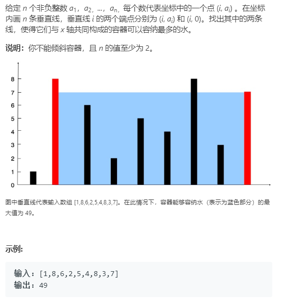

```java
class Solution {
    public int maxArea(int[] height) {
        int start = 0;
        int end = height.length - 1;
        int result = -1;
        while (start < end) {
            int tmp = Math.min(height[start], height[end]) * (end - start);
            result = Math.max(result, tmp);
            if (height[start] < height[end]) {
                start++;
            } else {
                end--;
            }
        }
        return result;        
    }
}
```

